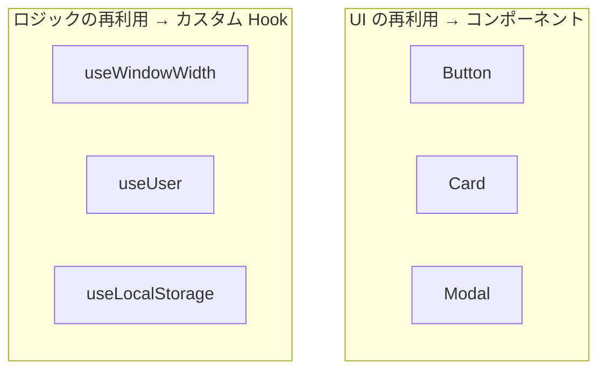

# カスタム Hooks — `use` で始まる関数を自分で作る

## 今日のゴール

- カスタム Hooks が「ロジックの再利用」の仕組みであることを知る
- コンポーネントの分割とは別の軸の設計判断であることを知る
- カスタム Hooks の作り方と使い方を知る

## 同じロジックが 2 箇所に出てきたら

画面のサイズを取得するロジックを、2 つのコンポーネントで使いたいとします。

```tsx
function Header() {
  const [width, setWidth] = useState(window.innerWidth);

  useEffect(() => {
    const handleResize = () => setWidth(window.innerWidth);
    window.addEventListener("resize", handleResize);
    return () => window.removeEventListener("resize", handleResize);
  }, []);

  return <header>{width > 768 ? "デスクトップ" : "モバイル"}</header>;
}

function Sidebar() {
  const [width, setWidth] = useState(window.innerWidth);

  useEffect(() => {
    const handleResize = () => setWidth(window.innerWidth);
    window.addEventListener("resize", handleResize);
    return () => window.removeEventListener("resize", handleResize);
  }, []);

  if (width <= 768) return null;
  return <aside>サイドバー</aside>;
}
```

`useState` + `useEffect` + `addEventListener` の部分がまったく同じです。コピペで動きますが、片方を修正したらもう片方も直す必要があります。

## カスタム Hooks — ロジックを関数に切り出す

同じロジックを `use` で始まる関数に切り出したものが**カスタム Hook** です。

```tsx
function useWindowWidth() {
  const [width, setWidth] = useState(window.innerWidth);

  useEffect(() => {
    const handleResize = () => setWidth(window.innerWidth);
    window.addEventListener("resize", handleResize);
    return () => window.removeEventListener("resize", handleResize);
  }, []);

  return width;
}
```

使う側はこうなります。

```tsx
function Header() {
  const width = useWindowWidth();
  return <header>{width > 768 ? "デスクトップ" : "モバイル"}</header>;
}

function Sidebar() {
  const width = useWindowWidth();
  if (width <= 768) return null;
  return <aside>サイドバー</aside>;
}
```

ロジックが 1 箇所にまとまり、使う側はシンプルになりました。

## `use` で始める理由

カスタム Hooks の名前は**必ず `use` で始めます**。これは React のルールです。

```tsx
// ✅ use で始まる
function useWindowWidth() { ... }
function useUser(id: string) { ... }
function useLocalStorage(key: string) { ... }

// ❌ use で始まらない（Hooks のルールが適用されない）
function getWindowWidth() { ... }
```

`use` で始まる関数の中では、`useState` や `useEffect` などの React Hooks が使えます。`use` で始まらない関数の中では使えません。React がこの命名規則で Hooks の呼び出しを追跡しているからです。

## コンポーネントの分割とは別の話

カスタム Hooks は**ロジック**の再利用です。コンポーネントは **UI** の再利用です。この 2 つは別の軸です。



- **コンポーネント**: 見た目のかたまり（ボタン、カード、モーダル）
- **カスタム Hook**: 振る舞いのかたまり（画面幅の監視、ユーザーデータの取得、ローカルストレージの操作）

「この見た目を再利用したい」→ コンポーネントに切り出す
「このロジックを再利用したい」→ カスタム Hook に切り出す

## よく見るカスタム Hooks のパターン

### データ取得

```tsx
function useUser(userId: string) {
  const [user, setUser] = useState(null);
  const [loading, setLoading] = useState(true);

  useEffect(() => {
    setLoading(true);
    fetch(`/api/users/${userId}`)
      .then((res) => res.json())
      .then((data) => {
        setUser(data);
        setLoading(false);
      });
  }, [userId]);

  return { user, loading };
}

// 使う側
function UserProfile({ userId }: { userId: string }) {
  const { user, loading } = useUser(userId);
  if (loading) return <p>読み込み中...</p>;
  return <p>{user.name}</p>;
}
```

### ローカルストレージ

```tsx
function useLocalStorage(key: string, initialValue: string) {
  const [value, setValue] = useState(() => {
    const saved = localStorage.getItem(key);
    return saved ?? initialValue;
  });

  useEffect(() => {
    localStorage.setItem(key, value);
  }, [key, value]);

  return [value, setValue] as const;
}
```

## まとめ

- カスタム Hooks は `use` で始まる関数で、ロジック（state + effect の組み合わせ）を再利用する仕組みです
- コンポーネント（UI の再利用）とカスタム Hook（ロジックの再利用）は別の軸の設計判断です
- `use` で始める命名規則は React のルールであり、Hooks の呼び出しを追跡するために必要です
- データ取得、ローカルストレージ操作、画面サイズ監視など、よく使うパターンがあります
