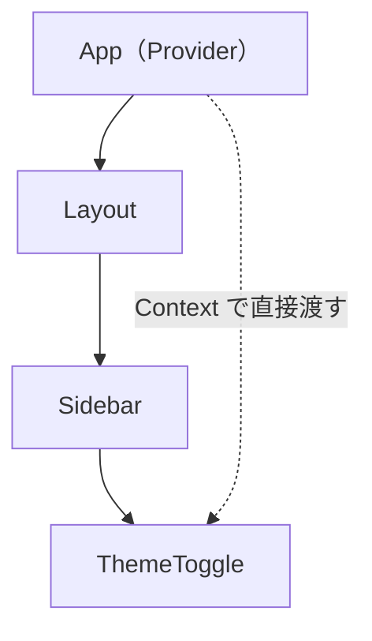

# Context — props のバケツリレーを解消する

## 今日のゴール

- props を何層も渡す「バケツリレー」の問題を知る
- Context でコンポーネントツリーを飛び越えてデータを渡せることを知る
- Context の使いどころと使いすぎの注意点を知る

## props のバケツリレー

React のコンポーネントは、親から子に props でデータを渡します。しかし、深くネストしたコンポーネントにデータを渡したいとき、途中のコンポーネントが「自分では使わないけど子に渡すためだけに受け取る」状況が起きます。

```tsx
function App() {
  const [theme, setTheme] = useState("light");
  return <Layout theme={theme} />;
}

function Layout({ theme }: { theme: string }) {
  // Layout 自身は theme を使わない。ただ渡すだけ
  return <Sidebar theme={theme} />;
}

function Sidebar({ theme }: { theme: string }) {
  // Sidebar も theme を使わない。ただ渡すだけ
  return <ThemeToggle theme={theme} />;
}

function ThemeToggle({ theme }: { theme: string }) {
  // ここで初めて theme を使う
  return <button>{theme === "light" ? "🌙" : "☀️"}</button>;
}
```

`theme` は `App` → `Layout` → `Sidebar` → `ThemeToggle` と 3 層を経由しています。`Layout` と `Sidebar` は自分では `theme` を使いません。渡すためだけに props を受け取っています。

これを **props のバケツリレー**（prop drilling）と呼びます。層が増えるほど面倒になり、途中で渡し忘れるとバグになります。

## Context — ツリーを飛び越えてデータを渡す

Context を使うと、途中のコンポーネントを経由せずにデータを渡せます。

```tsx
import { createContext, use, useState } from "react";

// 1. Context を作る
const ThemeContext = createContext("light");

function App() {
  const [theme, setTheme] = useState("light");

  // 2. Provider でツリーを囲む
  return (
    <ThemeContext value={theme}>
      <Layout />
    </ThemeContext>
  );
}

function Layout() {
  // theme を受け取らなくてよい
  return <Sidebar />;
}

function Sidebar() {
  // theme を受け取らなくてよい
  return <ThemeToggle />;
}

function ThemeToggle() {
  // 3. use() で直接読み取る
  const theme = use(ThemeContext);
  return <button>{theme === "light" ? "🌙" : "☀️"}</button>;
}
```



`Layout` と `Sidebar` から `theme` の props が消えました。`ThemeToggle` は `use(ThemeContext)` で直接データを読み取ります。

## Context の使い方

### 1. createContext で作る

```tsx
const ThemeContext = createContext("light");  // デフォルト値
```

### 2. Provider でツリーを囲む

```tsx
<ThemeContext value={theme}>
  {/* この中のどのコンポーネントからでも theme を読める */}
</ThemeContext>
```

### 3. use() で読み取る

```tsx
const theme = use(ThemeContext);
```

`use()` は React 19 で追加された API です。`if` 文の中でも使えます。

## Context の使いどころ

Context が適しているのは「多くのコンポーネントが必要とする、あまり変わらないデータ」です。

| 適している | 理由 |
|-----------|------|
| テーマ（ライト/ダーク） | ほぼ全コンポーネントが参照、変更は稀 |
| ログインユーザー | 多くの場所で表示、変更は稀 |
| ロケール（言語設定） | 全テキストに影響、変更は稀 |

## Context の使いすぎに注意

Context は便利ですが、**グローバル変数と同じ危うさ**があります。

```tsx
// ❌ なんでも Context に入れる
const AppContext = createContext({
  user: null,
  theme: "light",
  cart: [],
  notifications: [],
  sidebarOpen: false,
});
```

Context の値が変わると、その Context を使っているすべてのコンポーネントが再レンダリングされます。`cart` が変わっただけなのに `theme` しか使っていないコンポーネントまで再レンダリングされてしまいます。

**Context は目的別に分けます**。

```tsx
const ThemeContext = createContext("light");
const UserContext = createContext(null);
const CartContext = createContext([]);
```

また、2〜3 層程度の props リレーなら Context を使わずそのまま渡したほうがシンプルなこともあります。「バケツリレーが辛い」と感じたときに初めて Context を検討するのがよいバランスです。

## まとめ

- props を何層も経由して渡す「バケツリレー」は、層が深くなると管理が大変になります
- Context を使うと、途中のコンポーネントを経由せずにデータを渡せます
- `createContext` で作り、`<Context value={...}>` で囲み、`use(Context)` で読み取ります
- テーマ、ログインユーザー、ロケールなど「広く参照され、あまり変わらないデータ」に適しています
- Context は目的別に分けます。1 つにまとめると不要な再レンダリングが起きます
