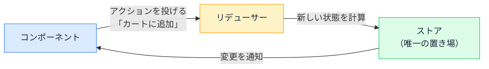

# 状態管理の世代史 — Redux から Zustand / Jotai まで

## 今日のゴール

- 状態管理ライブラリが「state の置き場所問題」の解決史だと知る
- Redux 世代と軽量世代（Zustand / Jotai）の違いを知る
- サーバーのデータは「別の問題」として扱われるようになったと知る

## 名前が多すぎる問題

React の状態管理を調べると、Redux、Zustand、Jotai、Recoil、MobX と、おびただしい数のライブラリ名に出会います。どれを選ぶべきか、そもそも要るのかは、名前を眺めていても分かりません。

ただの流行り廃りに見えますが、実際には**それぞれが前の世代の辛さを解決するために生まれた**、地続きの歴史があります。順にたどると、名前の一覧が「どの問題への回答か」で整理できます。

## 出発点 — React 標準機能の限界

React が標準で持つ状態の置き場所は 2 つです。

- **useState**: コンポーネントの中に置く。そのコンポーネント（と props で渡した子）だけが使える
- **Context**: ツリーの上に置き、深い子からも直接読める

小さなアプリならこれで足ります。しかしアプリが育つと、壁に当たります。

- 画面の離れた場所同士で同じ state を使いたい（カートの中身を、一覧にもヘッダーのバッジにも）
- Context に乗せると、**値が変わるたびに読んでいる全員が再レンダリング**される
- 「どこで誰が state を書き換えたのか」が追えなくなり、バグの再現すら難しい

状態管理ライブラリの歴史は、「アプリ全体の状態をどこにどう置くか」への回答の歴史です。

## 第 1 世代 — 厳格な単一ストアの Redux

2015 年頃に主流になった **Redux** の答えは、「**アプリ全体の状態を 1 つの大きな置き場（ストア）にまとめ、変更の手続きを厳格に決める**」でした。

- 状態は単一のストアに集約する
- 変更は「何が起きたか」を表すオブジェクト（アクション）を投げる方法でしか行えない
- 受け取ったアクションに応じて新しい状態を計算する関数（リデューサー）が、唯一の変更役



この厳格さの見返りとして、すべての変更が記録されるので「いつ・何が・なぜ変わったか」を追跡でき、状態を過去に巻き戻すデバッグまで可能になりました。大規模チーム開発の「誰が書き換えたか分からない」問題には、これがよく効きました。

一方で代償も大きく、ボタン 1 つの状態を足すのに、アクション・リデューサー・接続コードと**複数のファイルを書く手間**がかかりました。「Redux はボイラープレート（定型コード）が辛い」が合言葉になったほどです。

## 第 2 世代 — 軽量な Zustand / Jotai

「Redux の厳格さは多くのアプリにはやり過ぎだった」という反省から、2019 年以降の軽量な世代が生まれます。代表が **Zustand** と **Jotai** で、対照的な発想なので並べると違いが見えます。

| | Zustand | Jotai |
|---|---------|-------|
| 発想 | Redux 的な「1 つのストア」を、定型コードなしで | 状態を**小さな粒**（アトム）に分けて、必要な分だけ |
| 構造 | トップダウン（大きな置き場を作って切り出す） | ボトムアップ（小さな状態を組み合わせる） |
| 再レンダリング | 使っている部分が変わったときだけ | そのアトムを使うコンポーネントだけ |

```ts
// Zustand: ストアの定義がこれだけで終わる
import { create } from "zustand";

type CartState = {
  count: number;
  add: () => void;
};

export const useCartStore = create<CartState>((set) => ({
  count: 0,
  add: () => set((state) => ({ count: state.count + 1 })),
}));
```

```tsx
// どのコンポーネントからでも、バケツリレーなしで使える
function CartBadge() {
  const count = useCartStore((state) => state.count);
  return <span aria-label={`カートに ${count} 点`}>{count}</span>;
}
```

Redux であれほど書いたものが、ファイル 1 つに収まります。さらに Context と違って「**使っている値が変わったコンポーネントだけ再レンダリング**」が標準なので、性能面の問題も解消されています。

現在の新規プロジェクトでグローバル状態が必要なら、この世代が第一候補です。

::: tip Recoil は開発終了
Jotai と同じアトム方式の先行者だった Recoil は、2025 年に開発を終了しました。調べ物で名前を見かけても、新規で選ぶ候補ではありません。
:::

## 転換点 — サーバーのデータは別の問題

世代が進む中で、もう 1 つ大きな気づきがありました。ストアに入れていた状態の大半は、**サーバーから取ってきたデータのコピー**だったのです。

サーバー由来のデータには、UI の状態と違う独特の問題があります。

- 古くなる（他の誰かが更新しているかもしれない）
- 取得中・失敗という途中状態がある
- 同じデータを複数画面で使うなら、キャッシュしたい

これは「状態管理」ではなく「**キャッシュ管理**」の問題です。TanStack Query や SWR といった**データ取得専用ライブラリ**がこの問題を引き受けた結果、「グローバル状態」と呼ばれていたものの多くがストアから消えました。

さらに現在の Next.js では、データ取得をサーバー側で行い、そもそもブラウザ側に状態として持たない選択肢が主流になりつつあります。**状態管理ライブラリの守備範囲は、歴史を通じて狭くなり続けている**のです。

## 現在の使い分け

整理すると、いまの相場はこうなります。

| 状態の種類 | 置き場所 |
|-----------|---------|
| 1 つの画面・部品の中の状態 | useState |
| アプリ全体の設定（テーマ、ログインユーザー） | Context |
| 画面をまたぐ UI 状態（カート、通知） | Zustand / Jotai など |
| サーバー由来のデータ | サーバー側で取得、またはデータ取得ライブラリ |

新規のコードで「Redux を入れる」という提案を見たら、既存プロジェクトとの整合以外では古い選択かもしれません。「その状態は本当にグローバルか」「サーバーのデータではないか」と確認できれば、この歴史を踏まえた判断ができます。

## まとめ

- 状態管理の歴史は「state の置き場所と再レンダリング」の解決史
- Redux は厳格な単一ストアで追跡可能性を取り、定型コードの重さが反省を生んだ
- Zustand / Jotai は定型コードなしで必要な部分だけ再レンダリングする軽量世代
- サーバーのデータは状態でなくキャッシュなので、専用ライブラリかサーバー側へ
