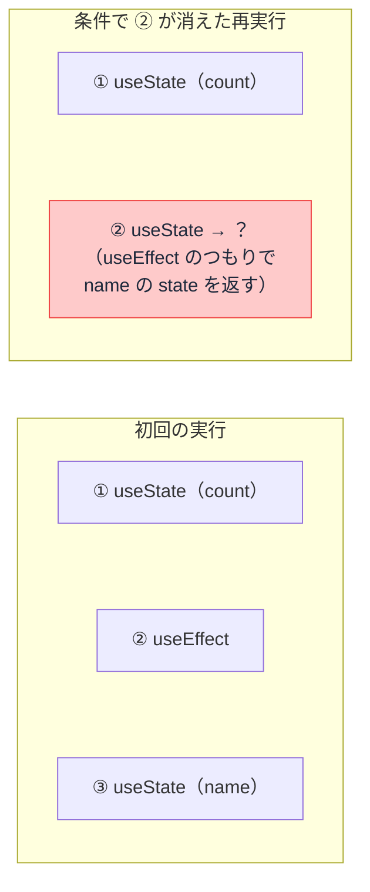

# カスタムフック — use で始まる関数の仕組み

## 今日のゴール

- カスタムフックが「hook を中で使う、ただの関数」だと知る
- 共有されるのはロジックで、state は呼び出しごとに独立だと知る
- 「use 始まり」「トップレベルで呼ぶ」のルールの理由を知る

## 標準には無い use〜 の関数

React の標準の hook は `useState` や `useEffect` など限られた数しかありません。ところが実際のプロジェクトのコードには、標準には無い use〜 がいくつも登場します。

```tsx
function SearchPage({ query }: { query: string }) {
  const windowSize = useWindowSize();             // 標準には無い
  const debouncedQuery = useDebounce(query, 300); // これも無い

  return <p>{debouncedQuery} を検索中（画面幅 {windowSize.width}px）</p>;
}
```

これらは**カスタムフック**と呼ばれます。ライブラリ由来のこともありますが、多くはそのプロジェクト内で**自作された関数**です。

「フック」という名前から特別な仕組みに見えますが、実態は驚くほど普通です。

## 実態は hook を中で使うただの関数

ウィンドウの幅を表示するコンポーネントを考えます。素直に書くと、state と購読のロジックがコンポーネントに直接書かれます。

```tsx
import { useEffect, useState } from "react";

function Header() {
  const [width, setWidth] = useState(0);

  useEffect(() => {
    const onResize = () => setWidth(window.innerWidth);
    onResize(); // まず現在の幅を反映
    window.addEventListener("resize", onResize);
    return () => window.removeEventListener("resize", onResize);
  }, []);

  return <p>幅: {width}px</p>;
}
```

このロジックを別の画面でも使いたくなったとき、コピペする代わりに**関数として切り出します**。

```tsx
// use-window-width.ts
import { useEffect, useState } from "react";

export function useWindowWidth() {
  const [width, setWidth] = useState(0);

  useEffect(() => {
    const onResize = () => setWidth(window.innerWidth);
    onResize();
    window.addEventListener("resize", onResize);
    return () => window.removeEventListener("resize", onResize);
  }, []);

  return width;
}
```

```tsx
// 使う側は 1 行になる
import { useWindowWidth } from "./use-window-width";

function Header() {
  const width = useWindowWidth();
  return <p>幅: {width}px</p>;
}
```

やったことは、コードを関数に切り出しただけです。`export function useWindowWidth()` に特別な宣言は何もありません。

**中で `useState` や `useEffect` を使う関数を、use 始まりの名前で作る**と、それがもうカスタムフックです。

切り出した結果、2 つの良いことが起きています。

- **使う側が読みやすい**: 「ウィンドウ幅を使う」という意図だけが残り、購読や後片付けの詳細が消える
- **再利用できる**: どのコンポーネントからも 1 行で使える

## 重要な性質 — state は呼び出しごとに独立

カスタムフックで共有されるのは**ロジック（手順）であって、state（値）ではありません**。

```tsx
function PageA() {
  const width = useWindowWidth(); // PageA 専用の state
}

function PageB() {
  const width = useWindowWidth(); // PageB 専用の、別の state
}
```

`useWindowWidth` を 2 か所で呼ぶと、中の `useState` も 2 セット作られます。それぞれの呼び出しが独立した state を持ち、互いに影響しません。

「カスタムフックにすれば state を共有できる」は典型的な誤解です。カスタムフックが配るのは「同じ作り方」であって「同じ値」ではありません。

コンポーネントをまたいで**同じ値**を共有したいなら、それは Context やストアの仕事です。

## 守るべき 2 つのルール

カスタムフックには守るべきルールが 2 つあります。どちらも「決まりだから」ではなく、仕組み上の理由があります。

### 1. 名前は use で始める

React 本体は関数名を見ていませんが、ESLint の React プラグインが **use 始まりの関数を hook とみなしてルール違反を検査**します。use 始まりにしておけば、if の中で hook を呼ぶような間違いを自動で見つけてもらえます。

名前は、人間とツールの両方に向けた目印です。

### 2. トップレベルで呼ぶ

hook は、if 文やループの中で呼んではいけません。

```tsx
function Profile({ isAdmin }: { isAdmin: boolean }) {
  if (isAdmin) {
    const [log, setLog] = useState<string[]>([]); // ❌ 条件の中で hook
  }

  return <p>プロフィール</p>;
}
```

React は各コンポーネントの hook を、名前ではなく**呼ばれた順番**で管理しています。「1 番目の useState はこの state、2 番目はこれ」という具合です。

条件分岐で呼ばれたり呼ばれなかったりすると、**再レンダリングで順番がズレて、別の hook の state を取り違えます**。



毎回同じ順番で全部呼ばれることが、仕組みの前提なのです。

カスタムフックも中で hook を呼ぶので、同じルールに従います。

## 切り出す基準

何でもカスタムフックにすればよいわけではありません。切り出す価値があるのは、次のどちらかです。

- **複数の場所で使う**ロジック（重複の解消）
- 1 か所でも、**コンポーネントの見通しを悪くしている**まとまったロジック（フォームの検証一式など）

逆に、`useState` 1 つを包んだだけのカスタムフックは、間接層が増えるだけで益がありません。見せかけの整理のために薄いカスタムフックが量産されていたら、「これは切り出す価値があるか」で間引く目を持ってください。

## まとめ

- カスタムフックは hook を中で使う、use 始まりのただの関数
- 共有されるのはロジックだけで、state は呼び出しごとに独立（値の共有は Context やストアの仕事）
- use 始まりはツールが検査するためで、トップレベル縛りは「呼ばれる順番」を保つため
- 切り出す基準は「複数で使う」か「見通しが悪い」か
