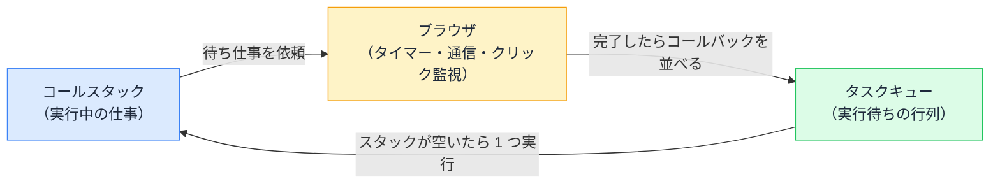

# イベントループ — シングルスレッドなのに固まらない仕組み

## 今日のゴール

- JavaScript が「一度に 1 つ」しか実行できないことを知る
- 待ち仕事はブラウザが預かり、終わったらキューに並ぶ仕組みを知る
- `setTimeout(fn, 0)` がすぐ実行されない理由を説明できるようになる

## 一度に 1 つしかできない言語

JavaScript には大前提があります。**コードを実行する流れ（スレッド）が 1 本しかない**。つまり、一度に 1 つの処理しかできません。これを**シングルスレッド**と呼びます。

実行中の処理は**コールスタック**という場所に積まれます。関数を呼ぶと積まれ、終わると降りる。スタックに何かが積まれている間、他の仕事は一切できません。

体感できる例があります。ボタンのクリックで重い計算を回すと、その間**ページ全体が固まります**。スクロールもクリックも効きません。

```js
button.addEventListener("click", () => {
  let sum = 0;
  for (let i = 0; i < 5_000_000_000; i++) {
    sum += i;
  }
  console.log(sum);
}); // 計算が終わるまで、画面は何も反応しない
```

画面の描画もユーザーへの反応も、同じ 1 本のスレッドの仕事だからです。スタックが長時間占領されると、画面は死にます。

しかしサーバーとの通信は何秒もかかるのに、**通信中も画面は普通に動きます**。一度に 1 つしかできないはずなのに画面が固まらないのは、**時間のかかる「待ち」を JavaScript ではなくブラウザ本体が引き受けている**からです。

## 待ち仕事はブラウザに預ける

`setTimeout` や `fetch`（通信）を呼んだとき、起きているのはこれです。

1. JavaScript は「3 秒測って」「このデータ取ってきて」と**ブラウザに依頼だけして、すぐ次の行へ進む**
2. 計測や通信は、ブラウザが裏で進める（ここは JavaScript のスレッドの外）
3. 完了したら、ブラウザは「依頼時に渡されたコールバック関数」を**タスクキュー（実行待ちの行列）に並べる**
4. **イベントループ**が「コールスタックが空になったら、キューの先頭を 1 つ実行する」を延々と繰り返す



JavaScript 自身は最後まで「一度に 1 つ」を守っています。並行で動いているように見えるのは、**待ちをブラウザに外注し、結果を行列で受け取っている**からです。この行列をぐるぐる回す係がイベントループです。

## setTimeout(fn, 0) の意味

この仕組みが分かると、有名な不思議が解けます。

```js
console.log("1");

setTimeout(() => {
  console.log("2");
}, 0); // 0 ミリ秒後に実行して、のはずが…

console.log("3");
// 出力: 1 → 3 → 2
```

`0 ミリ秒`と指定しても、コールバックは**いったんタスクキューに並びます**。キューから取り出されるのは「いま実行中のコード（スタック）が全部終わってから」。だから `"3"` が先です。

`setTimeout(fn, 0)` は「0 秒後に実行」ではなく「**いまの仕事が全部終わったら実行して**」という意味だった、ということです。

## 行列は 2 種類ある — Promise は優先される

実は、実行待ちの行列は 1 つではありません。

| 行列 | 並ぶもの | 優先度 |
|------|---------|--------|
| **マイクロタスク** | Promise の続き（`.then`、`await` の後続） | **高**。スタックが空くたび、毎回すべて処理 |
| **マクロタスク** | `setTimeout`、クリックなどのイベント | 低。マイクロタスクが空になってから 1 つずつ |

定番のクイズで確かめます。

```js
console.log("A");

setTimeout(() => console.log("B"), 0);          // マクロタスク行き

Promise.resolve().then(() => console.log("C")); // マイクロタスク行き

console.log("D");
// 出力: A → D → C → B
```

1. 同期コードの `"A"` と `"D"` が先に実行される
2. スタックが空いた瞬間、マイクロタスクの `"C"`（Promise）がすべて処理される
3. 最後にマクロタスクの `"B"`（setTimeout）

「**同期 → Promise → setTimeout**」。非同期処理のコードで「実行順が想定と違う」と感じたら、この 3 段の順番を思い出してください。`async/await` も裏側はこの仕組みで、`await` の行から先は「マイクロタスクとして後で実行される続き」に変換されています。

### 触って確かめる

いま読んだクイズのコードを、あなたのブラウザでその場で実行できます。書いた順は A → B → C → D ですが、さて。

<div class="c29-demo">
  <button type="button" class="c29-btn" onclick="
    var log = document.getElementById('c29-log');
    log.textContent = '';
    var add = function (s) { log.textContent += s + '\n'; };
    add('A（同期）');
    setTimeout(function () { add('B（setTimeout 0ms = マクロタスク）'); }, 0);
    Promise.resolve().then(function () { add('C（Promise.then = マイクロタスク）'); });
    add('D（同期）');
  ">このブラウザで実行する</button>
  <pre class="c29-log" id="c29-log" aria-live="polite">（ボタンを押すと、実際の実行順がここに表示されます）</pre>
</div>

何度押しても A → D → C → B。これはたまたまではなく、イベントループの仕様どおりの順番です。

## この知識が効く場面

- **画面が固まる**: 長時間スタックを占領する同期処理が犯人。「重い処理で UI がフリーズしている」と言葉にできれば、AI に分割や Web Worker（別スレッドで計算する仕組み）の検討を指示できる
- **実行順のバグ**: 「console.log の順番がおかしい」の多くは、マイクロ / マクロの優先度で説明がつく
- **「非同期 = 並列」ではない**と知る: JavaScript は待ちを外注しているだけで、コード自体は常に一度に 1 つ。だから「同時に実行されて変数が壊れる」心配は（基本的に）ない

## まとめ

- JavaScript はシングルスレッドで、スタックを占領すると画面ごと固まる
- 待ち仕事はブラウザに外注し、完了後のコールバックがキューに並び、それを回す係がイベントループ
- `setTimeout(fn, 0)` は「いまの仕事が全部終わったら」
- 実行順は 同期 → マイクロタスク（Promise） → マクロタスク（setTimeout）

<style>
.c29-demo {
  border: 1px solid #e2e8f0;
  border-radius: 10px;
  padding: 16px;
  margin: 1.2em 0;
  background: #f8fafc;
  color: #1e293b;
}
.c29-btn {
  padding: 8px 16px;
  font-size: 14px;
  border: none;
  border-radius: 6px;
  background: #3b82f6;
  color: #ffffff;
  cursor: pointer;
}
.c29-btn:hover { background: #2563eb; }
.c29-btn:focus-visible { outline: 2px solid #1d4ed8; outline-offset: 2px; }
.c29-log {
  background: #ffffff;
  color: #1e293b;
  border: 1px dashed #cbd5e1;
  border-radius: 6px;
  padding: 12px;
  font-size: 13px;
  min-height: 5.5em;
  white-space: pre-wrap;
  margin: 12px 0 0;
}
</style>
