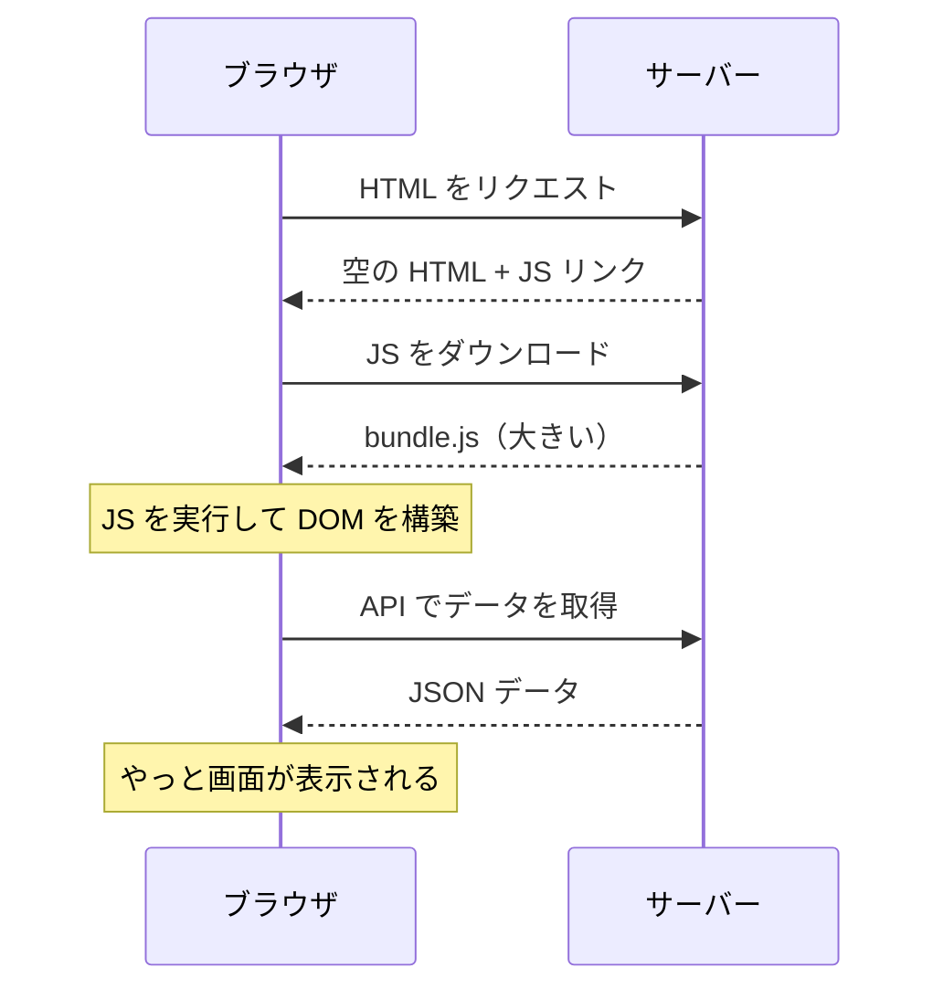
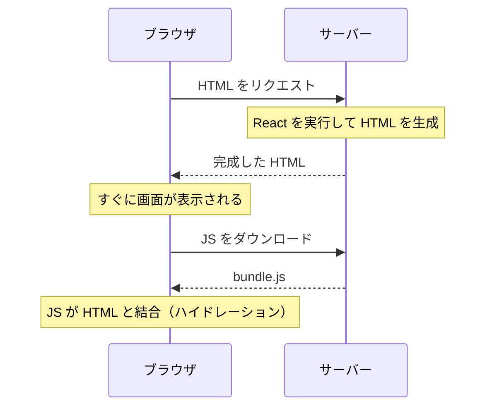

# SPA・CSR・SSR — ブラウザで作るか、サーバーで作るか

## 今日のゴール

- SPA（Single Page Application）の仕組みと限界を知る
- SSR（Server-Side Rendering）がその限界をどう解決するかを知る
- Next.js が SSR を簡単に実現するフレームワークだと知る

## React 単体で作ると何が起きるか

React だけでアプリを作ると、ブラウザに送られる HTML はほぼ空です。

```html
<!DOCTYPE html>
<html>
  <body>
    <div id="root"></div>
    <script src="/bundle.js"></script>
  </body>
</html>
```

中身は `<div id="root"></div>` だけ。ブラウザが `bundle.js`（React のコード）をダウンロードして実行し、JavaScript が DOM を組み立てて画面を表示します。

この方式を **CSR**（Client-Side Rendering）と呼びます。「クライアント（ブラウザ）がレンダリングする」という意味です。ページ遷移してもサーバーから HTML を取り直さず、JavaScript が画面を書き換えるだけなので、アプリのように滑らかに動きます。ページが 1 つしかないので **SPA**（Single Page Application）とも呼ばれます。

## CSR の限界

CSR には 2 つの弱点があります。

**初回表示が遅い**: ブラウザは空の HTML を受け取った後、JavaScript をダウンロードして実行し、さらに API からデータを取得して、やっと画面が表示されます。JavaScript のサイズが大きいほど、ユーザーは白い画面を見る時間が長くなります。



**検索エンジンに内容が見えない**: 検索エンジンのクローラーが HTML を読んでも、`<div id="root"></div>` しかありません。JavaScript を実行しないと中身がわからないため、検索結果に正しく表示されない場合があります。

## SSR — サーバーで HTML を作って返す

SSR（Server-Side Rendering）は、**サーバー側で React を実行して HTML を作り、完成した HTML をブラウザに返す**方式です。



ブラウザは完成した HTML を受け取るので、すぐに画面が表示されます。その後 JavaScript がダウンロードされて、ボタンのクリックなどのインタラクションが有効になります。この「HTML と JavaScript を結合する」過程を**ハイドレーション**と呼びます。

検索エンジンにも完成した HTML が返されるので、内容が正しくインデックスされます。

## Next.js — SSR を簡単にするフレームワーク

React 単体で SSR を実装するのは複雑です。サーバーの設定、ルーティング、データ取得のタイミング管理など、多くのことを自分で組む必要があります。

Next.js はこれらを**フレームワークとして一括で提供**します。ファイルを作って React コンポーネントを書くだけで、SSR が自動的に行われます。

AI が Next.js でアプリを作っているのは、「React を使いつつ、CSR の弱点を解消するため」です。

## まとめ

- React 単体の CSR は、ブラウザが JavaScript を実行して画面を作ります。初回表示が遅く、検索エンジンに内容が見えにくい弱点があります
- SSR はサーバーで HTML を作って返します。初回表示が速く、検索エンジンにも対応できます
- Next.js は SSR を簡単に実現するフレームワークです。React の書き方をそのまま使えます
