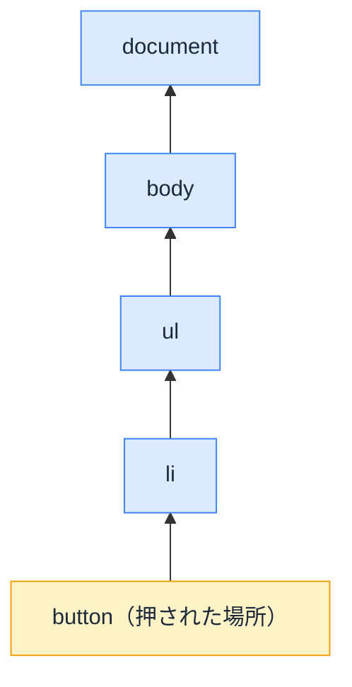

# イベントの仕組み — クリックはバブルのように昇っていく

## 今日のゴール

- イベントが子から親へ伝わる「バブリング」を知る
- `preventDefault` と `stopPropagation` の違いを説明できるようになる
- React の onClick がこの仕組みの上に作られていると知る

## 押した場所と、反応する場所

Web ページでは「押した要素」と「反応する要素」が一致しないことがよくあります。

- モーダルの**外側のどこを押しても**閉じる
- 一覧の行の**どこを押しても**詳細に飛ぶ（行の中のテキストでもアイコンでも）

ボタンそのものではなく「広い範囲のどこでも」が反応する。これを支えているのが、イベントの**伝わり方**の仕組みです。

## バブリング — イベントは親へ昇っていく

HTML の要素は入れ子になっています。`<li>` の中の `<button>` をクリックしたとき、イベントは `<button>` だけのものではありません。

```html
<ul>
  <li>
    <button>削除</button>
  </li>
</ul>
```

クリックイベントは、押された要素から**親、その親、と上に向かって順に伝わっていきます**。泡（バブル）が水面に昇る様子から、**バブリング**と呼ばれます。



通り道にある要素は、**自分に付けられたイベントハンドラでそのイベントを拾えます**。`<ul>` にハンドラを 1 つ付けておけば、中のどのボタンのクリックも拾える。「広い範囲のどこでも反応する」の正体はこれです。

### target と currentTarget

親で拾ったとき、「実際に押されたのはどれか」はイベントオブジェクトから分かります。

| プロパティ | 指すもの |
|-----------|---------|
| `e.target` | **実際に押された**要素（旅の出発点） |
| `e.currentTarget` | **このハンドラが付いている**要素（いま拾った場所） |

```js
document.querySelector("ul").addEventListener("click", (e) => {
  console.log(e.target);        // 押された <button>
  console.log(e.currentTarget); // ハンドラを付けた <ul>
});
```

### イベント委譲 — 1000 行に 1 つのハンドラ

バブリングの実用例が**イベント委譲**です。1000 行のリストの各行にハンドラを 1000 個付ける代わりに、親に 1 つ付けて `e.target` で「どの行か」を判定します。ハンドラの数が減るうえ、あとから行が追加されても付け直しが要りません。

### 触って確かめる

下のボタンを押すと、イベントが親へ昇っていく様子がログに出ます。チェックを入れると、中間の div が `stopPropagation()` で旅を止めます。

<div class="c30-demo">
  <div class="c30-outer" onclick="document.getElementById('c30-log').textContent += '→ 外側の div のハンドラが拾った\n'">
    外側の div
    <div class="c30-inner" onclick="
      if (document.getElementById('c30-stop').checked) {
        event.stopPropagation();
        document.getElementById('c30-log').textContent += '→ 中間の div が拾った（stopPropagation で旅は終了）\n';
      } else {
        document.getElementById('c30-log').textContent += '→ 中間の div のハンドラが拾った\n';
      }
    ">
      中間の div
      <button type="button" class="c30-btn" onclick="document.getElementById('c30-log').textContent = 'クリック！ ボタン自身のハンドラが拾った\n'">ボタン</button>
    </div>
  </div>
  <label class="c30-toggle">
    <input type="checkbox" id="c30-stop" />
    中間の div で stopPropagation() する
  </label>
  <pre class="c30-log" id="c30-log" aria-live="polite">（ボタンを押すと、イベントの旅がここに表示されます）</pre>
</div>

ボタンの**外側**（中間や外側の div の余白）をクリックすると、旅がその要素から始まることも確かめられます。

## 2 つの「止める」— preventDefault と stopPropagation

イベントには「止める」操作が 2 種類あり、**止める対象がまったく違います**。

| メソッド | 止めるもの | 例 |
|---------|-----------|---|
| `e.preventDefault()` | ブラウザの**既定の動作** | リンクの画面遷移、フォーム送信時のリロード |
| `e.stopPropagation()` | イベントの**旅（バブリング）** | 親のハンドラに伝えない |

`preventDefault` の代表例はフォームです。`<form>` は送信時にページを丸ごとリロードするのが既定の動作で、JavaScript で送信処理を書くときはこれをキャンセルします。

```js
form.addEventListener("submit", (e) => {
  e.preventDefault(); // リロードという既定の動作だけをキャンセル
  // 自前の送信処理…
});
```

`stopPropagation` の代表例はモーダルです。「外側クリックで閉じる」を背景に付けると、**モーダルの中身のクリックもバブリングで背景に届いて閉じてしまう**ので、中身で旅を止めます。

```js
overlay.addEventListener("click", closeModal); // 背景: どこを押しても閉じる

dialog.addEventListener("click", (e) => {
  e.stopPropagation(); // 中身のクリックは背景まで昇らせない
});
```

混同して `preventDefault` で伝播を止めようとする（または逆）のは定番の間違いで、AI のコードでも時々見かけます。「**既定の動作を止めるのか、親への伝播を止めるのか**」を言い分けられると、コードの意図も指示も明確になります。

なお `stopPropagation` は、親側の「全体のクリックを監視したい」仕組み（分析計測やメニューを閉じる処理）まで黙らせてしまう副作用があります。多用は禁物で、まず設計で避けられないかを考えるのが定石です。

## React の onClick は、この仕組みの上にある

React の `onClick={...}` も、裏側ではこのイベントの仕組みで動いています。

- React はバブリングを利用して、**アプリのルート要素で大半のイベントをまとめて受け取り**、どのコンポーネントの onClick を呼ぶべきか割り振っている（巨大なイベント委譲）
- ハンドラに渡される `e` は、ブラウザ差を吸収した React 製の包み（**合成イベント**）。`e.preventDefault()` や `e.target` はそのまま使える
- React でもイベントは親コンポーネントの onClick へバブリングする。「子のボタンを押したら親の onClick まで動いた」は React でも起きる

素のイベントの旅を知っていれば、React で起きる「なぜ親まで反応するのか」「フォームがリロードされるのはなぜか」が、同じ図で説明できます。

## まとめ

- イベントは押された要素から親へ昇る（バブリング）。通り道の要素はどこでも拾える
- `e.target` は押された場所、`e.currentTarget` は拾った場所
- `preventDefault` は既定の動作を、`stopPropagation` は旅を止める。別物
- React の onClick はバブリング + 委譲 + 合成イベントでできている

<style>
.c30-demo {
  border: 1px solid #e2e8f0;
  border-radius: 10px;
  padding: 16px;
  margin: 1.2em 0;
  background: #f8fafc;
  color: #1e293b;
}
.c30-outer {
  border: 2px solid #3b82f6;
  border-radius: 8px;
  padding: 16px;
  background: #dbeafe;
  color: #1e293b;
  cursor: pointer;
  font-size: 14px;
}
.c30-inner {
  border: 2px solid #f59e0b;
  border-radius: 8px;
  padding: 16px;
  margin-top: 8px;
  background: #fef3c7;
  color: #1e293b;
  cursor: pointer;
}
.c30-btn {
  display: block;
  margin-top: 8px;
  padding: 8px 16px;
  font-size: 15px;
  border: 1px solid #cbd5e1;
  border-radius: 6px;
  background: #ffffff;
  color: #1e293b;
  cursor: pointer;
}
.c30-btn:hover { background: #f1f5f9; }
.c30-btn:focus-visible { outline: 2px solid #2563eb; outline-offset: 2px; }
.c30-toggle {
  display: flex;
  align-items: center;
  gap: 6px;
  margin: 12px 0 8px;
  font-size: 14px;
  color: #1e293b;
  cursor: pointer;
}
.c30-log {
  background: #ffffff;
  color: #1e293b;
  border: 1px dashed #cbd5e1;
  border-radius: 6px;
  padding: 12px;
  font-size: 13px;
  min-height: 4.5em;
  white-space: pre-wrap;
  margin: 0;
}
</style>
