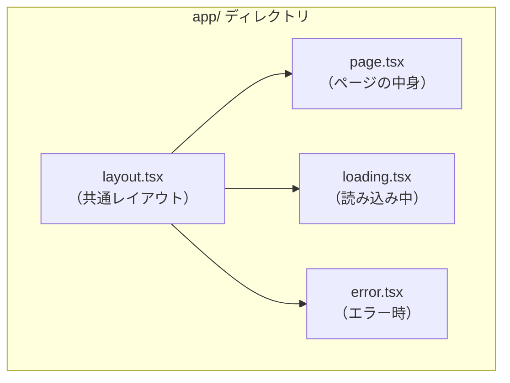

# Next.js のプロジェクト構成 — ファイル名がルーティングになる

## 今日のゴール

- Next.js の App Router で「ファイル = URL」になる仕組みを知る
- page.tsx, layout.tsx, loading.tsx, error.tsx の役割を知る
- なぜこのファイル規約が便利なのかを知る

## `app/` ディレクトリ = URL の構造

Next.js の App Router では、`app/` ディレクトリの中のフォルダ構造が**そのまま URL のパス**になります。

```
app/
├── page.tsx          → /
├── about/
│   └── page.tsx      → /about
├── blog/
│   ├── page.tsx      → /blog
│   └── [slug]/
│       └── page.tsx  → /blog/hello-world, /blog/my-first-post など
```

`app/about/page.tsx` を作れば `/about` というページができます。ルーティング設定ファイルを書く必要はありません。**ファイルを作ることがルーティングを定義すること**です。これを**ファイルベースルーティング**と呼びます。

## 特別なファイル名

Next.js は特定のファイル名に特別な意味を持たせています。

### page.tsx — ページの中身

URL にアクセスしたときに表示されるコンポーネントです。`page.tsx` がないフォルダは URL としてアクセスできません。

```tsx
// app/about/page.tsx
export default function AboutPage() {
  return <h1>このサイトについて</h1>;
}
```

### layout.tsx — 共通のレイアウト

そのフォルダ以下のすべてのページを囲むレイアウトです。ヘッダーやサイドバーなど、ページ間で共通する部分を定義します。

```tsx
// app/layout.tsx（ルートレイアウト）
export default function RootLayout({ children }: { children: React.ReactNode }) {
  return (
    <html lang="ja">
      <body>
        <header>サイト共通ヘッダー</header>
        <main>{children}</main>
        <footer>サイト共通フッター</footer>
      </body>
    </html>
  );
}
```

`{children}` の部分に、そのページの `page.tsx` が入ります。ページを遷移してもレイアウトは再レンダリングされません。

### loading.tsx — 読み込み中の表示

ページのデータ取得中に表示されるフォールバック UI です。

```tsx
// app/blog/loading.tsx
export default function Loading() {
  return <p>読み込み中...</p>;
}
```

`loading.tsx` を置くだけで、ページが読み込まれるまでの間、自動的にこのコンポーネントが表示されます。

### error.tsx — エラー時の表示

ページでエラーが発生したときに表示されるフォールバック UI です。

```tsx
// app/blog/error.tsx
"use client";

export default function Error({ error }: { error: Error }) {
  return <p>エラーが発生しました: {error.message}</p>;
}
```

`error.tsx` には `"use client"` が必要です（エラー時のリカバリーにはクライアント側の処理が必要なため）。

## ファイル規約のメリット



従来のフレームワークでは、ルーティングの定義、レイアウトの設定、ローディング状態の管理、エラーハンドリングをそれぞれ別の場所に書く必要がありました。

Next.js では**ファイルを置くだけ**でこれらが動きます。設定ファイルを書く代わりに、ファイル名がフレームワークとの約束になっているのです。

## まとめ

- Next.js の App Router では、`app/` のフォルダ構造がそのまま URL になります
- `page.tsx` がページ、`layout.tsx` が共通レイアウト、`loading.tsx` が読み込み中、`error.tsx` がエラー時の表示です
- ファイルを作ることがルーティングの定義であり、設定ファイルは不要です
