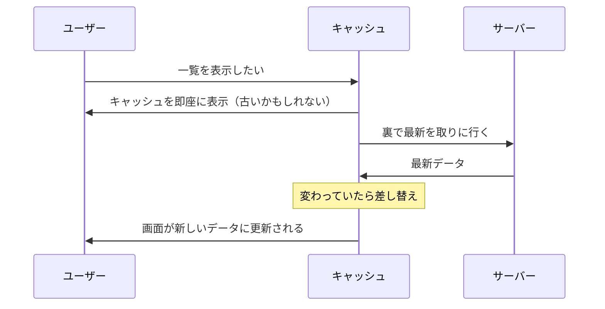

# データ取得ライブラリ — useEffect の fetch は何が辛いのか

## 今日のゴール

- useEffect で fetch を手書きすると隠れた穴が多いことを知る
- TanStack Query / SWR が「key 付きキャッシュ」で解決していると知る
- Next.js では「そもそもサーバーで取る」が第一候補だと知る

## データ取得の 2 つの書き方

「ユーザー一覧を API から取得して表示する」という、どこにでもある処理を例にします。1 つ目は `useEffect` と `fetch` で手書きする書き方です。

```tsx
import { useEffect, useState } from "react";

type User = { id: number; name: string };

function UserList() {
  const [users, setUsers] = useState<User[]>([]);
  const [isLoading, setIsLoading] = useState(true);
  const [error, setError] = useState<string | null>(null);

  useEffect(() => {
    fetch("/api/users")
      .then((res) => res.json())
      .then((data) => setUsers(data))
      .catch(() => setError("取得に失敗しました"))
      .finally(() => setIsLoading(false));
  }, []);

  if (isLoading) return <p>読み込み中...</p>;
  if (error) return <p role="alert">{error}</p>;
  return (
    <ul>
      {users.map((user) => (
        <li key={user.id}>{user.name}</li>
      ))}
    </ul>
  );
}
```

2 つ目は `useQuery` のようなデータ取得ライブラリを使う書き方です。手書き版でも一見動くのに、多くの現場がわざわざライブラリを入れているのは、手書きには**隠れた穴が多い**からです。

## 手書き版の問題

### 1. 同じ 3 つの state を毎回書く

データ・読み込み中・エラーの 3 つの state は、データ取得のたびに毎回必要です。取得が 10 か所あれば、ほぼ同じコードを 10 回書くことになります。

### 2. 画面を行き来するたびに取り直す

一覧画面から詳細画面へ移動して、また一覧に戻るとします。手書き版には前回の結果を覚えておく（キャッシュする）仕組みがないので、戻るたびに**ゼロから取得し直し**、「読み込み中...」がチラつきます。

### 3. 古い応答が新しい応答を上書きする — 競合

検索欄に「a」→「ab」と素早く打つと、リクエストが 2 本飛びます。ネットワークの状況次第では **「a」の結果が後から届き、「ab」の結果を上書き**することがあります。

画面は「ab」で検索したのに結果は「a」のもの、という分かりにくいバグです。手書きで防ぐには、リクエストの世代管理を自分で書く必要があります。

### 4. 同じデータを複数の場所で取るとリクエストも複数飛ぶ

ヘッダーとサイドバーが同じユーザー情報を使うと、手書きでは同じ API に 2 回リクエストが飛びます。

つまり手書き fetch の問題は「書けるかどうか」ではなく、**正しく書こうとすると考えることが多すぎる**ことです。

## ライブラリの答え — key 付きキャッシュ

TanStack Query（旧 React Query）で書き直すと、こうなります。

```tsx
import { useQuery } from "@tanstack/react-query";

type User = { id: number; name: string };

async function fetchUsers(): Promise<User[]> {
  const res = await fetch("/api/users");
  if (!res.ok) throw new Error("取得に失敗しました");
  return res.json();
}

function UserList() {
  const { data, isPending, error } = useQuery({
    queryKey: ["users"],     // このデータの「名前」
    queryFn: fetchUsers,     // 取得のしかた
  });

  if (isPending) return <p>読み込み中...</p>;
  if (error) return <p role="alert">{error.message}</p>;
  return (
    <ul>
      {data.map((user) => (
        <li key={user.id}>{user.name}</li>
      ))}
    </ul>
  );
}
```

設計の核心は、**取得したデータに `queryKey` という「名前」を付けてキャッシュする**ことです。この一手で、穴がまとめて塞がります。

| 穴 | ライブラリの解決 |
|----|----------------|
| 3 つの state の手書き | `data` / `isPending` / `error` が最初から付いてくる |
| 戻るたび取り直し | 同じ key のデータはキャッシュから即表示 |
| 競合 | key ごとにリクエストを管理し、古い応答を捨てる |
| 重複リクエスト | 同じ key の取得は 1 本にまとめられる |

### 「古いまま」にならない工夫 — stale-while-revalidate

キャッシュには「古くなる」問題が付きものです。ライブラリは、**キャッシュをまず即座に表示し、裏で取得し直して、変わっていたら差し替える**という戦略を取ります。



ユーザーは待たされず、データは勝手に新しくなります。この戦略は **stale-while-revalidate**（古いものを出しつつ再検証する）と呼ばれます。

もう 1 つの定番ライブラリ **SWR** の名前は、この頭文字から来ています。両者は考え方がほぼ同じで、TanStack Query が多機能、SWR が軽量という住み分けです。

## Next.js では「そもそもサーバーで取る」が先

ここまでの話には前提があります。これは**ブラウザ側（クライアント）でデータを取る場合**の話です。

現在の Next.js では、最初に表示するデータは**サーバー側で取得して HTML に焼き込む**のが第一候補です。サーバーで取れば、読み込み中表示もキャッシュ管理もブラウザ側には不要になります。

クライアント取得が向くのは、**表示後にユーザーの操作で変わり続けるデータ**です。

- 検索・絞り込みの結果
- 定期的に更新したいデータ（通知、ダッシュボード）
- 無限スクロールの続き

AI が書いたデータ取得のコードを評価する観点は 2 つです。「**そもそもサーバーで取れないか**」、クライアントで取るなら「**ライブラリを使わない理由はあるか**」。

この 2 つを問うだけで、データ取得の設計はかなり引き締まります。AI に取得コードを頼むときの指示にも、そのまま使えます。

## まとめ

- 手書き fetch の穴は、3 つの state の手書き・再取得のチラつき・競合・重複リクエスト
- ライブラリは key 付きキャッシュで穴をまとめて塞ぐ
- stale-while-revalidate は即表示して裏で更新する戦略で、SWR の名前の由来
- Next.js ではまずサーバー取得で、クライアント取得なら手書きよりライブラリ
