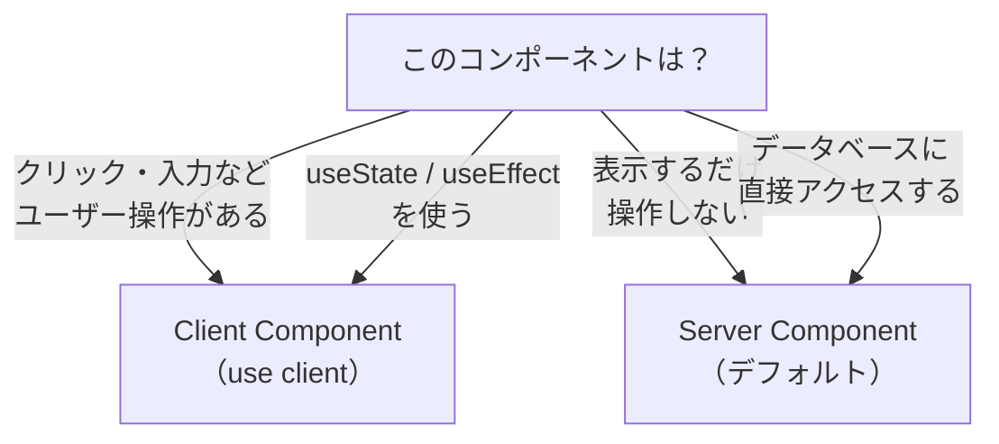

# Server Components と Client Components — `"use client"` の意味

## 今日のゴール

- Next.js のコンポーネントはデフォルトでサーバーで実行されることを知る
- `"use client"` を付けるとブラウザで実行されることを知る
- どちらを使うかの判断基準を知る

## Next.js のコンポーネントはサーバーで動く

Next.js の App Router では、コンポーネントは**デフォルトでサーバー上で実行**されます。これを **Server Component** と呼びます。

```tsx
// app/page.tsx — これは Server Component
export default function Home() {
  console.log("ここはサーバーで実行される");
  return <h1>ホームページ</h1>;
}
```

この `console.log` は、ブラウザのコンソールには表示されません。**サーバーのターミナルに表示**されます。コンポーネントがサーバーで実行され、生成された HTML だけがブラウザに送られるからです。

ブラウザには JavaScript が送られないので、ページの読み込みが速くなります。

## ボタンをクリックしようとすると動かない

Server Component に `onClick` を付けてみます。

```tsx
// app/page.tsx — Server Component
export default function Home() {
  const handleClick = () => {
    alert("クリックされました");
  };

  return <button onClick={handleClick}>押してください</button>;
}
```

これは**エラーになります**。

Server Component はサーバーで実行されて HTML を生成するだけです。生成された HTML がブラウザに送られますが、`onClick` を処理する JavaScript はブラウザに送られません。クリックイベントを処理するには、ブラウザで JavaScript が動く必要があります。

## `"use client"` — ブラウザで動かす宣言

`onClick`、`useState`、`useEffect` など、ブラウザでの操作が必要なコンポーネントには `"use client"` を付けます。

```tsx
// app/components/LikeButton.tsx
"use client";

import { useState } from "react";

export default function LikeButton() {
  const [count, setCount] = useState(0);

  return (
    <button onClick={() => setCount(count + 1)}>
      ♥ {count}
    </button>
  );
}
```

`"use client"` を付けたコンポーネントは **Client Component** になります。JavaScript がブラウザに送られ、`onClick` や `useState` が動きます。

## 判断基準 — サーバーかクライアントか



| | Server Component | Client Component |
|---|---|---|
| デフォルト | ✅ 何も書かなければこちら | `"use client"` が必要 |
| JavaScript がブラウザに送られるか | ❌ 送られない | ✅ 送られる |
| useState, useEffect | ❌ 使えない | ✅ 使える |
| onClick, onChange | ❌ 使えない | ✅ 使える |
| データベース/ファイルに直接アクセス | ✅ できる | ❌ できない |

**基本方針: できるだけ Server Component のままにする**。`onClick` や `useState` が必要な部分だけを Client Component にします。ページ全体ではなく、インタラクティブな部品だけを `"use client"` にするのが Next.js の設計意図です。

## Server Component の中に Client Component を置く

ページ全体を Client Component にする必要はありません。Server Component の中に Client Component を部品として配置できます。

```tsx
// app/page.tsx — Server Component
import LikeButton from "./components/LikeButton";

export default function BlogPost() {
  return (
    <article>
      <h1>記事のタイトル</h1>
      <p>記事の本文...</p>
      <LikeButton />  {/* この部品だけ Client */}
    </article>
  );
}
```

ページの大部分（タイトル、本文）は Server Component として HTML だけが送られ、「いいね」ボタンだけが Client Component として JavaScript が送られます。

## まとめ

- Next.js のコンポーネントはデフォルトで**Server Component**（サーバーで実行、JS をブラウザに送らない）
- `onClick`, `useState`, `useEffect` が必要なコンポーネントに `"use client"` を付けると **Client Component** になる
- できるだけ Server Component のまま、インタラクティブな部品だけを Client Component にする
- Server Component の中に Client Component を配置できる
