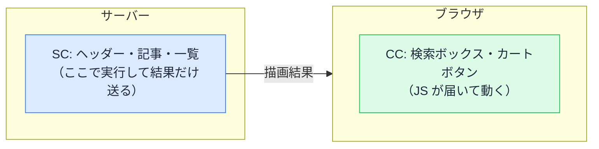

# Server Components と Client Components — "use client" は何の宣言か

## 今日のゴール

- コンポーネントが「サーバーで動く」「ブラウザでも動く」の 2 種類に分かれたことを知る
- なぜデフォルトがサーバーなのかを説明できるようになる
- "use client" が「ここから先はブラウザ側」という境界宣言だと知る

## ファイルの先頭にある "use client"

AI に Next.js のアプリを作らせると、ファイルの先頭にこの 1 行が入っていることがあります。

```tsx
"use client";

import { useState } from "react";

export function Counter() {
  const [count, setCount] = useState(0);
  return <button onClick={() => setCount(count + 1)}>{count}</button>;
}
```

この `"use client"` を消すとエラーになるファイルもあれば、付いていないファイルもある。何を区別しているのでしょうか。

これは現在の React / Next.js の根幹である、**コンポーネントの 2 種類の区別**です。

## コンポーネントは 2 種類ある

| | Server Components（SC） | Client Components（CC） |
|---|------------------------|------------------------|
| 実行される場所 | **サーバーだけ** | サーバーとブラウザの両方 |
| JavaScript のブラウザへの配信 | **されない** | される |
| できること | データ取得、秘密情報の利用 | クリック対応、state、ブラウザ API |
| Next.js でのデフォルト | **こちら** | `"use client"` を付けたときだけ |

最大のポイントは、Server Components の JavaScript は**ブラウザに一切送られない**ことです。サーバーで実行された結果（描画済みの内容）だけが届きます。

## なぜデフォルトがサーバーなのか

「画面の部品なんだから、ブラウザで動くのが当然では？」という感覚に対して、現在の React は「**ほとんどの部品は、ブラウザで動く必要がない**」という発見を突きつけました。

ページを見渡すと、ヘッダーのロゴ、記事の本文、商品の説明文、フッター。**ユーザーが操作しない部分が大半**です。操作しない部品のコードをブラウザに送って実行させるのは、ただの無駄でした。

サーバーで実行する部品をデフォルトにすると、利点が連鎖します。

- **ブラウザに送る JavaScript が激減する**: 操作する部品の分だけ送ればいい。読み込みが速くなる
- **データのすぐ隣で実行できる**: データベースや API とサーバー内で直接やり取りでき、往復が減る
- **秘密を持てる**: API キーやデータベース接続情報は、コードがブラウザに送られない SC でだけ安全に使える



## "use client" — ここから先はブラウザ側

とはいえ、クリックに反応する部品は**ブラウザで動く JavaScript が必要**です。`useState` も `onClick` も、ユーザーの手元で動いてこそ意味があります。

そこで `"use client"` です。これは「このファイルから先は Client Components です」という**境界の宣言**です。

```tsx
"use client"; // ← この宣言が必要な目印は、だいたいこの 3 つ

// 1. useState / useEffect などの hook
// 2. onClick / onChange などのイベントハンドラ
// 3. window / localStorage などのブラウザ専用 API
```

逆に言うと、この 3 つを使っていないコンポーネントは SC のままでよく、宣言は不要です。

### 境界は import を通じて「伝染する」

`"use client"` で重要なのは、**ファイル単位ではなく境界だ**ということです。`"use client"` を書いたファイルが import しているものは、**芋づる式にすべてブラウザ行きのコードになります**。

```
page.tsx（SC）
└─ SearchBox.tsx（"use client" ← ここが境界）
   ├─ Input.tsx（宣言なしでも CC 扱い）
   └─ heavy-lib（これもブラウザに送られる）
```

だから境界をどこに引くかで、ブラウザに送られる量が変わります。理想は「**木の葉っぱ（末端の小さな部品）にだけ境界を引く**」ことです。

### AI のコードあるある — 上のほうに "use client"

AI はエラーを手早く消すため、**ページの大元のファイルに `"use client"` を付けてしまう**ことがあります。動きはしますが、そのページの部品が芋づる式に全部ブラウザ行きになり、SC の利点（送る JS が少ない・サーバーでデータ取得できる）が丸ごと消えます。

`"use client"` がページの上位ファイルに付いていたら、「**操作が必要な部分だけ別ファイルに切り出して、そこに付けられない？**」と聞いてみてください。これだけで構成が大きく改善することがあります。

### SC を CC の中に「挟む」ことはできる

「CC の中では SC が使えない」と言われますが、正確には**children として渡すことはできます**。

```tsx
// page.tsx（SC）
import { ThemeProvider } from "./theme-provider"; // CC
import { Article } from "./article";              // SC

export default function Page() {
  return (
    <ThemeProvider>
      <Article /> {/* CC の中に SC を挟めている */}
    </ThemeProvider>
  );
}
```

CC（ThemeProvider）から見ると、children は「もう描画された中身を受け取って配置するだけ」なので、サーバーで実行済みの SC をそのまま挟めるのです。AI が「Provider で囲んだから全部 CC にしないと」と言い出したら、この形を思い出してください。

## まとめ

- コンポーネントは SC（サーバーだけ）と CC（ブラウザでも）の 2 種類。デフォルトは SC
- 操作しない部品が大半だから、JS を送らない SC が標準になった
- "use client" は境界宣言。import 先まで芋づる式にブラウザ行きになる
- 境界は葉っぱに引く。上位ファイルの "use client" は要注意
