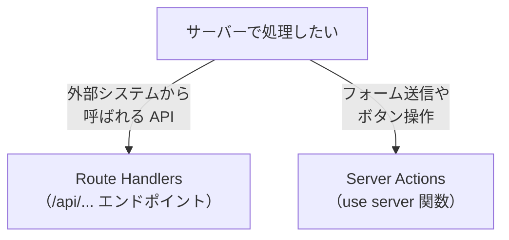

# Route Handlers と Server Actions — サーバー処理の 2 つの方法

## 今日のゴール

- Route Handlers で API エンドポイントを作れることを知る
- Server Actions で関数呼び出しのようにサーバー処理を実行できることを知る
- 2 つの使い分けを知る

## サーバーで処理を実行したい

Web アプリでは、ブラウザだけでなくサーバーで処理を実行したい場面があります。

- ユーザー登録のデータをデータベースに保存する
- 外部 API にリクエストを送る（API キーをブラウザに渡したくない）
- ファイルをアップロードする

Next.js には、サーバー処理を書く方法が 2 つあります。**Route Handlers** と **Server Actions** です。

## Route Handlers — API エンドポイントを作る

`app/api/` フォルダに `route.ts` ファイルを作ると、API エンドポイントになります。

```typescript
// app/api/users/route.ts
import { NextResponse } from "next/server";

export async function GET() {
  const users = await db.user.findMany();
  return NextResponse.json(users);
}

export async function POST(request: Request) {
  const body = await request.json();
  const user = await db.user.create({ data: body });
  return NextResponse.json(user, { status: 201 });
}
```

- `GET` 関数をエクスポートすると `GET /api/users` に対応
- `POST` 関数をエクスポートすると `POST /api/users` に対応

ファイル名が `route.ts` であること、関数名が HTTP メソッドと一致することがルールです。

クライアントからは `fetch` で呼び出します。

```tsx
const res = await fetch("/api/users", {
  method: "POST",
  body: JSON.stringify({ name: "田中" }),
});
```

## Server Actions — 関数呼び出しでサーバー処理

Server Actions は、React 19 で追加された仕組みです。**サーバーで実行される関数を、クライアントから直接呼び出せます**。

```tsx
// app/actions.ts
"use server";

export async function createUser(formData: FormData) {
  const name = formData.get("name") as string;
  await db.user.create({ data: { name } });
}
```

```tsx
// app/page.tsx
import { createUser } from "./actions";

export default function CreateUserForm() {
  return (
    <form action={createUser}>
      <input name="name" placeholder="名前" required />
      <button type="submit">作成</button>
    </form>
  );
}
```

`"use server"` が付いた関数は、サーバーで実行されます。`<form action={createUser}>` と書くだけで、フォーム送信時にサーバーの `createUser` が呼ばれます。API エンドポイントを作る必要がありません。

## 2 つの違い

| | Route Handlers | Server Actions |
|---|---|---|
| ファイル | `app/api/.../route.ts` | `"use server"` 付きの関数 |
| 呼び出し方 | `fetch("/api/...")` | `<form action={関数}>` や直接呼び出し |
| 用途 | 外部から呼ばれる API、Webhook | フォーム送信、ボタンクリック |
| HTTP メソッドの制御 | GET/POST/PUT/DELETE を自分で定義 | 自動（POST が使われる） |



## 使い分けの基準

**Server Actions を使う場面**:
- フォームの送信（ユーザー登録、設定変更）
- ボタン操作に応じたサーバー処理（いいね、削除）
- アプリ内部のサーバー処理全般

**Route Handlers を使う場面**:
- 外部のシステムからアクセスされる API（Webhook、モバイルアプリ向け API）
- GET リクエストで JSON を返す公開 API

Next.js のアプリ内の処理は Server Actions で済むことが多く、Route Handlers は「外部に公開する API が必要なとき」に使います。

## まとめ

- **Route Handlers** は `app/api/.../route.ts` に HTTP メソッドごとの関数をエクスポートして API エンドポイントを作る仕組みです
- **Server Actions** は `"use server"` 付きの関数で、`<form action>` やイベントハンドラから直接サーバー処理を呼び出す仕組みです
- アプリ内のフォーム送信や操作には Server Actions、外部向け API には Route Handlers が基本の使い分けです
