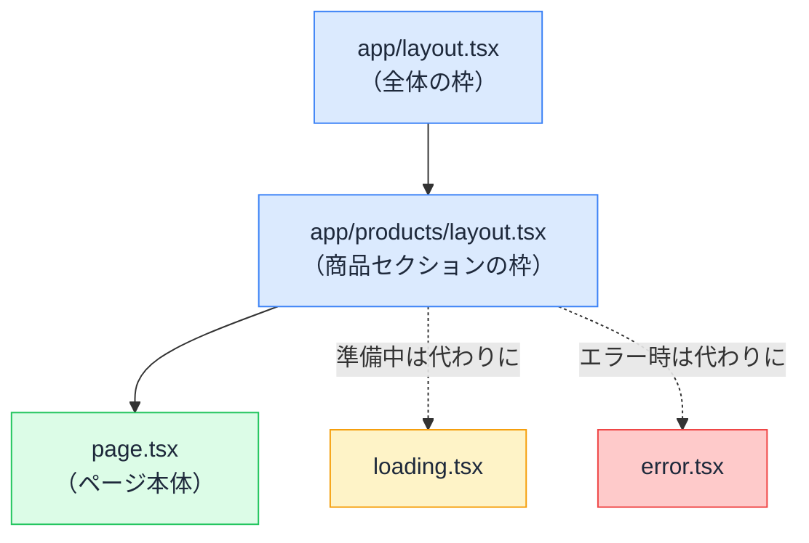

# App Router のファイル規約 — ファイル名が UI の骨格を決める

## 今日のゴール

- フォルダ構成がそのまま URL になることを知る
- page / layout / loading / error の役割分担を知る
- layout が「再レンダリングされない枠」だと知る

## どのプロジェクトでも同じ顔ぶれ

AI に Next.js のアプリを作らせると、`app/` ディレクトリには決まった名前のファイルが並びます。

```
app/
├─ layout.tsx
├─ page.tsx
├─ loading.tsx
├─ error.tsx
└─ products/
   ├─ page.tsx
   └─ layout.tsx
```

`page.tsx` がいくつもある。`layout.tsx` も複数。これは AI の癖ではなく、Next.js の **App Router** の規約です。**ファイル名そのものが機能を持ち**、置いた場所で URL と画面の骨格が決まります。

## フォルダ = URL

まず大原則です。`app/` の中の**フォルダ構成が、そのまま URL の構造になります**。

| ファイルの場所 | 対応する URL |
|---------------|-------------|
| `app/page.tsx` | `/` |
| `app/products/page.tsx` | `/products` |
| `app/products/new/page.tsx` | `/products/new` |

ページを増やしたいときは、フォルダを掘って `page.tsx` を置く。ルーティングの設定ファイルはありません。**ディレクトリがルーティング設定そのもの**です。

ちなみにフォルダ名を `[id]` のように角括弧にすると、`/products/123` の `123` の部分を受け取る「変数のページ」になります（今日は名前の紹介だけにとどめます）。

## 役割を持つファイルたち

同じフォルダに置く特別なファイル名は、まずこの 4 つを覚えれば十分です。

| ファイル名 | 役割 | いつ表示されるか |
|-----------|------|----------------|
| `page.tsx` | **ページ本体** | URL にアクセスしたとき |
| `layout.tsx` | **共通の枠**（ヘッダーやサイドバー） | 配下のページすべてを包む |
| `loading.tsx` | **読み込み中の表示** | page の準備ができるまでの間、自動で |
| `error.tsx` | **エラー時の表示** | 配下でエラーが起きたとき、自動で |

### layout — ページを包む再レンダリングされない枠

`layout.tsx` は、同じフォルダ以下のすべてのページを包む枠です。ページ本体を `children` として受け取ります。

```tsx
// app/products/layout.tsx
export default function ProductsLayout({
  children,
}: {
  children: React.ReactNode;
}) {
  return (
    <div>
      <nav aria-label="商品メニュー">{/* カテゴリ一覧など */}</nav>
      <main>{children}</main> {/* ここに各ページが入る */}
    </div>
  );
}
```

layout は**入れ子**になります。`app/layout.tsx`（全体の枠）の中に `app/products/layout.tsx`（商品セクションの枠）、その中に各ページ。マトリョーシカ構造です。

重要な性質が 1 つ。**ページを移動しても、共通の layout は再レンダリングされません**。`/products/1` から `/products/2` へ移動したとき、入れ替わるのは `page.tsx` の部分だけで、枠は表示も内部の状態もそのまま残ります。サイドバーのスクロール位置や開閉状態がページ移動で消えないのは、この性質のおかげです。

### loading — 置くだけで出る「読み込み中」

```tsx
// app/products/loading.tsx
export default function Loading() {
  return <p aria-live="polite">商品を読み込んでいます...</p>;
}
```

`loading.tsx` をフォルダに置くと、そのフォルダの page の準備中（データ取得中など）、**自動でこれが表示されます**。表示の切り替えコードはどこにも書きません。「ファイルを置く」ことが「読み込み中の UI を設定する」操作になっています。

### error — 置くだけで効く安全網

```tsx
// app/products/error.tsx
"use client"; // error.tsx は必ず Client Component にする規約

export default function Error({ reset }: { reset: () => void }) {
  return (
    <div role="alert">
      <p>商品の表示中に問題が発生しました。</p>
      <button onClick={() => reset()}>もう一度試す</button>
    </div>
  );
}
```

`error.tsx` を置いたフォルダの配下でエラーが起きると、画面全体が壊れる代わりに**そのフォルダの範囲だけがこの表示に差し替わります**。受け取れる `reset` は「再試行」の関数です。エラーへの反応（ボタンのクリック）が必要なので、`"use client"` が必須という規約になっています。

## 骨格は「重ね合わせ」で決まる

4 つのファイルの関係を 1 枚にすると、こうなります。



この規約の何がうれしいのか。**どのプロジェクトでも構造の読み方が同じ**になることです。初めて見るリポジトリでも、`app/` を眺めれば URL 構造・共通の枠・ローディングとエラーの守備範囲まで読み取れます。AI への指示も「`/products` 配下に loading.tsx を足して」のように、ファイル名で正確に伝えられます。

逆に、AI が `page.tsx` の中に手書きの「読み込み中」分岐やエラー分岐を入れていたら、「それは loading.tsx / error.tsx の仕事では？」と聞く価値があります。規約に乗ると、コードは短く、挙動は揃います。

## まとめ

- フォルダ構成がそのまま URL で、ルーティング設定ファイルは存在しない
- page は本体、layout は包む枠、loading / error は置くだけで効く差し替え画面
- layout はページ移動で再レンダリングされず、状態が残る
- 手書きの読み込み・エラー分岐を見たら、規約ファイルに寄せられないか疑う
