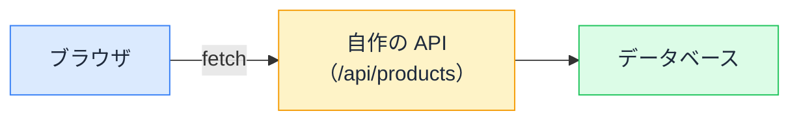

# Server Components でのデータ取得 — async なコンポーネントの衝撃

## 今日のゴール

- Server Components が「async にして直接 await する」だけでデータを取れることを知る
- API を経由しない取得が成立する理由を知る
- 取得の並び方（ウォーターフォール）に気を配れるようになる

## コンポーネントに async が付いている

AI に Next.js でデータ表示のページを作らせると、こんなコードが出てきます。

```tsx
// app/products/page.tsx（Server Component）
type Product = { id: number; name: string; price: number };

export default async function ProductsPage() {
  const res = await fetch("https://api.example.com/products");
  if (!res.ok) throw new Error("商品の取得に失敗しました"); // error.tsx が拾う
  const products: Product[] = await res.json();

  return (
    <ul>
      {products.map((p) => (
        <li key={p.id}>
          {p.name}: ¥{p.price.toLocaleString()}
        </li>
      ))}
    </ul>
  );
}
```

`async function` のコンポーネントが、**本文でいきなり `await fetch`** しています。useEffect も useState も、読み込み中フラグもありません。

ブラウザで動くコンポーネントでは、これは不可能でした。レンダリングは「いま画面を描く」仕事で、何秒もかかる通信を待てないからです。なぜ Server Components では許されるのでしょうか。

## サーバーでなら「待ってから描く」ができる

Server Components は**サーバーの中で実行され、描画結果だけがブラウザへ届きます**。実行の場がサーバーにあることで、時間の使い方が根本的に変わります。

- ブラウザでの描画は「ユーザーが画面の前で待っている」ので、待てない
- サーバーでの描画は「**データが揃ってから結果を送ればいい**」ので、待てる

だから Server Components は async にでき、本文で堂々と await できます。「データを取得してから、その結果で JSX を組み立てて返す」が、1 つの関数に素直に書けるのです。

さらに、待っている間ユーザーを退屈させない仕組みも揃っています。同じフォルダに `loading.tsx` を置けば、サーバーがデータを待つ間、自動でそちらが表示されます。

## API を作らなくていい、という転換

ブラウザからデータを取る構成では、間に「ブラウザから呼べる API」が必要でした。



Server Components は最初からサーバーで動いているので、**中間の API を省略してデータ源に直接アクセスできます**。

```tsx
import { db } from "@/lib/db"; // データベースに接続するライブラリ

export default async function ProductsPage() {
  // SQL やデータベース用ライブラリで直接取得してよい
  const products = await db.product.findMany();

  return <ul>{products.map((p) => <li key={p.id}>{p.name}</li>)}</ul>;
}
```

このコードはブラウザに送られないので、データベースの接続情報や API キーが漏れる心配もありません。「画面のためだけの中継 API」を作って・型を合わせて・保守する、という一連の作業が丸ごと消えます。

## URL の値を受け取る — params と searchParams

「`/products/123` の 123 を使って取得したい」という場面では、page が props で受け取れます。Next.js 16 では**どちらも Promise なので await が必要**です。

```tsx
// app/products/[id]/page.tsx
export default async function ProductPage({
  params,
}: {
  params: Promise<{ id: string }>;
}) {
  const { id } = await params; // Next.js 16 では await して取り出す
  const res = await fetch(`https://api.example.com/products/${id}`);
  const product = await res.json();

  return <h1>{product.name}</h1>;
}
```

検索条件などの `?sort=price` は、同様に `searchParams` で受け取ります。AI が古い書き方（await なしで `params.id`）を出してきたら、現在は Promise になっていることを思い出してください。

## 直列待ちに注意

await は書いた順に**待ち行列**を作ります。無関係な取得を縦に並べると、時間が足し算になります。

```tsx
// ❌ ウォーターフォール: 合計 = 商品 1 秒 + お知らせ 1 秒 = 2 秒
const products = await fetchProducts();
const news = await fetchNews();
```

```tsx
// ✅ 並列: 同時に始めて、両方揃うのを待つ。合計 ≒ 1 秒
const [products, news] = await Promise.all([fetchProducts(), fetchNews()]);
```

この「滝のように上から順に待つ」状態は**ウォーターフォール**と呼ばれ、ページが遅い原因の定番です。AI のコードで `await` が縦に並んでいたら、「**この 2 つは互いに無関係では？ 並列にできない？**」と見るのが、今日からできるレビューです（後の取得が前の結果を使うなら、直列で正しいケースです）。

## クライアント取得との住み分け

すべてを Server Components で取るわけではありません。役割分担はシンプルです。

| データ | 取り方 |
|--------|--------|
| 最初の表示に必要なもの | **Server Components で await** |
| 表示後にユーザー操作で変わるもの（検索、無限スクロール） | Client Components + データ取得ライブラリ |

「まずサーバーで取る。操作で動くものだけクライアント」。AI への指示もこの言葉で出せます。

## まとめ

- SC はサーバーで「データが揃ってから描く」ので、async + await が書ける
- 中継 API を省略してデータ源へ直接アクセスできる。秘密情報も漏れない
- params / searchParams は Promise。await で取り出す（Next.js 16）
- 無関係な await の縦並び（ウォーターフォール）は Promise.all で並列に
