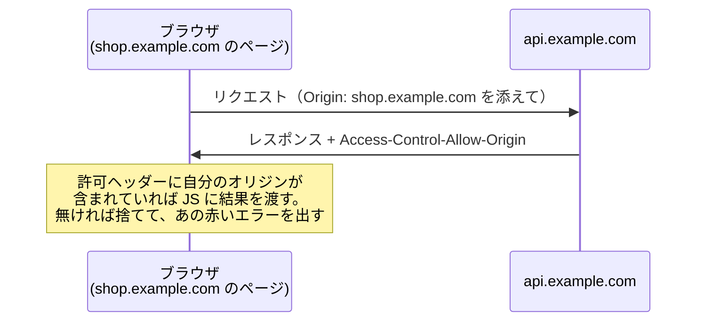

# CORS — なぜブラウザだけが別ドメインの API を拒むのか

## 今日のゴール

- 同一オリジンポリシーが「ブラウザの」防御だと知る
- CORS がサーバー側の「許可の表明」だと知る
- Server Components の fetch なら CORS が起きない理由を説明できるようになる

## 開発者が必ず一度は会うエラー

ブラウザで外部の API を呼ぶと、コンソールが赤くなることがあります。

```
Access to fetch at 'https://api.example.com/data' from origin
'http://localhost:3000' has been blocked by CORS policy
```

同じ URL をブラウザのアドレスバーに打てば普通に見られるのに、**自分のアプリの fetch からだけ拒否される**。AI に聞くと「CORS の設定をしましょう」と返ってきますが、このブロックの仕組みを理解するには、まず「オリジン」という単位を知る必要があります。

## 出発点 — オリジンという単位

ブラウザは Web ページを**オリジン**という単位で区別します。オリジンは URL の 3 つの部品の組です。

```
https://shop.example.com:443
└─┬─┘  └────────┬───────┘└┬┘
スキーム      ホスト       ポート
```

3 つすべてが一致して、初めて「同じオリジン」です。`http://localhost:3000` と `https://api.example.com` は別オリジン。`localhost:3000` と `localhost:8080` も別オリジンです。

## 同一オリジンポリシー — ブラウザの防御本能

ブラウザには大原則があります。**あるオリジンのページの JavaScript から、別のオリジンへのリクエストの結果を勝手に読ませない**。これが**同一オリジンポリシー**です。

なぜこんな不便な制限があるのか。無いと、こんな攻撃が成立するからです。

1. あなたは銀行のサイトにログインしている（ブラウザに銀行のログイン状態が保存されている）
2. 悪意あるサイト `evil.example` を開いてしまう
3. そのページの JavaScript が `fetch("https://bank.example/api/残高")` を実行する
4. ブラウザは律儀に銀行のログイン状態を添えて送信し、**あなたの残高が evil.example の手に渡る**

同一オリジンポリシーは、この 4 をブロックします（現在のブラウザは Cookie の送信自体にも別の防御を重ねていますが、防御の発想はこの通りです）。重要なのは、これが**ブラウザの中だけの防御**だということです。守っているのは「ブラウザに保存されたあなたのログイン状態が、悪意あるページに悪用されること」からです。

## CORS — サーバーが出す「許可証」

とはいえ、正当な理由で別オリジンの API を呼びたい場面は山ほどあります。そこで作られた緩和の仕組みが **CORS**（Cross-Origin Resource Sharing、オリジンをまたぐ資源共有）です。

仕組みはシンプルで、**呼ばれる側のサーバーが「このオリジンからなら読ませてよい」とレスポンスのヘッダーで表明**します。

```
Access-Control-Allow-Origin: https://shop.example.com
```

流れはこうです。



つまり CORS エラーの正体は、「**呼ばれた側のサーバーが、あなたのオリジンに許可を出していない**」です。検閲しているのはブラウザ、許可を出すのはサーバー。**ブラウザ側のコードをどういじっても解決しない**のはこのためです。

::: tip プリフライトリクエスト
データを変更するようなリクエストでは、ブラウザは本番の前に「この内容を送ってもいいですか」と確認の便（**プリフライトリクエスト**、OPTIONS メソッド）を先に送ります。Network タブで本番と別に OPTIONS が飛んでいるのは、この事前確認です。
:::

## サーバー同士の通信に CORS は無い

ここが今日いちばん持ち帰ってほしい点です。同一オリジンポリシーは**ブラウザの**防御なので、**サーバーからサーバーへの fetch にはそもそも適用されません**。

Next.js の Server Components でのデータ取得を思い出してください。あの fetch は**サーバーの中**で実行されます。


ブラウザは自分のアプリ（同一オリジン）としか話しておらず、外部 API へはサーバーが代わりに出向く。この構成なら **CORS エラーは構造的に発生しません**。

AI に「CORS エラーが出た」と相談すると、プロキシの設定や複雑な回避策を提案してくることがあります。その前に問うべきは「**この fetch はブラウザでやる必要があるか？ サーバー側（Server Components）に移せないか？**」です。移せるなら、エラーは消え、API キーも隠せて一石二鳥です。

## 対処の整理

CORS エラーに出会ったときの選択肢を、考える順に並べます。

1. **fetch をサーバー側に移す**: Server Components で取得する。Next.js ならまずこれ
2. **API 側に許可してもらう**: 自社の API なら `Access-Control-Allow-Origin` に自分のオリジンを追加してもらう
3. **どうしてもブラウザから外部 API を直接呼ぶ**: 自分のサーバーに中継役を作る（その API が公開を想定しているかは要確認）

CORS はログイン状態を守る門番であり、門を通る用事はなるべくサーバーに任せるのが定石です。

## まとめ

- オリジン = スキーム + ホスト + ポート。同一オリジンポリシーはブラウザの防御
- CORS エラー = 呼ばれた側のサーバーが許可ヘッダーを出していない。直すのはサーバー側
- サーバー間の通信に CORS は無い。SC の fetch なら構造的に起きない
- 「その fetch、ブラウザでやる必要ある？」が最初の問い
