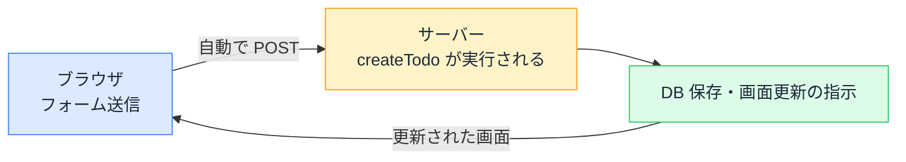

# Server Actions とフォーム — action に関数を渡すという発想

## 今日のゴール

- Server Actions が「フォームから直接呼べるサーバーの関数」だと知る
- "use server" と FormData による値の受け取りを知る
- useActionState で結果と送信中状態を画面に返せることを知る

## onSubmit が無いフォーム

AI に Next.js でフォームを作らせると、見慣れない形のコードが出てきます。

```tsx
// app/todos/page.tsx（Server Component）
import { createTodo } from "./actions";

export default function TodosPage() {
  return (
    <form action={createTodo}>
      <label>
        やること
        <input name="title" required />
      </label>
      <button type="submit">追加</button>
    </form>
  );
}
```

`onSubmit` がありません。`e.preventDefault()` も `fetch` もありません。代わりに `action={createTodo}` と、**関数がそのまま渡されています**。

HTML の `<form action="...">` は本来「送信先の URL」を書く場所でした。フォームはもともと、JavaScript なしでサーバーにデータを送れる仕組みです。Next.js の **Server Actions** は、その古典的な仕組みを現代化したものです。**URL の代わりに「サーバーで動く関数」を直接指定する**。これが今日の主役です。

## "use server" — フォームから呼べるサーバーの関数

渡している `createTodo` の定義はこうです。

```ts
// app/todos/actions.ts
"use server";

import { db } from "@/lib/db";
import { revalidatePath } from "next/cache";

export async function createTodo(formData: FormData) {
  const title = formData.get("title") as string;

  await db.todo.create({ data: { title } }); // データベースに直接保存

  revalidatePath("/todos"); // 一覧の表示を更新する合図
}
```

`"use server"` は「このファイルの関数は**サーバーでだけ実行される**」という宣言です。Client Components の境界を宣言する `"use client"` と対になっています。

仕組みはこうなっています。



- ビルド時に、この関数への「呼び出し口」が自動で作られる
- フォームが送信されると、Next.js が自動でサーバーに POST し、関数を実行する
- 開発者は **API を作らず、fetch も書かず、サーバーの処理を「関数を呼ぶ」感覚で書ける**

### 値は name 属性で届く

関数が受け取る `FormData` は、フォームの入力値の入れ物です。**どの値がどの名前で入るかは、input の `name` 属性で決まります**。`formData.get("title")` が取れるのは、`<input name="title">` があるからです。

state で入力値を管理していない（非制御の）素朴なフォームでよい、というのもポイントです。送信時に値が揃っていればいいので、1 文字ごとの再レンダリングもありません。

## useActionState — 結果を画面に返す

保存するだけなら上で完成ですが、実際は「エラーメッセージを出したい」「送信中はボタンを無効にしたい」が必要です。それを担うのが React の `useActionState` です。

```ts
// app/todos/actions.ts
"use server";

export type FormState = { message: string };

export async function createTodo(
  prevState: FormState,
  formData: FormData,
): Promise<FormState> {
  const title = formData.get("title") as string;

  if (title.trim() === "") {
    return { message: "やることを入力してください" }; // 結果を返せる
  }

  await db.todo.create({ data: { title } });
  revalidatePath("/todos");
  return { message: "追加しました" };
}
```

```tsx
// todo-form.tsx
"use client";

import { useActionState } from "react";
import { createTodo, type FormState } from "./actions";

const initialState: FormState = { message: "" };

export function TodoForm() {
  const [state, formAction, isPending] = useActionState(createTodo, initialState);

  return (
    <form action={formAction}>
      <label>
        やること
        <input name="title" required />
      </label>
      <button type="submit" disabled={isPending}>
        {isPending ? "追加中..." : "追加"}
      </button>
      <p aria-live="polite">{state.message}</p>
    </form>
  );
}
```

`useActionState` は 3 つを返します。

| 戻り値 | 役割 |
|--------|------|
| `state` | アクションが**最後に return した値**（エラーメッセージなど） |
| `formAction` | form の `action` に渡す、包み直されたアクション |
| `isPending` | **送信中かどうか**。ボタンの無効化や文言切り替えに |

サーバーの関数が `return` した値が、そのままクライアントの `state` に現れる。サーバーとブラウザの往復が、関数の引数と戻り値という**普通のプログラミングの形**に畳み込まれています。

メッセージ表示の `aria-live="polite"` は、画面を見ていない（読み上げで使っている）人にも結果の変化を伝えるための属性です。結果メッセージにはセットで付ける習慣にしておくと良いです。

## 1 つだけ忘れてはいけないこと — これは公開された入口

Server Actions は手軽ですが、実体は**インターネットに公開された呼び出し口**です。フォームを経由せずに直接呼び出すことも技術的には可能なので、「画面側でボタンを隠したから安全」は通用しません。

- ログインが必要な操作なら、**アクションの中で**認証を確認する
- 受け取った値は、**アクションの中で**検証する（`required` などの画面側の検証は突破できる）

AI が生成した Server Action に認証チェックも値の検証も無かったら、それは「鍵のかかっていない裏口」です。「このアクション、直接呼ばれても大丈夫？」が合言葉です。

## まとめ

- Server Actions = form の action に渡せるサーバーの関数。"use server" で宣言
- 値は input の name 属性 → FormData で届く。API も fetch も書かない
- useActionState が「結果の state」「送信中の isPending」を画面に返す
- 実体は公開エンドポイント。認証と検証はアクションの中で
