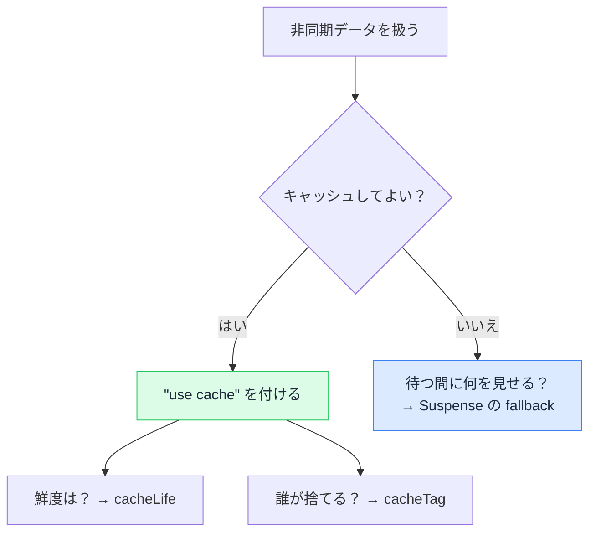

# キャッシュの新モデル — 隠れていた判断が自分の手に出てくる

## 今日のゴール

- 従来モデルの「暗黙の判定」と「ページ単位」が何を困らせていたか分かる
- 新モデルが開発者に渡す 4 つの判断を知る
- その判断を表す語彙（use cache / cacheLife / cacheTag / Suspense）を読める

::: info このレッスンの前提（新モデル）
ここで扱うのは `next.config.ts` に `cacheComponents: true` を書いて有効にする新モデルです（有効化は任意）。従来モデルのキャッシュを先に知っていると対比しやすくなります。
:::

## 従来モデルで困っていたこと

従来モデルのキャッシュには、実務で繰り返しぶつかる痛みがあります。

### 判断が暗黙

従来モデルでは、ページを静的にするか動的にするかを **Next.js が条件から推定**していました。`fetch` のオプション、`cookies()` の有無、キャッシュ指定の有無などを見て「このページは静的化できる／できない」を Next.js が判定します。

この判定はコードに書いてありません。だから起きるのが：

- 「キャッシュしたつもりがない `fetch` が、なぜか結果を返し続ける」
- 「何もしていないのに、ページが勝手に動的になった」

原因を調べると、**Next.js の判定ロジックに当てに行く作業**になります。バージョンで既定が変わることもあり、「前は動いていたのに」が起きやすい構造でした。

### 判断がページ単位

もう 1 つの痛みは、**レンダリング方式がページに 1 つしか選べない**ことです。

商品ページを例にします。

- ヘッダーや商品説明：誰が見ても同じ。めったに変わらない
- 在庫数：今この瞬間の値がほしい

従来モデルでは、在庫数のためにキャッシュ指定なしの `fetch` が 1 本あるだけで、**ページ全体が動的に倒れます**。ヘッダーも商品説明も毎回作り直され、1 つの動的な部分のためにページ全体の速さを諦めることになります。

## 新モデルが変えたこと

新モデルは、この 2 つの痛みをひっくり返します。

- **暗黙 → 明示**：Next.js が推定するのではなく、開発者が `"use cache"` と書いたものだけがキャッシュされる。書かなければキャッシュされない
- **ページ単位 → コンポーネント単位**：1 枚のページの中で、部品ごとに「キャッシュする／しない」を分けられる。静的な土台と動的な穴を混ぜられる

## 開発者が下す 4 つの判断

この「明示」と「コンポーネント単位」の結果として、新モデルでは非同期データを扱うたびに 4 つの判断を自分で下します。従来は Next.js が暗黙にやっていた判断が、手元に出てきた形です。

### 1. この結果はキャッシュしてよいか

関数やコンポーネントの先頭に `"use cache"` を書くと、その結果がキャッシュされます。書かなければキャッシュされません。

```ts
import { cacheLife } from "next/cache";

export async function getProducts() {
  "use cache"; // ← この結果は使い回してよい、という判断
  cacheLife("hours");

  const res = await fetch("https://api.example.com/products");
  if (!res.ok) throw new Error("取得に失敗しました");
  return res.json();
}
```

`"use cache"` は `"use client"` や `"use server"` と同じ形のディレクティブ（先頭に書く目印）です。関数に書けば**戻り値**が、コンポーネントに書けば**描画結果**がキャッシュされます。

従来は取得手段ごとに道具が分かれていましたが（`fetch` のオプション、`unstable_cache`、自動静的化）、この 1 つに統一されました。

### 2. どれくらい新鮮であるべきか

`cacheLife()` で鮮度を宣言します。

| データの例 | 宣言 |
|-----------|------|
| 株価・在庫数 | `cacheLife("seconds")` |
| ニュース一覧 | `cacheLife("minutes")` |
| 商品カタログ | `cacheLife("hours")` |
| 会社概要 | `cacheLife("days")` |

ミリ秒ではなく**業務の言葉**で書きます。「在庫は秒単位で正確であってほしい」「会社概要は日単位でいい」が、そのままコードになります。

### 3. 変わったとき誰が捨てるか

`cacheTag` で名札を付けておき、データを変えた側から捨てます。

```ts
import { cacheLife, cacheTag } from "next/cache";

export async function getProducts() {
  "use cache";
  cacheLife("hours");
  cacheTag("products"); // 名札を付ける
  // ...
}
```

捨てる関数は 2 つあります。

| 関数 | 動き | 場面 |
|------|------|------|
| `updateTag("products")` | すぐ捨て、新しい結果を待つ | 管理画面で編集 → 自分にすぐ反映 |
| `revalidateTag("products", "max")` | 古い結果を返しつつ裏で作り直す | 不特定多数が見るページ |

`updateTag` は、フォーム送信などを処理する Server Action（サーバー側で動く関数）の中だけで使えます。

取得側にタグを付けたのに、更新側で捨て忘れるパターンはよくあります。「このデータ、更新したら**誰がキャッシュを捨てるの？**」がレビューの一言になります。

### 4. キャッシュしない部分は、待つ間に何を見せるか

キャッシュしない非同期データ（在庫数など）は、`<Suspense>` で囲んで「待っている間の仮表示」を宣言します。

```tsx
import { Suspense } from "react";

export default function ProductPage() {
  return (
    <main>
      <ProductDescription /> {/* use cache で静的化 → すぐ表示 */}
      <Suspense fallback={<p>在庫を確認中…</p>}>
        <StockCount /> {/* キャッシュしない → 後から届く */}
      </Suspense>
    </main>
  );
}
```

これが「ページ単位 → コンポーネント単位」の具体です。同じページの中で、静的な土台はすぐ返し、動的な部分だけ後から流します。

新モデルでは、非同期データは `"use cache"` で**畳む**か、`<Suspense>` で**流す**かの**どちらかを必ず宣言**します。どちらも書かないとビルドが通りません。Next.js が暗黙に決めるのではなく、ここでも判断は開発者の手元にあります。

## 4 つの判断の全体像



## まとめ

- 従来モデルは判断が暗黙かつページ単位 → 「なぜキャッシュされた」「全体が動的に倒れる」が起きる
- 新モデルは判断を明示的に、コンポーネント単位で開発者に渡す
- 渡される判断は 4 つ：キャッシュするか / 鮮度 / 誰が捨てるか / 待つ間に何を見せるか
