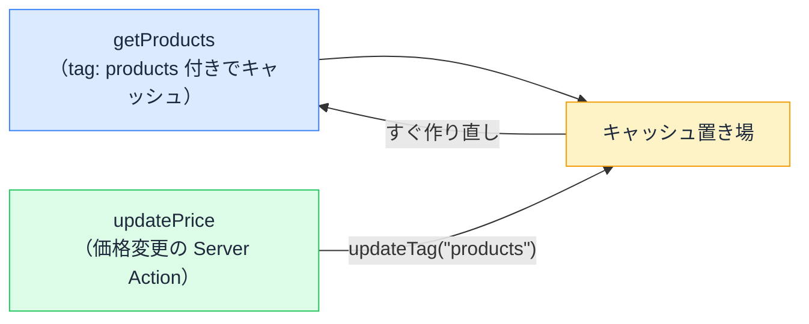

# use cache でキャッシュする — 鮮度と無効化をコードで宣言する

## 今日のゴール

- `"use cache"` が従来モデルのキャッシュ指定（`fetch` オプションや `unstable_cache`）の代わりだと知る
- 関数・コンポーネント・ファイルに書け、データも描画結果もキャッシュできると知る
- 鮮度の宣言（cacheLife）と無効化（cacheTag ＋ updateTag / revalidateTag）の組み立てを知る

::: info このレッスンの前提（新モデル）
ここで扱うのは**新モデル**、`next.config.ts` に `cacheComponents: true` を書いて有効にする書き方です（有効化は任意で、現在の既定は無効）。有効にしていない既定の状態（従来モデル）では `fetch` のオプションや `unstable_cache` を使います。本文では従来モデルと対比しながら進めます。
:::

## 速いページにはキャッシュが要る

アクセスのたびにデータ元へ問い合わせてページを組み立てていたら、人気のページほど遅くなります。そこで使うのが**キャッシュ**、「一度作った結果を保存して使い回す」仕組みです。

ただしキャッシュにはつきものの問題があります。使い回している間にデータが変わると、古い表示が出続けます。

- 商品の価格を変えたのに、サイトには古い価格が出ている
- 記事を直したのに、反映されない

「速さ」と「新しさ」は引っ張り合いの関係です。新モデルのキャッシュ制御は、この綱引きを `"use cache"` で**コードに宣言する**仕組みです。

## 従来モデルは道具がばらばらだった

従来モデルでは、何をどうキャッシュするかが手段ごとに分かれていました。

- `fetch` で取るデータ → `fetch` のオプション（`next: { revalidate }`、`cache: "force-cache"`、`next: { tags }`）
- `fetch` を使わない取得（データベース直結など） → `unstable_cache` で関数を包む
- ページの HTML → 条件を満たすと Next.js が自動で静的化

道具が 3 系統あり、「これはどれで制御するんだっけ」と迷いやすい作りでした。

新モデルは、これらを **`"use cache"` という 1 つのディレクティブに統一**します。`fetch` でもデータベースでも、データでも HTML でも、同じ書き方でキャッシュできます。

| 従来モデル | 新モデル |
|-----------|---------|
| `fetch` の `revalidate` / `force-cache` | `"use cache"` ＋ `cacheLife` |
| `fetch` の `next: { tags }` | `"use cache"` ＋ `cacheTag` |
| `unstable_cache`（`fetch` 以外の取得） | `"use cache"` |
| ページの自動静的化 | コンポーネントに `"use cache"` |

## "use cache" — 何をキャッシュできるか

`"use cache"` は `"use client"` や `"use server"` の仲間の**ディレクティブ（先頭に書く目印）**です。書く場所で、キャッシュする対象が変わります。

**関数の先頭**に書くと、その関数の**戻り値（取得したデータ）**がキャッシュされます。

```ts
// lib/products.ts
export async function getProducts() {
  "use cache"; // この関数の戻り値を使い回す
  const res = await fetch("https://api.example.com/products");
  if (!res.ok) throw new Error("取得に失敗しました");
  return res.json();
}
```

取得の手段は問いません。`fetch` でも、データベースへの問い合わせでも、同じ `"use cache"` でキャッシュできます。従来モデルで `fetch` 以外に必要だった `unstable_cache` は要りません。

**コンポーネントの先頭**に書くと、その**描画結果（組み立てた HTML）**がキャッシュされます。

```tsx
// app/products/ProductList.tsx
export async function ProductList() {
  "use cache"; // このコンポーネントの描画結果を使い回す
  const products = await getProducts();
  return (
    <ul>
      {products.map((p) => (
        <li key={p.id}>{p.name}</li>
      ))}
    </ul>
  );
}
```

**ファイルの先頭**に書けば、そのファイルがエクスポートする関数すべてが対象になります。

`"use cache"` がキャッシュするのはコンポーネントだけではありません。従来モデルで別々だった「データのキャッシュ」と「HTML のキャッシュ」を、データを返す関数にもコンポーネントにも、同じ書き方で付けられます。

宣言が無ければキャッシュされません。新モデルのキャッシュは「**どこを使い回すかを開発者が明示的に選ぶ**」設計です。

## cacheLife — 時間で鮮度を宣言する

`cacheLife()` は「この結果はどれくらい新鮮であるべきか」の宣言です。`"use cache"` を書いた中で呼びます。`"seconds"`、`"minutes"`、`"hours"`、`"days"` といった**プロファイル名**で指定します。

```ts
// lib/products.ts
import { cacheLife } from "next/cache";

export async function getProducts() {
  "use cache";
  cacheLife("hours"); // 鮮度は「数時間」単位でよい

  const res = await fetch("https://api.example.com/products");
  if (!res.ok) throw new Error("取得に失敗しました");
  return res.json();
}
```

| データの例 | 宣言 |
|-----------|------|
| 株価・在庫数 | `cacheLife("seconds")` |
| ニュース一覧 | `cacheLife("minutes")` |
| 商品カタログ | `cacheLife("hours")` |
| 会社概要 | `cacheLife("days")` |

これはミリ秒の設定値ではなく、**「業務的な鮮度」の宣言**です。「在庫は秒単位で正確であってほしい」「会社概要は日単位でいい」という要件が、そのままコードになります。

期限が切れたら、次のアクセスのタイミングで作り直されます。

## cacheTag と無効化 — 変わったら捨てる

時間ベースには弱点があります。`cacheLife("hours")` の商品カタログで価格を変更したら、最悪数時間、古い価格が出続けます。かといって鮮度を短くすれば、キャッシュの意味が薄れます。

そこで使うのが**タグ**です。キャッシュに名札を付けておき、データを変えた側から「この名札のキャッシュを捨てて」と指示します。まず取得側に `cacheTag` で名札を付けます。

```ts
// lib/products.ts
import { cacheLife, cacheTag } from "next/cache";

export async function getProducts() {
  "use cache";
  cacheLife("hours");
  cacheTag("products"); // この結果に「products」という名札を付ける

  const res = await fetch("https://api.example.com/products");
  if (!res.ok) throw new Error("取得に失敗しました");
  return res.json();
}
```

捨てる側には 2 つの関数があり、**捨てた後の見え方**が違います。

| 関数 | 捨て方 | 使う場面 |
|------|--------|---------|
| `updateTag("products")` | すぐ捨て、次のアクセスは新しい結果を待つ | 管理画面で編集 → その人にすぐ反映したい（Server Action 専用） |
| `revalidateTag("products", "max")` | 古い結果を返しつつ裏で作り直す | ブログ・カタログなど、少しの遅れは許せる |

価格を編集した管理者には、すぐ新しい価格を見せたいはずです。この「自分の変更を自分で確認する」場面には `updateTag` が向いています。

```ts
// app/admin/actions.ts — 価格を更新する Server Action
"use server";

import { updateTag } from "next/cache";
import { db } from "@/lib/db";

export async function updatePrice(formData: FormData) {
  await db.product.update(/* 価格の変更 */);

  updateTag("products"); // 名札「products」のキャッシュをすぐ捨てる
}
```

`updateTag` は Server Action の中だけで使えて、捨てたキャッシュはその場で作り直されます。価格を変えた管理者は、リロードした瞬間に新しい価格を見られます。

一方 `revalidateTag` は、第 2 引数に `cacheLife` のプロファイル（`"max"` など）を渡します。古い結果を即座に返しつつ裏で作り直す動き（stale-while-revalidate）になり、不特定多数が見るページで「待たせない」ことを優先したいときに向きます。

```ts
revalidateTag("products", "max"); // 名札を「古い」と印付けし、裏で作り直す
```

> 第 2 引数を省いた `revalidateTag("products")` は従来モデルの書き方で、新モデルでは非推奨です（TypeScript の型エラーになります）。



## 時間で捨てるか、変更で捨てるか

| 捨て方 | 道具 | 向いている場面 |
|--------|------|---------------|
| 時間で捨てる | cacheLife | 変更のタイミングを自分が知らないデータ（外部 API、集計結果） |
| 変更で捨てる | cacheTag ＋ updateTag / revalidateTag | 変更が自分のアプリ経由で起きるデータ（管理画面で編集する商品・記事） |

実際は併用が基本です。タグで変更時に捨てつつ、保険として cacheLife も宣言しておく、という組み立てになります。

## 「古いデータが出続ける」と言われたら

この知識は、定番のトラブル対応で効きます。「更新したのに画面が変わらない」と言われたとき、見るべき場所が決まるからです。

1. その表示の元の関数に `"use cache"` はあるか
2. あるなら鮮度（cacheLife）はいくつか。それは業務要件と合っているか
3. 更新処理は `updateTag` / `revalidateTag` / `revalidatePath` を呼んでいるか。タグ名は一致しているか

取得側にタグを付けたのに、更新側で捨て忘れる（またはその逆）パターンはよくあります。「このデータ、更新したら誰がキャッシュを捨てるの？」という問いが、レビューの一言になります。

## まとめ

- `"use cache"` は従来モデルの `fetch` オプション・`unstable_cache`・自動静的化をまとめた 1 つの宣言
- 関数なら戻り値、コンポーネントなら描画結果をキャッシュする
- cacheLife は時間で、cacheTag ＋ updateTag / revalidateTag は変更で捨てる
- 「更新が反映されない」= 鮮度の宣言と捨てる係を疑う
