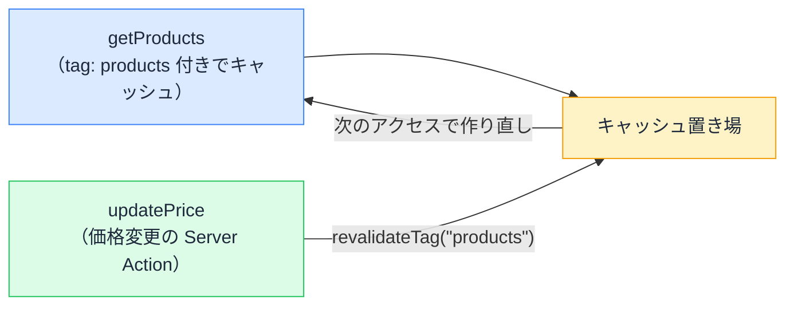

# キャッシュ制御 — "use cache" と、鮮度をコードで宣言する世界

## 今日のゴール

- "use cache" が「この結果は使い回してよい」という宣言だと知る
- cacheLife（時間で更新）と cacheTag（イベントで更新）の使い分けを知る
- 「古いデータが出続ける」問題をキャッシュの言葉で説明できるようになる

## 速いページの裏には、必ずキャッシュがいる

アクセスのたびにデータベースへ問い合わせてページを組み立てていたら、人気のページほど遅くなります。そこで使われるのが**キャッシュ**、つまり「一度作った結果を保存して使い回す」仕組みです。

ただしキャッシュには宿命の問題があります。**使い回している間にデータが変わったら、古い表示が出続ける**。

- 商品の価格を変えたのに、サイトには古い価格が出ている
- 記事を直したのに、反映されない

「速さ」と「新しさ」は引っ張り合いの関係です。Next.js のキャッシュ制御は、この綱引きを**コードで宣言する**仕組みです。

## "use cache" — 使い回してよい、の宣言

Next.js では、設定（`next.config.ts` の `cacheComponents: true`）を有効にしたうえで、**キャッシュしたい処理に `"use cache"` と書きます**。

```ts
// lib/products.ts
import { cacheLife } from "next/cache";

export async function getProducts() {
  "use cache"; // この関数の結果は使い回してよい
  cacheLife("hours"); // 鮮度は「数時間」単位でよい

  const res = await fetch("https://api.example.com/products");
  if (!res.ok) throw new Error("取得に失敗しました");
  return res.json();
}
```

`"use cache"` は、`"use client"` や `"use server"` の仲間の**ディレクティブ（目印の宣言）**です。関数の先頭に書けばその関数の結果が、ファイルの先頭に書けばファイル全体が、コンポーネントに書けばその描画結果がキャッシュされます。

宣言が無ければキャッシュされません。つまり Next.js のキャッシュは「**どこを使い回すかを、開発者が明示的に選ぶ**」設計です。

## cacheLife — 時間で鮮度を宣言する

`cacheLife()` は「この結果はどれくらい新鮮であるべきか」の宣言です。`"seconds"`、`"minutes"`、`"hours"`、`"days"` といった**プロファイル名**で指定します。

| データの例 | 宣言 |
|-----------|------|
| 株価・在庫数 | `cacheLife("seconds")` |
| ニュース一覧 | `cacheLife("minutes")` |
| 商品カタログ | `cacheLife("hours")` |
| 会社概要 | `cacheLife("days")` |

ポイントは、これが**ミリ秒の設定値ではなく「業務的な鮮度」の宣言**だということです。「在庫は秒単位で正確であってほしい」「会社概要は日単位でいい」という要件が、そのままコードになります。期限が切れたら、次のアクセスのタイミングで作り直されます。

## cacheTag — 変わった瞬間に捨てる

時間ベースには弱点があります。`cacheLife("hours")` の商品カタログで価格を変更したら、**最悪数時間、古い価格が出続けます**。かといって短くすれば、キャッシュの意味が薄れます。

そこで 2 つ目の道具、**タグ**です。キャッシュに名札を付けておき、「**このデータを変えたら、この名札のキャッシュを捨てて**」と更新側から指示します。

```ts
// lib/products.ts
import { cacheLife, cacheTag } from "next/cache";

export async function getProducts() {
  "use cache";
  cacheLife("hours");
  cacheTag("products"); // この結果に「products」という名札を付ける

  const res = await fetch("https://api.example.com/products");
  if (!res.ok) throw new Error("取得に失敗しました");
  return res.json();
}
```

```ts
// app/admin/actions.ts — 価格を更新する Server Action
"use server";

import { revalidateTag } from "next/cache";
import { db } from "@/lib/db";

export async function updatePrice(formData: FormData) {
  await db.product.update(/* 価格の変更 */);

  revalidateTag("products"); // 名札「products」のキャッシュを無効化
}
```

価格を変えた**その瞬間**に該当キャッシュだけが捨てられ、次のアクセスから新しい結果になります。時間切れを待つ必要はありません。



## 2 つの戦略の使い分け

| 戦略 | 道具 | 向いている場面 |
|------|------|---------------|
| **時間ベース** | cacheLife | 変更のタイミングを自分が知らないデータ（外部 API、集計結果） |
| **イベントベース** | cacheTag + revalidateTag | 変更が**自分のアプリ経由で起きる**データ（管理画面で編集する商品・記事） |

実際は併用が基本です。「タグで即時更新しつつ、保険として cacheLife も宣言しておく」が定石になります。

## 「古いデータが出続ける」と言われたら

この知識は、定番のトラブル対応で効きます。「更新したのに画面が変わらない」と言われたとき、見るべき場所が決まるからです。

1. その表示の元の関数に `"use cache"` はあるか
2. あるなら鮮度（cacheLife）はいくつか。それは業務要件と合っているか
3. 更新処理は `revalidateTag` / `revalidatePath` を呼んでいるか。タグ名は一致しているか

**取得側にタグを付けたのに更新側の revalidateTag を忘れる**（またはその逆）パターンはよくあります。「このデータ、更新したら誰がキャッシュを捨てるの？」という問いが、レビューの一言になります。

## まとめ

- "use cache" は「結果を使い回してよい」の明示的な宣言（cacheComponents: true で有効化）
- cacheLife は時間ベースの鮮度宣言。業務要件がそのままコードになる
- cacheTag + revalidateTag は「変えた瞬間に捨てる」イベントベースの更新
- 「更新が反映されない」= 鮮度の宣言と捨てる係を疑う
