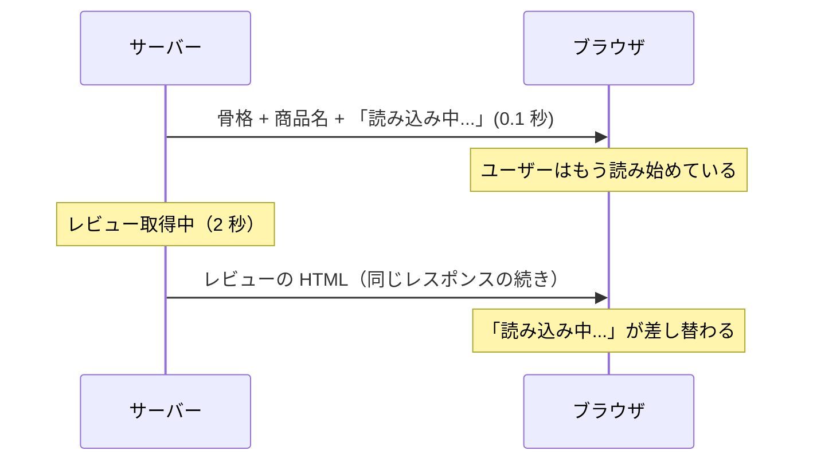

# Suspense と Streaming — 速い部分から先に見せる

## 今日のゴール

- 「全部待つ」と「スピナーだらけ」の間に第三の道があると知る
- Suspense が「準備中はこれを出しておく」境界だと知る
- Streaming が HTML を少しずつ届ける仕組みだと知る

## 従来の二択 — 全部待つか、後から取るか

商品ページを考えます。商品名と価格はすぐ取れるのに、レビュー一覧の集計だけ 2 秒かかるとします。ページの作り方は、従来 2 つの選択肢しかありませんでした。

**選択肢 1: 全部揃うまで待つ**。サーバーでレビューまで取得してから HTML を返します。一番遅い処理に**ページ全体が引きずられ**、商品名は 0.1 秒で出せるのにユーザーは 2 秒間白い画面を見ます。

**選択肢 2: 後からブラウザで取る**。ページはすぐ出して、レビューはブラウザ側で取得します。今度は画面のあちこちで読み込み中の表示（スピナー）が出て、取得のための JavaScript も増えます。

「速い部分は今すぐ、遅い部分はできたときに、同じサーバー描画のまま」はできないのか。それを実現するのが **Suspense と Streaming** です。

## Suspense — 準備中の身代わりを宣言する境界

React の `<Suspense>` は、**まだ準備できていない部分の身代わり表示（fallback）を宣言する境界**です。

```tsx
// app/products/[id]/page.tsx
import { Suspense } from "react";

export default async function ProductPage({
  params,
}: {
  params: Promise<{ id: string }>;
}) {
  const { id } = await params;
  const product = await getProduct(id); // 速い（0.1 秒）

  return (
    <main>
      <h1>{product.name}</h1>
      <p>¥{product.price.toLocaleString()}</p>

      <Suspense fallback={<p aria-busy="true">レビューを読み込み中...</p>}>
        <Reviews productId={id} /> {/* 遅い（2 秒）。中で await している Server Component */}
      </Suspense>
    </main>
  );
}
```

```tsx
// reviews.tsx — 自分のデータを自分で待つ Server Component
export async function Reviews({ productId }: { productId: string }) {
  const reviews = await getReviews(productId); // ここに 2 秒かかる

  return (
    <ul>
      {reviews.map((r) => (
        <li key={r.id}>{r.comment}</li>
      ))}
    </ul>
  );
}
```

`<Suspense>` で包むと、React は `Reviews` の準備を**待たずに**ページの残りを完成させ、その場所には fallback を置いておきます。`Reviews` のデータが揃ったら、fallback と差し替えます。

実は身近なところに既にあります。App Router の `loading.tsx` は、**ページ全体を 1 つの Suspense で包んだもの**です。`<Suspense>` を自分で書くのは、その境界をもっと細かく、部品単位で引く行為です。

## Streaming — HTML を少しずつ届ける

「あとから差し替える」を、サーバー描画でどう実現しているのか。鍵は **HTML を 1 回で送り切らない**ことです。

サーバーはレスポンスを開きっぱなしにして、できた部分から順に流します。

1. まず**ページの骨格 + 速い部分 + fallback** を送る（ユーザーはこの時点で商品名を読める）
2. レビューの準備ができたら、**続きの HTML を同じレスポンスに流し込む**
3. ブラウザに届いた追加分が、fallback の場所に差し込まれる



この「少しずつ流す」配信が **Streaming**（ストリーミング）です。動画を全部ダウンロードする前に再生が始まるのと同じで、HTML も全部そろう前に届いた分から表示します。

これは選択肢 1 と 2 の良いとこ取りです。

| | 全部待つ | クライアント取得 | Suspense + Streaming |
|---|---------|----------------|---------------------|
| 最初の表示 | 遅い | 速い | **速い** |
| 遅いデータの扱い | 全体が遅くなる | ブラウザで取得（JS 増） | **サーバーが後から流す** |

## 境界をどこに引くか — 優先順位の設計

Suspense の境界は、技術というより**「ユーザーに何を先に見せるか」という優先順位の宣言**です。

- 商品名・価格: ユーザーの目的そのもの。**待たせない**
- レビュー・関連商品・おすすめ: あれば嬉しい。**後から来てよい**

この区別ができていれば、境界は自然に決まります。逆に AI に丸ごと作らせると、「全部 await で直列」（選択肢 1 のまま）か「ページ全体を 1 つの Suspense で包むだけ」になりがちです。「**この中で本当に遅いのはどれ？ そこだけ包める？**」が、設計を一段良くする問いです。

fallback の作りにも一工夫あります。ただの「読み込み中...」の文字より、**完成後と同じ高さ・形の仮表示（スケルトン）**にすると、差し替え時に画面がガタッとずれる（レイアウトシフト）のを防げます。

## まとめ

- 「全部待つ」と「スピナーだらけ」の間に、部品単位で待つ第三の道がある
- Suspense は fallback 付きの境界。loading.tsx はページ全体版
- Streaming は HTML を開きっぱなしのレスポンスで少しずつ届ける仕組み
- 境界を引く = 何を先に見せるかの優先順位の宣言
