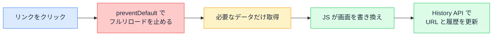

# SPA のページ遷移の仕組み — リンクを押してもページは移動していない

## 今日のゴール

- フルリロードの遷移と SPA の遷移の違いを知る
- SPA の遷移が「クリックの乗っ取り + 書き換え + History API」だと知る
- `<a>` ではなく `<Link>` を使う理由を説明できるようになる

## 同じ「ページ移動」なのに、体感が違う

昔ながらの Web サイトでは、リンクを押すと一瞬画面が白くなってから次のページが出ます。一方、Next.js で作ったアプリのページ移動は一瞬で、白い画面が挟まりません。

どちらも「リンクを押して URL が変わって新しい画面が出る」のは同じですが、裏側の仕組みはまったく違います。

実は後者では、**ブラウザはページを移動していません**。移動したように見せているだけです。今日はこの仕組みを見ていきます。

## 本来のページ遷移 — 全部を捨てて、全部を取り直す

`<a href="/products">` を押したときのブラウザの標準動作は、引っ越しに近い大仕事です。

1. いまのページを**完全に破棄する**（実行中の JavaScript、画面の状態もすべて消える）
2. サーバーに新しいページの HTML を要求する
3. 届いた HTML を最初から解析し、CSS や JavaScript も読み込み直す

これが**フルリロード**の遷移です。確実ですが、ページごとに共通のヘッダーもナビゲーションも**毎回ゼロから作り直し**ます。白い画面の一瞬は、この引っ越し作業の時間です。

## SPA の遷移 — 3 つの仕組みの組み合わせ

SPA（Single Page Application、1 枚のページでできたアプリ）は、この引っ越しをやめました。仕組みは 3 つの組み合わせです。

### 1. クリックを乗っ取る

`<Link>` の実体は `<a>` タグですが、クリックされた瞬間に JavaScript が `preventDefault()`（ブラウザの既定の動作のキャンセル）を呼び、**フルリロードを止めます**。

### 2. 差分だけ取って書き換える

ページを捨てる代わりに、**次のページに必要なデータだけ**をサーバーから取得し、JavaScript が画面の中身を書き換えます。共通のヘッダーやサイドバーはそのまま残ります。

### 3. URL を History API で書き換える

画面は書き換えたものの、このままでは URL が古いままです。そこでブラウザの **History API** を使い、**ページを移動せずにアドレスバーの URL と履歴を書き換えます**。

```js
// 通信もリロードも起こさず、URL と履歴だけが変わる
history.pushState({}, "", "/products");
```

戻るボタンにも対応できます。ユーザーが戻る操作をするとブラウザが「履歴が戻されたよ」というイベント（popstate）を発火するので、それを拾って前の画面を描き直します。



つまり SPA の「ページ遷移」は、**遷移という名の画面の書き換え + URL の演出**です。URL が変わるのに通信ログにページの取得が出ない、という不思議はこれで説明がつきます。

## Next.js の `<Link>` がやっていること

Next.js の `<Link>` は、この 3 つの仕組みに加えて気の利いた仕事をしています。

```tsx
import Link from "next/link";

export function Nav() {
  return (
    <nav aria-label="メイン">
      <Link href="/products">商品一覧</Link>
    </nav>
  );
}
```

- **先読み**（プリフェッチ）: リンクが画面内に見えた時点で、遷移先のデータを裏で取得しておく。クリック時にはもう手元にあるので一瞬で表示される
- **部分的な書き換え**: 移動先と共通の layout は描き直さず、変わる部分（page）だけを入れ替える。layout の中の状態（サイドバーの開閉など）は保たれる
- **サーバー描画との両立**: 取得するのは描画済みの部品（Server Components の結果）なので、ブラウザ側の JavaScript は軽いまま

### a タグで書くと、何が起きるか

同じ画面内リンクを `<a href="/products">` で書いても、一応動きます。ただしクリックの乗っ取りが働かないので、**毎回フルリロード**になります。

| | `<a>`（内部リンク） | `<Link>` |
|---|---|---|
| 遷移 | フルリロード | 書き換え（速い） |
| 共通部分 | 毎回作り直し | 保持される |
| 先読み | なし | あり |

AI は基本的に `<Link>` を使ってきますが、たまに `<a>` が混ざることがあります。「**アプリ内のリンクなのに `<a>` になっていないか**」は、見つけやすく効果の大きいチェックポイントです（外部サイトへのリンクは `<a>` で正解です）。

## まとめ

- フルリロードは「全部捨てて全部取り直す」引っ越し。白い画面はその作業時間
- SPA 遷移 = クリックの乗っ取り + 差分の取得と書き換え + History API の履歴操作
- `<Link>` はさらに先読みと layout の保持までやる
- アプリ内リンクが `<a>` になっていたらフルリロードしている合図
