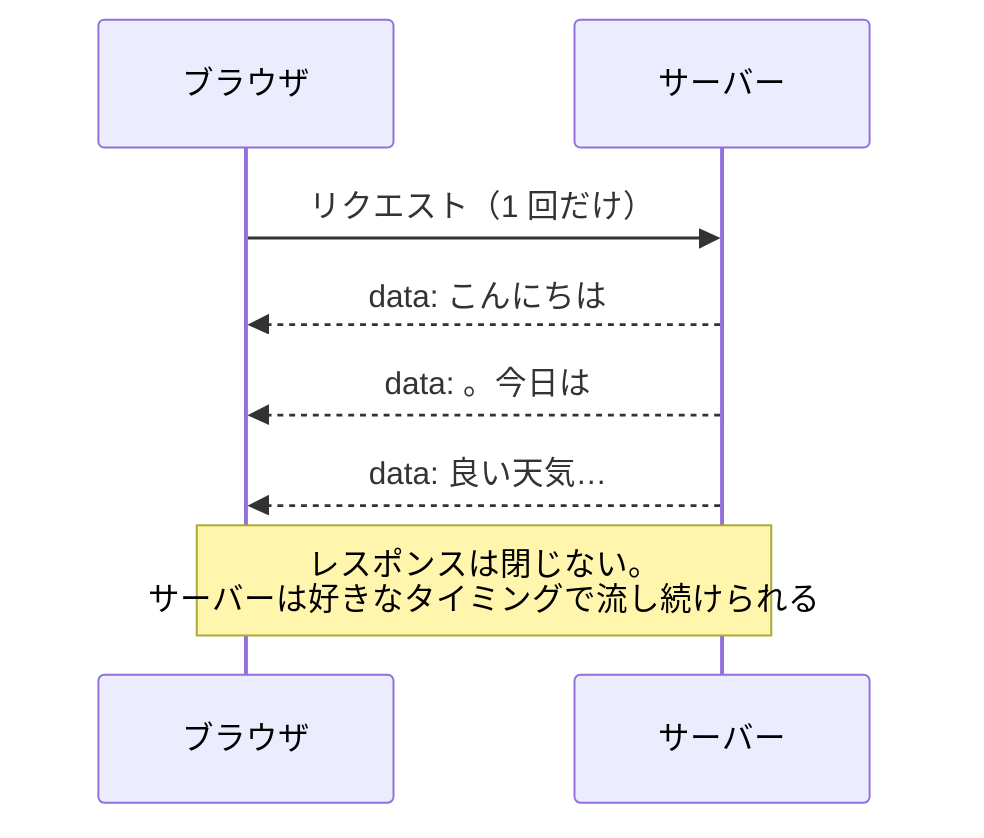

# WebSocket と SSE — AI チャットの文字がパラパラ出る仕組み

## 今日のゴール

- HTTP の「一往復で終わり」という性質と、その限界を知る
- SSE が「閉じない一方通行のレスポンス」だと知る
- WebSocket との使い分けを説明できるようになる

## 返事が「少しずつ」届いている

AI チャットに質問すると、答えの文字がパラパラと流れるように表示されます。あれは演出ではありません。**本当に、答えが少しずつ届いています**。

これは普通の HTTP の感覚では説明がつきません。HTTP の基本は「リクエストを送る → レスポンスが返る → **おしまい**」の一往復です。レスポンスを受け取った時点で会話は終わり、その後サーバーが「続きがあるんだけど」と思っても、**サーバーから話しかける手段がありません**。

- AI の答えを少しずつ送りたい
- 新着通知をリロードなしで届けたい
- チャットの相手の発言を即座に出したい

「サーバー発の連絡」をどう実現するか。今日はその 3 つの答え（ポーリング、SSE、WebSocket）を見ていきます。

## 素朴な答え — ポーリング

いちばん素朴なのは、**ブラウザが定期的に聞きに行く**方法です。

```ts
// 10 秒ごとに「新着ある？」と聞きに行く
setInterval(async () => {
  const res = await fetch("/api/notifications");
  const items = await res.json();
  // 画面に反映…
}, 10_000);
```

これを**ポーリング**と呼びます。仕組みは普通の HTTP の繰り返しなので確実に動きますが、弱点も明快です。

- ほとんどの問い合わせは「新着なし」の**空振り**
- 新着があっても、次の問い合わせまで**最大 10 秒の遅れ**

更新がまれなデータなら、実はこれで十分です。ただ「即時」が欲しい場面には向きません。

## SSE — 閉じない一方通行のレスポンス

**SSE**（Server-Sent Events）の発想は大胆です。「レスポンスを返したら終わり」なら、**レスポンスを終わらせなければいい**。

サーバーはレスポンスを開きっぱなしにして、送りたいことができるたびに**同じレスポンスの続きとして**少しずつデータを流します。



ブラウザ側は `EventSource` という標準 API で受け取れます。

```ts
const source = new EventSource("/api/stream");

source.onmessage = (event) => {
  console.log(event.data); // 届くたびに呼ばれる
};
```

SSE の特徴は 3 つです。

- **一方通行**: 流せるのはサーバー → ブラウザだけ。ブラウザから送りたければ普通の HTTP で別途送る
- **中身は普通の HTTP**: 特別なプロトコルではないので、既存のインフラにそのまま乗る
- **自動再接続**: 回線が切れたら EventSource が勝手に繋ぎ直す

**AI チャットの正体はほぼこれ**です。生成 AI の API（ChatGPT や Claude）は、答えを生成しながら SSE 形式で少しずつ流しています。画面の文字がパラパラ出るのは、この `data:` の粒が届くたびに描画しているからです。

## WebSocket — 双方向の専用回線

SSE は一方通行でした。**双方向**をリアルタイムにやりたい、つまり「ブラウザからもサーバーからも、いつでも好きなタイミングで送り合いたい」場面のための仕組みが **WebSocket** です。

最初の握手だけ HTTP で行い、その後は**双方向の専用回線に切り替えて**繋ぎっぱなしにします（URL も `https://` ではなく `wss://` になります）。

```ts
const socket = new WebSocket("wss://example.com/chat");

socket.onmessage = (event) => {
  console.log("受信:", event.data); // サーバーから、いつでも届く
};

socket.send("こんにちは"); // ブラウザから、いつでも送れる
```

向いているのは、双方向のやり取りが高頻度に発生するものです。

- チャット（自分も送るし、相手からも届く）
- 共同編集（全員の操作を全員へ）
- オンラインゲーム、株価ボードの操作

代償もあります。「繋ぎっぱなしの回線」をサーバー側で大量に抱えるのは普通の HTTP より運用が重く、再接続やスケールの設計も自前の工夫が増えます。

## 使い分け — まず方向を問う

3 つの道具は、「**通信の方向と頻度**」で選びます。

| 場面 | 方向 | 適した道具 |
|------|------|-----------|
| AI の生成結果、進捗表示、通知 | サーバー → ブラウザだけ | **SSE** |
| チャット、共同編集 | 双方向・高頻度 | **WebSocket** |
| 数分おきの更新で十分なデータ | どちらでもない | ポーリング |

ありがちな過剰設計が「通知が欲しいだけなのに WebSocket」です。一方通行で足りるなら、HTTP のまま動いて勝手に再接続してくれる SSE のほうが安く済みます。AI がリアルタイム機能に WebSocket を提案してきたら、「**これは双方向である必要がある？**」と問い返すのが、今日から使えるレビューの一言です。

ちなみに、HTML を少しずつ届ける Streaming（Suspense の裏側）も、「レスポンスを閉じずに流し続ける」という同じ発想の親戚です。**現代の Web の「速さ」の多くは、開きっぱなしのレスポンスでできています**。

## まとめ

- HTTP は一往復で終わり。サーバーから話しかける手段が本来は無い
- SSE は閉じないレスポンスで一方通行に流す。AI チャットのパラパラの正体
- WebSocket は双方向の繋ぎっぱなし回線。チャットや共同編集向け
- 選び方は「方向と頻度」。一方通行に WebSocket は過剰
