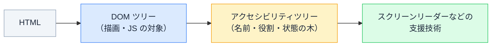

# WAI-ARIA の仕組み — 見た目を変えない属性は、何を変えているのか

## 今日のゴール

- ブラウザが DOM とは別に「アクセシビリティツリー」を作っていることを知る
- ARIA がそのツリーを上書きする属性だと知る
- 「まずネイティブ HTML、ARIA は補完」という第一規則を知る

## 見た目が 1px も変わらない属性

React のコードには、こういう属性が混ざっています。

```tsx
<button aria-expanded={isOpen} aria-controls="filter-panel">
  絞り込み
</button>
```

`aria-expanded` を消しても、画面の見た目は 1px も変わりません。CSS でもなく、JavaScript の動作でもない。この属性の役割は「**ブラウザがもう 1 つ作っている、見えないツリー**」にあります。

## アクセシビリティツリー — DOM の影にあるもう 1 本の木

ブラウザは HTML を解析して DOM ツリーを作りますが、実は**もう 1 本**、DOM をもとに**アクセシビリティツリー**を作っています。



このツリーには見た目の情報はなく、各要素の**名前・役割・状態**だけが載っています。スクリーンリーダーが「保存、ボタン」と読めるのは、このツリーを受け取っているからです。

`<button>` と書けば役割「ボタン」が、`<label>` を結べば名前が、**自動で**このツリーに載ります。セマンティックな HTML が大事だと言われ続ける理由は、このツリーを正しく育てるためです。

## ARIA — ツリーを直接上書きする属性

**WAI-ARIA**（通称 ARIA）は、このアクセシビリティツリーを**手動で上書きするための属性群**です。DOM の見た目や動作には一切触らず、ツリーに載る情報だけを変えます。

| 属性 | ツリーの何を変えるか | 例 |
|------|--------------------|---|
| `role` | **役割** | `role="tablist"`（これはタブの並びです） |
| `aria-label` | **名前** | `aria-label="メニューを開く"`（アイコンだけのボタンに名前を） |
| `aria-expanded` など | **状態** | 開いている / 閉じている |

冒頭のコードの意味が、これで読めます。

```tsx
<button aria-expanded={isOpen} aria-controls="filter-panel">
  絞り込み
</button>
```

- 読み上げ: 「絞り込み、ボタン、**折りたたみ / 展開済み**」
- `aria-expanded={isOpen}` が、見た目では矢印アイコンで伝えている開閉状態を、**音の世界にも伝えている**
- `aria-controls` は「このボタンが操作するのはあの領域」という関係の表明

見た目だけ作ると、開閉の状態は「見える人」にしか伝わりません。ARIA は、その差を埋める属性です。

## 第一規則 — まずネイティブ HTML

ARIA には、仕様の冒頭近くに書かれた有名な原則があります。

> **ネイティブの HTML 要素で実現できるなら、それを使え**（ARIA を使うな）

`role="button"` を付けた `<div>` と、`<button>` を比べると理由が分かります。

| | `<div role="button">` | `<button>` |
|---|---|---|
| 読み上げの役割 | ボタン ✓ | ボタン ✓ |
| Tab でフォーカスできる | ✗（`tabindex` を自分で付ける） | ✓ 自動 |
| Enter / Space で押せる | ✗（キーボード処理を自分で書く） | ✓ 自動 |
| 無効化（disabled） | ✗ 自分で作る | ✓ 自動 |

**ARIA が変えるのは「読み上げられ方」だけ**で、フォーカスもキーボード操作も付いてきません。`role="button"` は「ボタンと名乗る」だけの属性であり、振る舞いまでボタンにするのは全部自分の仕事になります。やり切れずに「ボタンと読み上げられるのに Enter で押せない」という、**何も付けないより悪い状態**が生まれがちです。

「**悪い ARIA は、ARIA 無しより悪い**」。これが合言葉です。

## では ARIA の出番はどこか

ネイティブ HTML で表現しきれないものだけが、ARIA の正当な出番です。

- **アイコンだけのボタンの名前**: `<button aria-label="閉じる">✕</button>`
- **動的な状態**: `aria-expanded`（開閉）、`aria-current="page"`（ナビの現在地）、`aria-busy`（処理中）
- **動的な通知**: `aria-live="polite"`（画面の変化を読み上げてもらう領域）
- **HTML に無い複合 UI の役割**: タブ、ツリービューなど（キーボード操作の実装とセットで）

逆に、`<button>` に `role="button"` を付けるような**重複 ARIA は無意味**で、AI のコードによく混ざります。また `aria-label` の内容がボタンの実際の機能とズレていると、読み上げユーザーだけが**嘘の案内**を受けることになります。見た目に出ないぶん、レビューで意識しないと誰も気づきません。

AI のコードの ARIA を見るときの問いは 3 つです。

1. それは**ネイティブ HTML で済まないか**（`div` + role より `button`）
2. その `aria-label` は**実際の機能と一致しているか**
3. 状態系（expanded / current）は**ちゃんと JavaScript で更新されているか**（付けっぱなしの嘘になっていないか）

## まとめ

- ブラウザは DOM とは別にアクセシビリティツリー（名前・役割・状態）を作り、支援技術に渡している
- ARIA はそのツリーを上書きする属性。見た目と振る舞いには何も起きない
- 第一規則は「まずネイティブ HTML」。悪い ARIA は無しより悪い
- 正当な出番は、アイコンの名前・動的な状態・動的な通知
