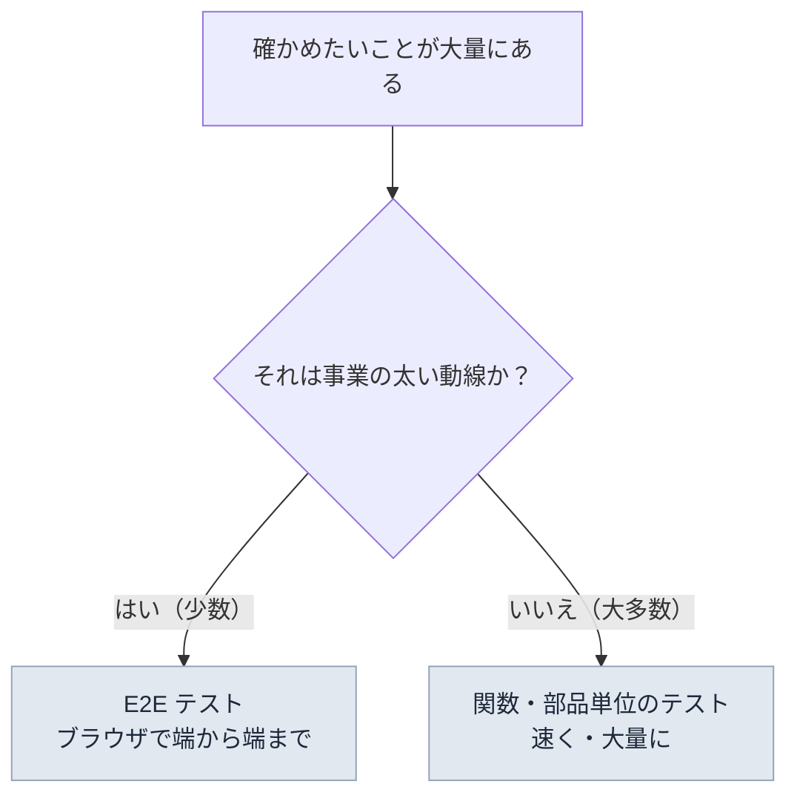

# E2E テスト — ブラウザを自動操縦するという発想

## 今日のゴール

- E2E テストが「ユーザーの操作を丸ごと再現する」テストだと知る
- 強み（本物に近い）と弱み（遅い・壊れやすい）を知る
- 「どこまで E2E でやるか」という戦略の考え方を知る

## リリース前の儀式

アプリに機能を足したら、壊れていないか確かめる必要があります。素朴には、人間がブラウザで触って確認します。

ところが機能が増えるほど、確認項目は積み上がります。「ログインできるか」「商品を検索できるか」「カートに入るか」「購入が通るか」「退会できるか」……。リリースのたびに全部を手で確かめるのは、10 項目なら耐えられても、100 項目では破綻します。しかも人間は、昨日通った項目を今日は飛ばしたくなる生き物です。

「ブラウザの操作を機械にやらせて、毎回全部確かめさせればいい」。これが **E2E テスト**（End-to-End、端から端まで）の発想です。

## ブラウザの自動操縦

E2E テストのコードは、「ユーザーがやる操作の台本」です。現在の定番ツール **Playwright** で書くとこうなります。

```ts
import { test, expect } from "@playwright/test";

test("ログインしてダッシュボードが表示される", async ({ page }) => {
  await page.goto("/login");

  await page.getByLabel("メールアドレス").fill("test@example.com");
  await page.getByLabel("パスワード").fill("password123");
  await page.getByRole("button", { name: "ログイン" }).click();

  await expect(page.getByRole("heading", { name: "ダッシュボード" })).toBeVisible();
});
```

実行すると、**本物のブラウザが起動し、本当にページを開き、本当に入力してクリックします**。アプリ側は普段どおり動くだけで、テストのための特別な作りは要りません。サーバー、データベース、画面描画、JavaScript。**全部つないだ状態**（端から端まで）で「ユーザーの目的が達成できるか」を確かめるのが E2E です。

### ブラウザはなぜ「操縦」できるのか

魔法ではありません。ブラウザには、**外部のプログラムから操作するための公式の窓口**（自動化プロトコル）が組み込まれています。Chrome なら開発者ツールと同じ通信路（CDP）で、「この要素をクリックして」「いまの DOM の状態を教えて」という命令を受け付けます。

Playwright はこの窓口に接続して命令を送る**操縦席**です。つまり E2E テストとは、「人間の代わりにプロトコル経由でブラウザに指示を出し、画面の状態を問い合わせて期待と照合する」仕組みです。開発者ツールで手動でやっている確認の自動化版、と言えます。

コードの読み方にも注目してください。`getByLabel("メールアドレス")` は「メールアドレスというラベルの入力欄」、`getByRole("button", { name: "ログイン" })` は「ログインという名前のボタン」。**画面の HTML の構造ではなく、ユーザー（と支援技術）に見える名前と役割**で要素を探しています。ラベルのない入力欄や `div` 製のボタンはこの探し方で見つけられないので、**アクセシビリティの手抜きはテストの書きにくさとして跳ね返ってきます**。逆もまた然りで、a11y がまともなアプリは E2E が書きやすいのです。

## 強みと弱み

E2E は万能に見えますが、はっきりした代償があります。

| | 内容 |
|---|------|
| **強み** | 本物のブラウザ・本物の構成で動くので、**通れば本当に動く**という確信が強い |
| **弱み 1: 遅い** | 1 本数秒〜数十秒。数百本あれば数十分。コードを直すたびに全部は回せない |
| **弱み 2: 壊れやすい** | 通信の揺らぎやタイミングで、**コードは正しいのに時々失敗する**（flaky と呼ばれる）。「またあのテストか」と無視され始めたら形骸化の入り口 |
| **弱み 3: 原因が遠い** | 失敗しても「ログインのどこかが壊れた」としか分からない。犯人捜しは別途必要 |

この性質から、結論はこうなります。**E2E は強力だが高コスト。だから「少数精鋭」で使う**。

## 戦略 — 何を E2E に残すか

すべての確認を E2E でやるのではなく、テストには役割分担があります。

- **細かいロジックの正しさ**（料金計算、入力チェックの条件など）は、関数単位の小さなテストで大量に・高速に確かめる
- **E2E はクリティカルパスだけ**に絞る

クリティカルパスとは、「**これが壊れていたら事業が止まる**」という太い動線のことです。

- EC なら: 商品を探す → カートに入れる → 購入できる
- SaaS なら: ログインできる → 主要機能が使える → 課金できる

逆に、細かい表示の差異やレアな操作の組み合わせまで E2E にすると、遅くて壊れやすいテストの山ができて、メンテナンスに追われます。**「念のため全部」が E2E では悪手**になる、というのが運用の急所です。



## AI 時代の E2E

E2E は「このページのテストを書いて」と頼めば、いくらでも量産できます。だからこそ効くのが今日の戦略です。

- **シナリオの選定は人間の仕事**: 「何がクリティカルパスか」は事業の知識であり、AI はリポジトリから読み取れない。本数を絞る判断はこちらで持つ
- **できたテストの書かれ方を見る**: `getByRole` / `getByLabel` ベースなら良い兆候。画面の構造の深い位置（「3 番目の div の中の 2 番目の span」のような指定）に依存していたら、画面を少し変えただけで壊れるテスト
- **flaky の芽を見る**: 「3 秒待つ」のような固定の待ち時間が入っていたら、揺らぎで失敗する予備軍。「表示されるまで待つ」型（`expect(...).toBeVisible()`）が正解

## まとめ

- E2E はユーザー操作の台本でブラウザを自動操縦し、端から端まで確かめる
- 通れば確信は強いが、遅い・壊れやすい・原因が遠いの三重苦
- だから少数精鋭で、事業が止まる動線（クリティカルパス）だけに絞る
- 要素を名前と役割で探すので、a11y の質がテストの書きやすさに直結する
