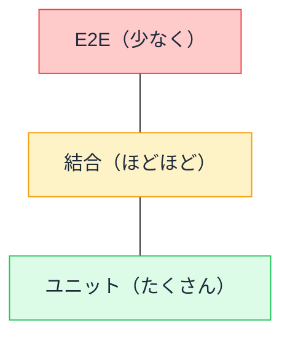
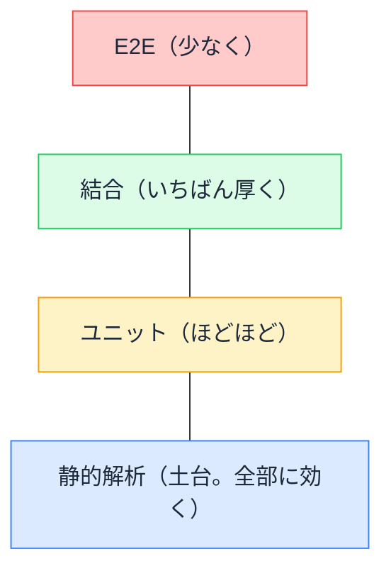

# テストのコスト構造 — なぜ層によって速さと確信が違うのか

## 今日のゴール

- テストに層があり、層ごとにコストと確信の強さが違うことを知る
- 「ピラミッド」と、フロントエンド向けの「トロフィー」の配分を知る
- 配分が崩れたプロジェクトの症状を知る

## 種類は分かった。で、どの割合で持つ？

AI に「テストを書いて」と頼むと、頼んだ粒度のテストが何十本でも量産されます。生産の苦労が消えた結果、**残った問いは「どの種類を、どの割合で持つべきか」だけ**になりました。置き場の感覚が無いまま量産を受け入れると、後述する「遅くて壊れやすいテストの山」が出来上がります。

テストには粒度の違う層があります。

| 層 | 確かめるもの | 例 |
|----|------------|---|
| **静的解析** | 実行せずに分かる間違い | TypeScript の型チェック、ESLint |
| **ユニット** | 関数・部品単体の正しさ | 送料計算の関数、ボタン単体 |
| **結合（インテグレーション）** | 部品を組み合わせた振る舞い | フォーム一式が「入力 → 送信 → 結果表示」まで動く |
| **E2E** | 本物のブラウザで端から端まで | ログインして購入できる |

下の層ほど**速くて安くて、原因の特定が簡単**。上の層ほど**本物に近くて確信が強いが、遅くて壊れやすい**。

では、それぞれを何割ずつ持つべきか。この「配分」の議論には、形の名前が付いています。

## テストピラミッド — 古典の答え

古典的な答えが**テストピラミッド**です。

**安くて速い層を土台にたくさん、高くて遅い層は頂点に少しだけ**。E2E の三重苦（遅い・壊れやすい・原因が遠い）を踏まえれば、自然な結論です。サーバーサイドの世界では、いまもこれが基本形です。

## テストトロフィー — フロントエンドの再解釈

一方、React のようなコンポーネントベースのフロントエンドでは、ピラミッドを少し変形させた**テストトロフィー**という配分が広く支持されています。トロフィー（優勝カップ）の形に、4 つの層を当てはめたものです。

ピラミッドとの違いは 2 つです。

### 違い 1: 最厚は「結合」

フロントエンドのバグの多くは、部品単体ではなく**配線**で起きます。ボタン単体は正しい、入力欄単体も正しい、でも「入力してボタンを押したら結果が出る」という**組み合わせ**が壊れている。

だから「フォーム一式を描画して、ユーザーのように操作して、結果を確かめる」結合レベルのテストが、**ユーザーの価値にいちばん近い割に、E2E よりずっと速くて安定**という、コストパフォーマンスの最良点になります。Testing Library で書くテストの主戦場はここです。

### 違い 2: 土台は「静的解析」

TypeScript と ESLint は、テストを 1 本も書かなくても「存在しないプロパティへのアクセス」「使われていない変数」「hook のルール違反」を**全コードに対して常時**検出します。最安のテスト層として、土台に最初から数えてしまうのがトロフィーの考え方です。

## 崩れた形には名前がある

配分が崩れたプロジェクトの症状にも、名前が付いています。

- **逆ピラミッド（アイスクリームコーン）**: E2E ばかりが大量にある状態。テスト実行に 1 時間、毎日どれかが flaky に倒れ、誰も結果を信じなくなる。「とりあえず画面で確認するテストを足そう」を繰り返すと、ここに着地する
- **砂時計**: ユニットと E2E はあるのに中間が無い。部品は正しいのに配線のバグが E2E まで素通りし、原因の特定に時間が溶ける

AI にテストを頼むときも、この配分の感覚が指示の質を決めます。何も言わなければ AI は「頼まれた粒度」で量産するだけです。「**この機能は結合レベルで、ユーザー操作の流れをテストして。E2E は購入フローだけでいい**」と層を指定して頼めるのが、配分を知っている人の頼み方です。

## 配分チェックの 3 つの質問

自分のプロジェクト（や AI の提案）を見るときの質問はこれだけです。

1. **いちばん厚い層はどこか**。フロントエンドなら結合が厚いのが健康体
2. **E2E は数えられる本数か**。「クリティカルパス + α」を超えて増殖していないか
3. **型と Lint は効いているか**。土台が緩いと、上の層で安い間違いを高く捕まえることになる

## まとめ

- テストは層構造。下ほど安くて速く、上ほど本物に近くて高い
- 古典はピラミッド。フロントエンドは「結合最厚 + 静的解析の土台」のトロフィー
- 配線のバグが多いから、結合テストがコストパフォーマンスの最良点
- 崩れた形（アイスクリームコーン・砂時計）には症状が出る。層を指定して AI に頼む
