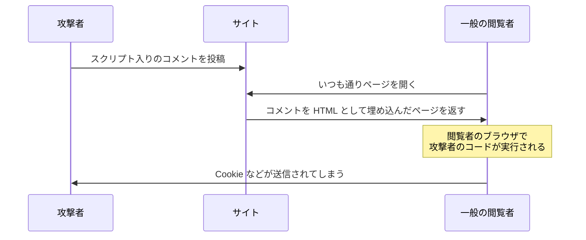

# XSS — dangerouslySetInnerHTML は何が dangerous なのか

## 今日のゴール

- XSS が「ユーザーの入力がコードとして実行される」事故だと知る
- React の JSX が自動エスケープで守ってくれていることを知る
- 守りに穴が開く 2 つの書き方を見分けられるようになる

## わざわざ「危険」と名乗る API

React には、名前からして不穏な API があります。

```tsx
<div dangerouslySetInnerHTML={{ __html: comment.body }} />
```

`dangerously`（危険を承知で）に、`__html` という二重アンダースコア。「本当にいいんですね？」と何度も確認してくる念の入れようです。AI も、Markdown の表示や CMS の記事埋め込みなどで、この API を平気で使ってきます。

何がそんなに危険なのか。答えは、Web セキュリティで最も有名な攻撃 **XSS** にあります。

## XSS — 入力が「コード」に化ける

**XSS**（クロスサイトスクリプティング）は、**ユーザーが入力した文字列が、他のユーザーのブラウザで JavaScript として実行されてしまう**脆弱性です。

コメント欄のあるサイトを想像してください。悪意あるユーザーが、感想の代わりにこれを投稿します。

```html
いい記事ですね！
```

サイト側がこの文字列を**そのまま HTML として**ページに埋め込むと、このコメントを表示した**全閲覧者のブラウザ**で `onerror` の中身が実行されます。画像 `x` は存在しないので必ずエラーになり、つまり必ず発火します。

実行されるのは攻撃者の書いた JavaScript ですから、できることは何でもありです。

- ログイン状態（Cookie やトークン）を盗んで攻撃者に送る → **なりすまし**
- ページを書き換えて偽のログインフォームを出す → **パスワード窃取**
- 利用者の権限で操作を実行する（送金、投稿、設定変更）

恐ろしさの核心は、**被害者は「いつものサイト」を見ているだけ**だということです。怪しいサイトを踏んだわけでもないのに、コメントを 1 件表示しただけで乗っ取られる。



## React は最初から守ってくれている

ここで朗報です。React で普通に書いている限り、この攻撃は**ほぼ成立しません**。

```tsx
// comment.body に  が入っていても安全
<p>{comment.body}</p>
```

JSX の `{}` に入れた文字列を、React は**必ずただのテキストとして描画**します。`<` は `&lt;` に変換され（**エスケープ**と呼びます）、タグとしては決して解釈されません。画面には `` という**文字がそのまま見える**だけです。

「ユーザー入力を表示する場所すべてが地雷原」だった素の Web に対して、React は**デフォルトで全部エスケープ**という設計を選びました。普段 XSS を意識せずに済んでいるのは、この自動の防御のおかげです。

## 防御に穴を開ける 2 つの書き方

逆に言うと、危ないのは**この防御を自分で外す瞬間**です。代表は 2 つあります。

### 穴 1: dangerouslySetInnerHTML

冒頭の API は、まさに「エスケープせずに HTML として挿入する」ための非常口です。名前が大げさなのは、**React の防御の外に出る**からでした。

```tsx
// ❌ comment.body にユーザー入力が混ざるなら、XSS がそのまま成立する
<div dangerouslySetInnerHTML={{ __html: comment.body }} />
```

正当な用途もあります。自分たちで管理している CMS の記事や、Markdown を変換した HTML など、**出どころが信頼できる HTML** を埋め込む場合です。その場合も定石は決まっていて、**サニタイズ**（HTML から危険な部分を除去する処理。定番ライブラリは DOMPurify）を通してから渡します。

```tsx
import DOMPurify from "dompurify";

<div dangerouslySetInnerHTML={{ __html: DOMPurify.sanitize(article.html) }} />
```

### 穴 2: href に入るユーザー入力

もう 1 つの見落としがちな穴が、リンク先です。

```tsx
// ❌ url がユーザー入力なら、"javascript:悪意あるコード" を仕込める
<a href={user.websiteUrl}>ウェブサイト</a>
```

`javascript:` で始まる URL は、クリックした瞬間にコードとして実行されます。タグを挿入していないのにスクリプトが動く、エスケープでは防げない経路です（React はこの形の URL に警告を出しますが、防御をフレームワーク任せにしないのが基本です）。ユーザー入力を `href` に使うなら、「`http://` か `https://` で始まるものだけ許可する」という検証が必要です。

## AI のコードを見るポイント

整理すると、XSS のチェックは「**ユーザー由来の文字列が、テキスト以外の文脈に入る場所**」を探すことに尽きます。

1. `dangerouslySetInnerHTML` を見たら: 渡している HTML の**出どころ**は？ ユーザー入力が混ざるなら、サニタイズはある？
2. `href={変数}` を見たら: その変数はユーザー入力？ スキームの検証はある？
3. AI に Markdown 表示やリッチテキストを頼んだら: 生成コードに DOMPurify 相当が入っているか確認

「dangerously と名乗る API には、名乗るだけの理由がある」。この感覚があれば、レビューで素通りしなくなります。

## まとめ

- XSS = ユーザー入力が他人のブラウザで JavaScript として実行される事故
- React の JSX は全部エスケープする。普通に書けば安全はデフォルト
- 穴は防御を外す瞬間: dangerouslySetInnerHTML と href のユーザー入力
- 信頼できない HTML はサニタイズ（DOMPurify）してから。href はスキームを検証
