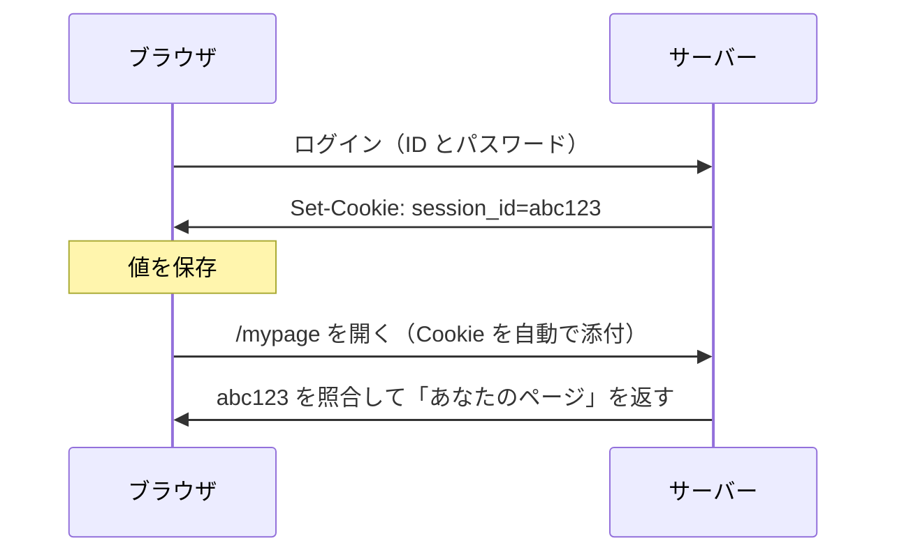

# Cookie — ブラウザが自動で送る値

## 今日のゴール

- Cookie は「サーバーが預け、ブラウザが以降自動で送り返す値」だと仕組みで知る
- 宛先は決まっているが、どのページから送ったかは問われないと知る
- その隙を CSRF が突き、SameSite で送信を、HttpOnly で読み出しを絞ると知る

## リロードしてもログインが続く理由

ログインした後は、リロードしても、ブラウザを閉じて開き直しても、サイトはあなたを覚えています。当たり前に感じますが、HTTP の仕組みからすると当然ではありません。

HTTP は **ステートレス**、つまり状態を持たないプロトコルです。リクエストは 1 回ごとに独立していて、サーバーから見ると全リクエストが初対面です。

「さっきログインした人」という記憶は、サーバーのどこにもありません。だから毎回のリクエストで「私はさっきの続きです」と申告する仕組みが要ります。

その仕組みが **Cookie** です。

## Cookie の仕組み — 預けて自動で送り返す

Cookie は 2 ステップで動きます。

1. サーバーがレスポンスで「この値を持っておいて」と渡す（`Set-Cookie`）
2. ブラウザはそれを保存し、以降そのサーバーへのリクエストに自動で付けて送る

ログインの一連の流れで追うと、こうなります。



やり取りされる中身はこれだけです。

```
（ログイン成功時のレスポンス）
Set-Cookie: session_id=abc123

（以降、ブラウザが毎回付ける）
Cookie: session_id=abc123
```

見落としやすいのですが、2 回目に `Cookie:` を付けたのは**ブラウザ自身**です。アプリのコードは「Cookie を送れ」とはどこにも書いていないのに、ブラウザが勝手に付けます。

記憶しているのはブラウザで、サーバーは毎回届いた値を照合しているだけです。便利なのも危険なのも、この「勝手に送る」性質から来ています。

## 宛先は決まっているが発信元は問われない

「自動で送る」といっても、宛先は決まっています。Cookie には発行元のドメインが紐づいていて、ブラウザは**その宛先へのリクエストにだけ**付けます。

だから `example.com` の Cookie は `example.com` にしか送られず、`attacker.com` に渡ることはありません。ここは心配いりません。

ただし、抜けがあります。ブラウザは長い間、**そのリクエストがどのページから送られたか**を気にしていませんでした。

そのため、`attacker.com` を開いていると、そこから `example.com` へ送られるリクエストにも `example.com` の Cookie が付いてしまいます。

この「宛先は見るが発信元は問わない」という隙を、攻撃者が突きます。

## 自動送信の危険と対策

`example.com` にログイン中のまま別のサイトを開くと、そのサイトが仕込んだ `example.com` への送信にも、ブラウザは Cookie を付けてしまいます。利用者は操作した覚えがないのに、ログイン済みの操作が通ってしまいます。

これが、別サイトからあなたになりすます CSRF（Cross-Site Request Forgery）という攻撃です。

### なりすましを防ぐ SameSite

この CSRF を抑えるのが `SameSite` 属性です。送る前に「発信元が同じサイトか」を見て、別サイト発の送信には Cookie を付けないようにします。

Chrome をはじめ多くのブラウザは、指定のない Cookie を `Lax` として扱います。値は 3 段階あり、別サイトへの送信をどこまで許すかが変わります。

- `Lax`（多くのブラウザで既定）: 同じサイト内では送り、別サイトからでもリンクをたどる通常の遷移では送る。POST や埋め込みには送らないので、ログイン維持と CSRF 対策のバランスが取れる
- `Strict`: 同じサイト内でしか送らない。外部リンクから来た初回は未ログイン扱いになるため、安全側だが利用者の体験は損なう
- `None`: 別サイトへの送信でも常に送る。`Secure` が必須で、CSRF の露出が大きいので別の対策とセットで使う

この「同じサイト」は、よく same-origin と混同されますが、基準が違います。

- **same-origin**（同一オリジン）: スキーム・ホスト・ポートがすべて一致する、いちばん厳密な基準
- **same-site**（同一サイト）: スキームが同じで、登録可能ドメイン（`example.com` など）が同じ。ポートやサブドメインの違いは同じサイト扱い

| 比べる URL | same-origin | same-site |
|---|---|---|
| `https://example.com` と `https://example.com/mypage` | ○ | ○ |
| `https://example.com` と `https://shop.example.com` | ✗ ホスト違い | ○ ドメインは同じ |
| `https://example.com` と `https://example.com:8080` | ✗ ポート違い | ○ ポートは見ない |
| `http://example.com` と `https://example.com` | ✗ スキーム違い | ✗ スキーム違い |
| `https://example.com` と `https://attacker.com` | ✗ | ✗ |

`SameSite` が見るのは same-site のほうです。一方、JavaScript が別サイトのデータを読めるかどうかは、より厳密な same-origin で決まります。

### 盗み見を防ぐ HttpOnly

もう一つの危険は、値をどこに置くかです。ログインの値を JavaScript から読める場所（`localStorage` など）に置くと、XSS（Cross-Site Scripting、入力がコードとして実行される攻撃）が一度でも成立したら、その値がまるごと盗まれます。

`HttpOnly` を付けた Cookie は、ブラウザの JavaScript（`document.cookie`）から読めなくなります。XSS で紛れ込んだスクリプトがあっても、その値を読み出して盗めません。

## そのほかの属性と書き方

属性は、名前と値のうしろに `;` で並べて書きます。

```
Set-Cookie: session_id=abc123; HttpOnly; Secure; SameSite=Lax; Path=/; Max-Age=3600
```

`HttpOnly` と `Secure` は値を取らないフラグで、その語を書けば有効、書かなければ無効です。`SameSite` や `Path` は `=` のうしろに値を書きます。

よく使う属性を一覧にします。

| 属性 | 書き方 | 何を絞るか |
|---|---|---|
| `HttpOnly` | フラグ（値なし） | ブラウザの JavaScript から読めなくする |
| `Secure` | フラグ（値なし） | HTTPS のときだけ送る |
| `SameSite` | `SameSite=Lax` など | 別サイトへのリクエストにも送るか |
| `Domain` / `Path` | `Domain=example.com` / `Path=/` | どの範囲のリクエストに送るか |
| `Expires` / `Max-Age` | `Max-Age=3600`（秒）など | いつまで保存するか |

`SameSite` と `HttpOnly` は上で見たとおりです。残りは、詳しく知りたいときに開いてください。

::: details Secure・Domain・Path・Expires の詳しい説明
- `Secure`: HTTPS のときだけ送る。付けないと暗号化されていない通信にも送られて盗み見られるので、ログインの値には付ける
- `Domain`: どのホストまで送るか。付けなければ発行したホストだけ（`www.example.com` の Cookie は `shop.example.com` に届かない）。`Domain=example.com` を付けるとサブドメイン全部に届き、またいで共有したいときだけ指定する
- `Path`: 同じホストの中で送る URL の範囲。`/admin` のように絞れるが、同一オリジンなら別のパスから読めるのでセキュリティの境界にはならない。特別な理由がなければ `/`（サイト全体）にする
- `Expires` / `Max-Age`: 保存する期間。指定なしはブラウザを閉じると消え（セッション Cookie）、指定するとその期間は残る
:::

認証の値なら `HttpOnly` と `Secure` を付け、送る範囲（`SameSite`・`Domain`）は既定の狭いまま、必要なときだけ広げます。

## まとめ

- Cookie はサーバーが預け、ブラウザが以降のリクエストに自動で送り返す値
- 宛先は決まっているが、どのページから送ったかは問われない隙がある
- その隙を突くのが CSRF で、SameSite が発信元を見て別サイト送信を絞る
- 認証の値は HttpOnly Cookie に置き、localStorage に置かない
