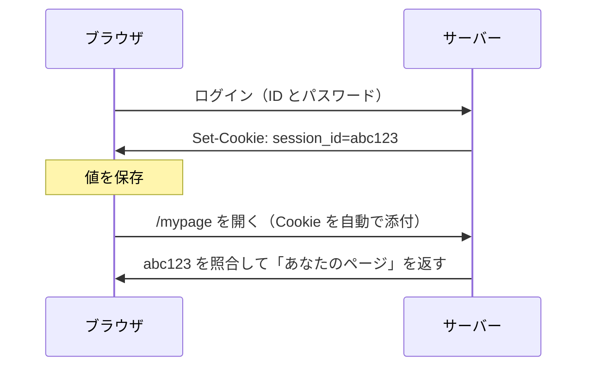

# Cookie — ブラウザが自動で送る値

## 今日のゴール

- Cookie は「サーバーが預け、ブラウザが以降自動で送り返す値」だと仕組みで知る
- 宛先は決まっているが、どのページから送ったかは問われないと知る
- その隙を CSRF が突き、SameSite や HttpOnly で送り方を絞ると知る

## リロードしてもログインが続く理由

ログインした後は、リロードしても、ブラウザを閉じて開き直しても、サイトはあなたを覚えています。当たり前に感じますが、HTTP の仕組みからすると当然ではありません。

HTTP は **ステートレス**、つまり状態を持たないプロトコルです。リクエストは 1 回ごとに独立していて、サーバーから見ると全リクエストが初対面です。

「さっきログインした人」という記憶は、サーバーのどこにもありません。だから毎回のリクエストで「私はさっきの続きです」と申告する仕組みが要ります。

その仕組みが **Cookie** です。

## Cookie の仕組み — 預けて自動で送り返す

Cookie は 2 ステップで動きます。

1. サーバーがレスポンスで「この値を持っておいて」と渡す（`Set-Cookie`）
2. ブラウザはそれを保存し、以降そのサーバーへのリクエストに自動で付けて送る

ログインの一連の流れで追うと、こうなります。



やり取りされる中身はこれだけです。

```
（ログイン成功時のレスポンス）
Set-Cookie: session_id=abc123; HttpOnly; Secure

（以降、ブラウザが毎回付ける）
Cookie: session_id=abc123
```

見落としやすいのですが、2 回目に `Cookie:` を付けたのは**ブラウザ自身**です。アプリのコードは「Cookie を送れ」とはどこにも書いていないのに、ブラウザが勝手に付けます。

記憶しているのはブラウザで、サーバーは毎回届いた値を照合しているだけです。便利なのも危険なのも、この「勝手に送る」性質から来ています。

## 宛先は決まっているが発信元は問われない

「自動で送る」といっても、宛先は決まっています。Cookie には発行元のドメインが紐づいていて、ブラウザは**その宛先へのリクエストにだけ**付けます。

だから `example.com` の Cookie は `example.com` にしか送られず、`attacker.com` に渡ることはありません。ここは心配いりません。

ただし、抜けがあります。ブラウザは長い間、**そのリクエストがどのページから送られたか**を気にしていませんでした。

そのため、`attacker.com` を開いていると、そこから `example.com` へ送られるリクエストにも `example.com` の Cookie が付いてしまいます。

この「宛先は見るが発信元は問わない」という隙を、攻撃者が突きます。

## 自動送信の危険と対策

`example.com` にログイン中のまま別のサイトを開くと、そのサイトが仕込んだ `example.com` への送信にも、ブラウザは Cookie を付けてしまいます。利用者は操作した覚えがないのに、ログイン済みの操作が通ってしまいます。

これが、別サイトからあなたになりすます CSRF という攻撃です。

抑えるのが `SameSite` 属性です。送る前に「発信元が同じサイトか」を見て、別サイト発の送信には Cookie を付けないようにします。

主要ブラウザは、指定のない Cookie を `Lax` として扱います。

`SameSite` が見る「同じサイト」は、よく same-origin と混同されます。この 2 つは基準が違います。

- **same-origin**（同一オリジン）: スキーム・ホスト・ポートがすべて一致する、いちばん厳密な基準
- **same-site**（同一サイト）: スキームが同じで、登録可能ドメイン（`example.com` など）が同じ。ポートやサブドメインの違いは同じサイト扱い

| 比べる URL | same-origin | same-site |
|---|---|---|
| `https://example.com` と `https://example.com/mypage` | ○ | ○ |
| `https://example.com` と `https://shop.example.com` | ✗ ホスト違い | ○ ドメインは同じ |
| `https://example.com` と `https://example.com:8080` | ✗ ポート違い | ○ ポートは見ない |
| `https://example.com` と `https://attacker.com` | ✗ | ✗ |

`SameSite` が見るのは same-site のほうです。一方、JavaScript が別サイトのデータを読めるかどうかは、より厳密な same-origin で決まります。

`SameSite` の値は、別サイトへの送信をどこまで許すかの3段階です。

- `Lax`（指定なしの既定）: 同じサイト内では送り、別サイトからでもリンクをたどる通常の遷移では送る。POST や埋め込みには送らないので、ログイン維持と CSRF 対策のバランスが取れる
- `Strict`: 同じサイト内でしか送らない。外部リンクから来た初回は未ログイン扱いになるため、安全側だが利用者の体験は損なう
- `None`: 別サイトへの送信でも常に送る。`Secure` が必須で、CSRF の露出が大きいので別の対策とセットで使う

危険はもう一つ、値をどこに置くかにもあります。ログインの値を JavaScript から読める場所（`localStorage` など）に置くと、XSS（入力がコードとして実行される攻撃）が一度でも成立したら、その値がまるごと盗まれます。

`HttpOnly` を付けた Cookie は、ブラウザの JavaScript（`document.cookie`）から読めなくなります。XSS で紛れ込んだスクリプトがあっても、その値を読み出して盗めません。

実際の `Set-Cookie` では、名前と値のうしろに属性を `;` で並べて書きます。

```
Set-Cookie: session_id=abc123; HttpOnly; Secure; SameSite=Lax; Path=/; Max-Age=3600
```

`HttpOnly` と `Secure` は値を取らないフラグで、その語を書けば有効、書かなければ無効です。`SameSite` や `Path`、`Max-Age` は `=` のうしろに値を書きます（`Max-Age` は秒数、`SameSite` は `Lax`/`Strict`/`None` のいずれか、という具合です）。

| 属性 | 書き方 | 絞る内容 |
|---|---|---|
| `HttpOnly` | フラグ（値なし） | ブラウザの JavaScript から読めなくする |
| `Secure` | フラグ（値なし） | HTTPS のときだけ送る |
| `SameSite` | `SameSite=Lax` など | 別サイトへのリクエストにも送るか |
| `Domain` / `Path` | `Domain=example.com` / `Path=/` | どの範囲のリクエストに送るか |
| `Expires` / `Max-Age` | `Max-Age=3600`（秒）など | いつまで保存するか |

`Domain` と `Path` は、送る宛先の範囲を決めます。`Domain` が「どのホストまで送るか」、`Path` が「同じホストのどの URL 以下に送るか」です。

`Domain` は宛先のホストの広さです。

- 付けないとき（既定）: 発行したホストにだけ送る。`www.example.com` が発行した Cookie は、`shop.example.com` にも `example.com` にも届かない
- `Domain=example.com`: そのドメインとサブドメイン全部（`www.` `shop.` `api.` など）に送る。`app.example.com` と `api.example.com` でログインを共有したいときのように、サブドメインをまたいで使うときだけ広げる

`Path` は同じホストの中の URL の範囲を絞りますが、同一オリジンなら別のパスから読み出せるため、強い隔離にはなりません。ふつうは全体（`/`）のままにします。

`Secure` は、HTTPS のときだけ Cookie を送る指定です。付けないと暗号化されていない通信にも送られてしまい、途中で盗み見られる恐れがあるので、ログインの値には付けておきます。

`Expires` と `Max-Age` は、保存しておく期間です。指定しなければブラウザを閉じたときに消え（セッション Cookie）、指定するとその期間は残ります。

認証の値なら `HttpOnly` と `Secure` を付け、送る範囲（`SameSite`・`Domain`）は既定の狭いまま、必要なときだけ広げます。

## まとめ

- Cookie はサーバーが預け、ブラウザが以降のリクエストに自動で送り返す値
- 宛先は決まっているが、どのページから送ったかは問われない隙がある
- その隙を突くのが CSRF で、SameSite が発信元を見て別サイト送信を絞る
- 認証の値は HttpOnly Cookie に置き、localStorage に置かない
