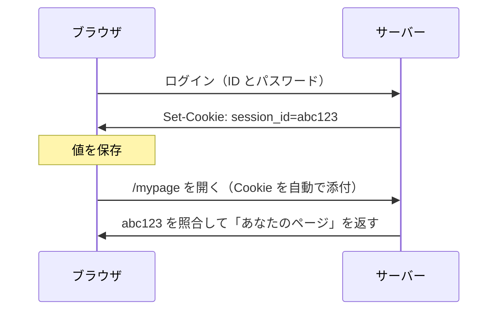

# Cookie — ブラウザが自動で送る値

## 今日のゴール

- Cookie は「サーバーが預け、ブラウザが以降自動で送り返す値」だと仕組みで知る
- 自動で送るからこそ、送る範囲を same-site で絞る必要があると知る
- 自動で送るからこそ生まれる危険を、HttpOnly・SameSite などの属性で絞ると知る

## リロードしてもログインが続く理由

ログインした後は、リロードしても、ブラウザを閉じて開き直しても、サイトはあなたを覚えています。当たり前に感じますが、HTTP の仕組みからすると当然ではありません。

HTTP は **ステートレス**、つまり状態を持たないプロトコルです。リクエストは 1 回ごとに独立していて、サーバーから見ると全リクエストが初対面です。

「さっきログインした人」という記憶は、サーバーのどこにもありません。だから毎回のリクエストで「私はさっきの続きです」と申告する誰かが要ります。

その申告役が **Cookie** です。

## Cookie の仕組み — 預けて自動で送り返す

Cookie は 2 ステップで動きます。

1. サーバーがレスポンスで「この値を持っておいて」と渡す（`Set-Cookie`）
2. ブラウザはそれを保存し、以降そのサーバーへのリクエストに自動で付けて送る

ログインの一連の流れで追うと、こうなります。



やり取りされる中身はこれだけです。

```
（ログイン成功時のレスポンス）
Set-Cookie: session_id=abc123; HttpOnly; Secure

（以降、ブラウザが毎回付ける）
Cookie: session_id=abc123
```

ここで一番大事なのは、2 回目のリクエストに `Cookie:` を付けたのが**ブラウザ自身**だということです。アプリのコードは「Cookie を送れ」とはどこにも書いていないのに、ブラウザが勝手に付けます。

記憶しているのはブラウザで、サーバーは毎回届いた値を照合しているだけです。この「勝手に付けて送る」性質が、便利さと危険の両方を生みます。

## 送る範囲を絞る — same-site と same-origin

「自動で送る」といっても、どこへでも送るわけではありません。もし本当にどこへでも送ったら、まったく無関係なサイトを開いただけで `session_id` が相手に渡ってしまいます。

だからブラウザは、Cookie を**発行元と同じサイト宛てのリクエストにだけ**付けます。攻撃者の `attacker.com` を開いても、そこから `example.com` への通信に `example.com` の Cookie は付きません。

この「同じサイト」の基準が、よく混同される 2 つに分かれます。

- **same-origin**（同一オリジン）: スキーム・ホスト・ポートがすべて一致する、いちばん厳密な基準
- **same-site**（同一サイト）: 登録可能ドメイン（`example.com` など）が同じ。ポートやサブドメインの違いは同じサイト扱い

具体的な URL で判定を並べると、違いがはっきりします。

| 比べる URL | same-origin | same-site |
|---|---|---|
| `https://example.com` と `https://example.com/mypage` | ○ | ○ |
| `https://example.com` と `https://shop.example.com` | ✗ ホスト違い | ○ ドメインは同じ |
| `https://example.com` と `https://example.com:8080` | ✗ ポート違い | ○ ポートは見ない |
| `https://example.com` と `https://attacker.com` | ✗ | ✗ |

Cookie の送信範囲を決める `SameSite` 属性が見ているのは、名前のとおり same-site のほうです。だから `shop.example.com` から `example.com` への送信は「同じサイト」として扱われます。

一方、JavaScript が別サイトのデータを読めるかどうかは、より厳密な same-origin で判定されます。同じ「サイト」という言葉でも、場面によって基準が違うわけです。

## 自動送信が生む危険と属性での制御

自動で送る便利さには裏返しがあります。危険も同じ「勝手に送る」性質から生まれます。

`example.com` にログイン中のまま別のサイトを開くと、そのサイトが仕込んだ `example.com` への送信にも、ブラウザは Cookie を付けてしまいます。利用者は操作した覚えがないのに、ログイン済みの操作が成立してしまいます。

これが、別サイトからあなたになりすます CSRF という攻撃の芽です。抑えるのが `SameSite` 属性で、既定値の Lax は別サイト発の送信の多くに Cookie を付けません。

危険はもう一つ、値をどこに置くかにもあります。ログインの値を JavaScript から読める場所（`localStorage` など）に置くと、XSS（入力がコードとして実行される攻撃）が一度でも成立したら、その値がまるごと盗まれます。

`HttpOnly` を付けた Cookie なら、同じ状況でもブラウザの JavaScript から直接は読めません。`document.cookie` からも、`fetch` で受け取ったヘッダーからも取れないため、XSS で紛れ込んだスクリプトに盗まれません。

これらの属性はどれも、この「自動送信をどう絞るか」を決めるものです。

| 属性 | 絞る内容 |
|---|---|
| `HttpOnly` | ブラウザの JavaScript から読めなくする |
| `Secure` | HTTPS のときだけ送る |
| `SameSite` | 別サイトへのリクエストにも送るか |
| `Domain` / `Path` | どの範囲のリクエストに送るか |
| `Expires` / `Max-Age` | いつまで保存するか |

このうち値で挙動が大きく変わるのが `SameSite` と `Domain` です。どちらも「どこまで送るか」を選びます。

`SameSite` は、別サイトへの送信をどこまで許すかの3段階です。

- `Lax`（既定）: 同じサイト内では送り、別サイトからでもリンクをたどる通常の遷移では送る。POST や埋め込みには送らないので、ログイン維持と CSRF 対策のバランスが取れる
- `Strict`: 同じサイト内でしか送らない。外部リンクから来た初回は未ログイン扱いになるため、安全側だが利用者の体験は損なう
- `None`: 別サイトへの送信でも常に送る。`Secure` が必須で、CSRF の露出が大きいので別の対策とセットで使う

`Domain` は、送る宛先の広さを決めます。

- 付けないとき（既定）: 発行したホストにだけ送る。`example.com` の Cookie は `shop.example.com` には届かない
- `Domain=example.com`: そのドメインとサブドメイン全部に送る。サブドメイン間で共有したいときだけ広げる

`Path` も送る URL の範囲を絞れますが、同一オリジン内では強い隔離になりません。ふつうは全体（`/`）のままでよいものです。

どの属性も、既定が安全側に寄っています。広げるのは必要なときだけ、が基本です。

## Next.js での読み方

Server Components や Server Actions はサーバーで動くので、ブラウザが自動で送ってきた Cookie をそのまま読めます。

```tsx
import { cookies } from "next/headers";

export default async function MyPage() {
  const cookieStore = await cookies();
  const sessionId = cookieStore.get("session_id")?.value;
  // sessionId でユーザーを照合して画面を作る
}
```

ブラウザが自動で送る、サーバーで照合する、というこのレッスンの流れが、App Router では `cookies()` として現れます。

ただし、アプリの後ろに別のバックエンド API がいる構成では一点だけ注意があります。ブラウザから Next への Cookie は自動でも、Next からその API への `fetch` には自動で付きません。

サーバー間の通信には、ブラウザのような Cookie の保管庫がないからです。届いた Cookie を次のリクエストに載せ替えれば、その先でも同じ利用者だと分かります。

## まとめ

- Cookie はサーバーが預け、ブラウザが以降のリクエストに自動で送り返す値
- 自動で送るから、送信範囲を same-site（ドメイン基準、same-origin とは別）で絞る
- 自動で送るから危険も生まれ、HttpOnly・SameSite で送り方を絞る
- 認証の値は HttpOnly Cookie に置き、localStorage に置かない
