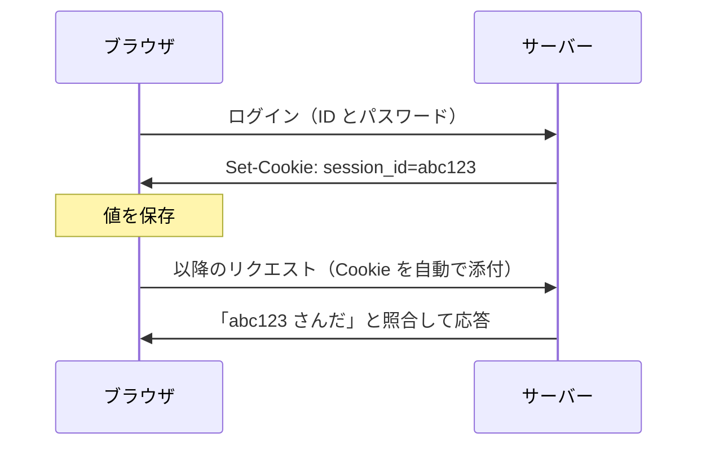

# Cookie — ブラウザが自動で送る値とその制御

## 今日のゴール

- Cookie は「ブラウザが自動で送る値」で、ログイン状態を支えると知る
- どこに送られるか（same-site と same-origin の違い）を知る
- HttpOnly・Secure・SameSite など、送り方を制御する属性を知る

## リロードしてもログインしたまま

ログインした後は、リロードしても、ブラウザを閉じて開き直しても、サイトはあなたを覚えています。当たり前に感じますが、HTTP の仕組みからすると当然ではありません。

HTTP は **ステートレス**、つまり状態を持たないプロトコルです。リクエストは 1 回ごとに独立していて、サーバーから見ると全リクエストが初対面です。

「さっきログインした人」という記憶は、HTTP のどこにもありません。覚えているのは **Cookie** の仕組みです。

## Cookie は自動で送られる値

Cookie の仕組みは 2 ステップです。

1. サーバーがレスポンスで「この値を持っておいて」と渡す（`Set-Cookie`）
2. ブラウザはそれを保存し、以降のリクエストに自動で付けて送る

```
（ログイン成功時のレスポンス）
Set-Cookie: session_id=abc123; HttpOnly; Secure

（以降、ブラウザが毎回付ける）
Cookie: session_id=abc123
```



サーバーは届いた値を照合して「abc123 さんだ」と分かります。記憶しているのはブラウザで、サーバーは毎回照合しているだけです。

Cookie に入れる値は、多くはログイン状態を表す ID（セッション ID）や、署名付きのトークンです。

そして Cookie の要点は、すべて「自動で送られる」ことに集約されます。この後の属性も、その自動送信をどう制御するかの話です。

## どこに送られるか — same-site と same-origin

「自動で送られる」と言っても、どこへでも送られるわけではありません。Cookie は基本的に、発行元と同じサイトへのリクエストに付きます。

この「同じサイト」の判定基準が、よく混同される 2 つに分かれます。

- **same-origin**（同一オリジン）: スキーム・ホスト・ポートがすべて一致する、いちばん厳密な基準
- **same-site**（同一サイト）: 登録可能ドメイン（`example.com` など）が同じ。ポートやサブドメインの違いは同じサイト扱い

具体的な URL で比べてみます。

| 比べる URL | same-origin | same-site |
|---|---|---|
| `https://example.com` と `https://example.com/mypage` | ○ | ○ |
| `https://example.com` と `https://shop.example.com` | ✗ ホスト違い | ○ ドメインは同じ |
| `https://example.com` と `https://example.com:8080` | ✗ ポート違い | ○ ポートは見ない |
| `https://example.com` と `https://attacker.com` | ✗ | ✗ |

Cookie の `SameSite` 属性が見ているのは、名前のとおり same-site のほうです。だから `shop.example.com` から `example.com` への送信は「同じサイト」として扱われます。

一方、JavaScript が別サイトのデータを読めるかどうかは、より厳密な same-origin で判定されます。同じ「サイト」という言葉でも、基準が違うわけです。

## 送り方を制御する属性

Cookie の属性は、どれも「自動送信をどう制御するか」を決めます。

| 属性 | 制御する内容 |
|---|---|
| `HttpOnly` | JavaScript から読めなくする |
| `Secure` | HTTPS のときだけ送る |
| `SameSite` | 別サイトへのリクエストにも送るか |
| `Domain` / `Path` | どの範囲のリクエストに送るか |
| `Expires` / `Max-Age` | いつまで保存するか |

特に大事なのが `HttpOnly` です。ログインの値を JavaScript から読める場所（`localStorage` など）に置くと、XSS（入力がコードとして実行される攻撃）が一度でも成立したら盗まれます。

`HttpOnly` を付けた Cookie は、同じ状況でも JavaScript から直接は読めません。「認証の値は HttpOnly Cookie に置く」は、覚えておく価値のある基本です。

`SameSite` は、別サイトからの意図しない送信（CSRF）を抑えるための属性です。既定値は Lax で、他サイト発の送信の多くには付きません。

## Next.js ではどう見えるか

Server Components や Server Actions はサーバーで動くので、届いた Cookie をそのまま読めます。

```tsx
import { cookies } from "next/headers";

export default async function MyPage() {
  const cookieStore = await cookies();
  const sessionId = cookieStore.get("session_id")?.value;
  // sessionId でユーザーを照合して画面を作る
}
```

ブラウザが自動で送る、サーバーで照合する、という流れが、App Router では `cookies()` として現れます。

## まとめ

- Cookie は、ブラウザが自動で送る小さな値で、ログイン状態を支える
- 送られる範囲は same-site（ドメイン基準）で、より厳密な same-origin とは別物
- 自動送信を制御するのが HttpOnly・Secure・SameSite・有効期限などの属性
- 認証の値は HttpOnly Cookie に置き、localStorage に置かない
