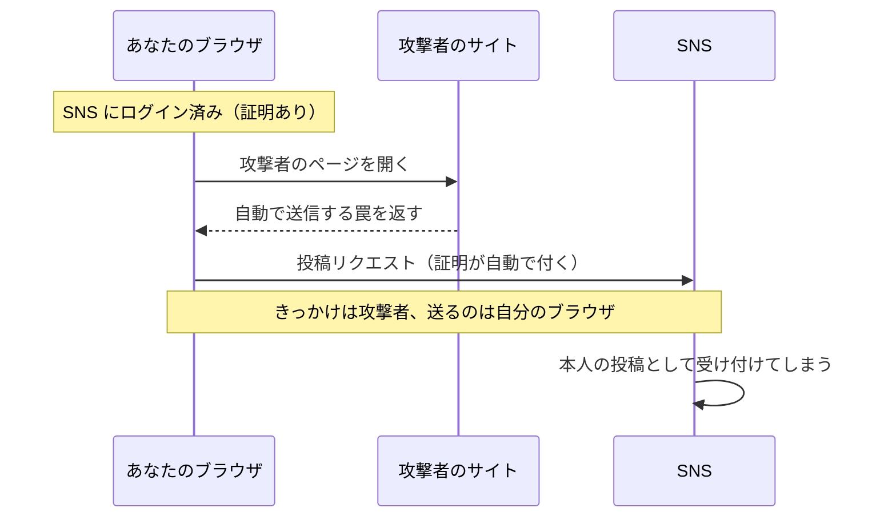

# CSRF — 別サイトからあなたになりすます攻撃

## 今日のゴール

- CSRF が「別サイトから本人の操作を偽造する攻撃」だと知る
- なぜ成立するのか、その仕組みを知る
- SameSite と CSRF トークンという 2 つの防御を知る

## CSRF とは何か

あなたが SNS にログインしています。その状態のまま、メールに届いたリンクを何気なく開きます。

すると、そのページを開いただけで、あなたのアカウントから勝手に投稿が行われます。投稿した覚えはありません。

これが **CSRF**（Cross-Site Request Forgery）です。別のサイトから、ログイン中の本人になりすまして操作を送り込む攻撃を指します。

盗まれたのはパスワードではありません。「操作」そのものが偽造されたのです。

同じ手口は、退会や送金のような、もっと重い操作にも使われます。

## なぜ起きるのか

原因は、ログイン状態を保つ **Cookie が自動で送られる** ことです。

Cookie は「ログイン済みの本人だ」という証明で、ブラウザが預かっています。SNS 宛てのリクエストには、ブラウザがこの証明を自動で付けます。

だからあなたは、毎回ログインし直さずに済んでいます。

問題は、この自動添付が **どのサイトをきっかけに送られたかを問わない** ことです。宛先が SNS でさえあれば、別のサイトのページがきっかけで送られたリクエストでも、ブラウザは SNS の証明を付けてしまいます。

その結果、あなたのブラウザから偽の投稿リクエストが送られ、SNS には「本人からの正規の投稿」として届きます。

ブラウザは、別サイトのデータを JavaScript から読み取ることは止めています（同一オリジンポリシー）。しかし、別サイトへ送信すること自体は昔から許されてきました。

だから CSRF でできるのは、結果を読むことではなく、操作を送りつけることだけです。



::: details 攻撃の仕掛けを見る
攻撃者がやることは、自分のサイトにこんなフォームを置いておくだけです。

```html
<form action="https://sns.example/posts" method="POST">
  <input type="hidden" name="text" value="【拡散希望】いますぐ登録 https://spam.example" />
</form>
<script>
  document.forms[0].submit(); // ページを開いた瞬間に自動送信
</script>
```

ユーザーがこのページを開くと、スクリプトがフォームを自動で送信します。送信先は SNS なので、ここで SNS の Cookie が一緒に送られれば、SNS は本人の投稿だと信じてしまいます。
:::

## XSS との違い

同じ Web セキュリティの定番でも、XSS と CSRF は別物です。XSS は、標的サイトの画面の中に攻撃者のスクリプトを紛れ込ませる攻撃です。

| | XSS | CSRF |
|---|-----|------|
| 攻撃の場所 | 標的サイトの中にスクリプトを注入 | 外部の攻撃者サイトからしかける |
| できること | ほぼ何でも（読み取りも操作も） | 操作の偽造だけ（結果は読めない） |
| 例えるなら | 家の中に侵入される | 家の外から、本人の名前で出前を注文される |

違いは「どこから攻撃するか」です。XSS は標的サイトの中でスクリプトを動かすので、読み取りも操作も自由にできます。

CSRF は外の攻撃者サイトからしかけるだけなので、操作は通せても、返ってきた結果は読めません。

## どう防ぐか

### SameSite Cookie

まず効くのが Cookie の `SameSite` 属性です。Cookie 自身に「他サイト発のリクエストには付かない」と宣言させます。

前提として、リクエストには種類があります。ページを開いて表示する読み取りが GET、フォーム送信のようにデータを変える操作が POST です。

| 値 | 動き |
|----|------|
| `Lax`（現在の既定値） | 他サイト発の POST などには付けない。リンクをたどる移動（GET）だけ付ける |
| `Strict` | 他サイト発には一切付けない |
| `None` | 従来どおり常に付ける（`Secure` 必須） |

主要ブラウザの既定が `Lax` になったことで、さきほどの自動送信フォーム（他サイト発の POST）には Cookie が付かなくなりました。古典的な CSRF の多くは、いまや既定でふさがれています。

ただし、これで安心はできません。リンクをクリックして移動する GET のリクエストには、Lax でも Cookie が付きます。

だから、データを変える処理を GET で作ってあると、リンクを踏ませるだけで今でも通ってしまいます。Cookie を `None` に設定している場合も、この守りは外れます。

こうした穴があるので、次のトークンと重ねるのが定石です。

### CSRF トークン

昔からある堅い防御が、正規のフォームにだけ合言葉を仕込む方法です。

1. サーバーは画面を返すとき、推測できないトークンをフォームに埋め込む
2. 送信時に、そのトークンが一緒に届くかを検証する
3. 攻撃者サイトはこのトークンを読み取れないので、正しい合言葉つきの偽造ができない

Cookie は自動で付いてしまいますが、合言葉は正規の画面からしか持ち出せません。この差を突いた防御です。

### Next.js の場合

Server Actions には、そのリクエストが自分のサイトから来たか（Origin ヘッダー）を検証する仕組みが入っています。SameSite の既定値と合わせて、何もしなくても一定の防御がある状態です。

気をつけるのは、自前で API（Route Handler）を作って Cookie 認証で操作を受け付けるときです。ここはこの自動防御の外に出ます。

「この変更系 API、他サイトから叩かれたらどうなるか」を自分に問うのが大事です。先ほどの GET の抜け道もあるので、変更を起こす処理を GET で作らないことも徹底します。

## まとめ

- CSRF は、Cookie の自動添付を悪用し、外部サイトから本人の操作を偽造する攻撃
- XSS は家への侵入、CSRF は外からの名義悪用で、操作の偽造だけができる
- 防御は SameSite（既定 Lax）と CSRF トークンの重ねがけ
- Lax でも GET のリンクには Cookie が付くので、変更処理を GET で作らない
