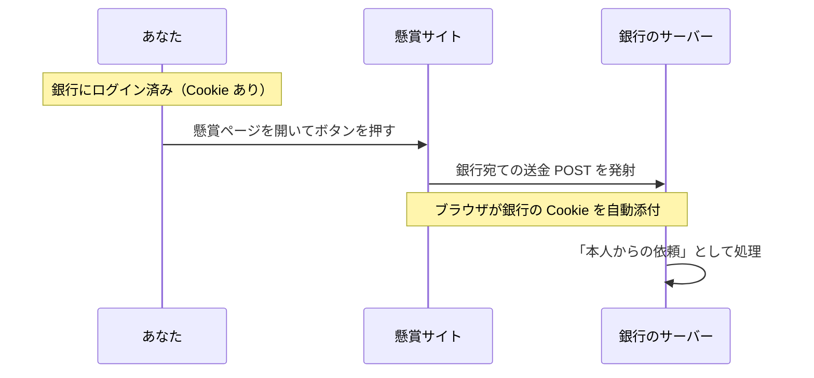

# CSRF — ログイン中のあなたを、別サイトから操る攻撃

## 今日のゴール

- Cookie の自動添付が、攻撃の入口にもなることを知る
- CSRF の攻撃の流れと、XSS との違いを知る
- SameSite と CSRF トークンという 2 つの防御を知る

## 送金ボタンを押していないのに送金される

あなたは今、銀行のサイトにログインしています。別のタブで開いた懸賞サイトに、「プレゼントに応募する」というボタンがあります。

押してみましょう。

実はこのボタン、見た目とは裏腹に、こんな仕込みがされています。

```html
<!-- 懸賞サイトの中身。見た目は「プレゼントに応募する」ボタン -->
<form action="https://bank.example/transfer" method="POST">
  <input type="hidden" name="to" value="attacker-account" />
  <input type="hidden" name="amount" value="100000" />
  <button>応募する</button>
</form>
```

ボタンを押すと、このフォームは懸賞サイトではなく**銀行に向かって** POST を送ります。Cookie は、リクエストがどこから発射されたかに関係なく、宛先が一致していれば自動で添付されるからです。

銀行の Cookie を持っているあなたのブラウザは、これが懸賞サイトからの送信だとは気にせず、銀行の Cookie を律儀に乗せてしまいます。結果として、銀行のサーバーには「**ログイン済み本人からの送金依頼**」が届きます。



サーバー側から見ると、正規の操作と区別がつきません。パスワードは盗まれていないのに、操作だけが偽造されています。

これが **CSRF**（Cross-Site Request Forgery、サイトをまたいだリクエストの偽造）です。

### XSS との違い

| | XSS | CSRF |
|---|-----|------|
| 攻撃の場所 | **標的サイトの中**にスクリプトを注入 | **外部の罠サイト**からリクエストを発射 |
| できること | ほぼ何でも（読み取りも操作も） | **操作の偽造だけ**（結果を読むことはできない） |
| 例えるなら | 家の中に侵入される | 家の外から、本人の名前で出前を注文される |

ブラウザにはもともと「別サイトのデータを JavaScript から**読ませない**」防御（同一オリジンポリシー）があります。しかし**送信そのもの**（フォームの POST）は昔から別サイト宛てに可能で、そこに Cookie が付くことが CSRF の急所です。

読み取りは防がれているのに、操作は通ってしまうという隙間です。

## 1. SameSite Cookie

この抜け穴をふさぐ一番手の防御が `SameSite` 属性です。Cookie 自身に「他サイト発のリクエストには付かない」と宣言させます。

| 値 | 動き |
|----|------|
| `Lax`（**現在の既定値**） | 他サイト発の POST などには付けない。リンクをクリックして移動する（GET）場合だけ付ける |
| `Strict` | 他サイト発には一切付けない（リンクで来た直後はログアウト状態に見える） |
| `None` | 従来どおり常に付ける（`Secure` 必須。サイトをまたぐ正当な連携用） |

主要ブラウザの既定が `Lax` になったことで、先ほどの懸賞サイトの罠フォーム（他サイト発の POST）には Cookie が付かなくなり、古典的な CSRF の多くは既定でふさがれました。

ただし設定や例外で崩れることもあるため、次のトークンと重ねるのが定石です。

## 2. CSRF トークン — 合言葉

もう 1 つ、昔からある堅い防御が、**正規のフォームにだけ合言葉を仕込む**方法です。

1. サーバーは画面を返すとき、推測不能なトークンをフォームに埋め込む
2. 送信時にトークンも一緒に届くか検証する
3. 罠サイトはこのトークンを**読めない**（別オリジンの読み取りは同一オリジンポリシーが防ぐ）ので、正しい合言葉付きのリクエストを偽造できない

Cookie は自動で付いてしまいますが、合言葉は正規の画面からしか持ち出せません。この差を利用した防御です。

## Next.js ではどうなっているか

Server Actions には、そのリクエストが自分のサイトから来たものか（Origin ヘッダー）を検証する仕組みが組み込まれています。SameSite の既定値と合わせて、何もしなくても一定の防御がある状態です。

ただし、自前で API（Route Handler）を作って Cookie 認証で操作を受け付ける場合は、この自動防御の外に出ます。

自作 API のときは、「この変更系 API、他サイトから叩かれたらどうなるか」と自分に問うのが大事です。

変更系を GET で作らないという基本もここで効いてきます。GET は SameSite=Lax でも Cookie が付く側だからです。

## まとめ

- CSRF は、Cookie の自動添付を悪用し、外部サイトから「本人の操作」を偽造する攻撃
- XSS は家への侵入、CSRF は外からの名義悪用で、読み取りはできず操作の偽造だけ
- 防御は SameSite（既定 Lax）と CSRF トークンの重ねがけ
- Server Actions は Origin 検証内蔵。自作 API と GET の変更系は要注意
