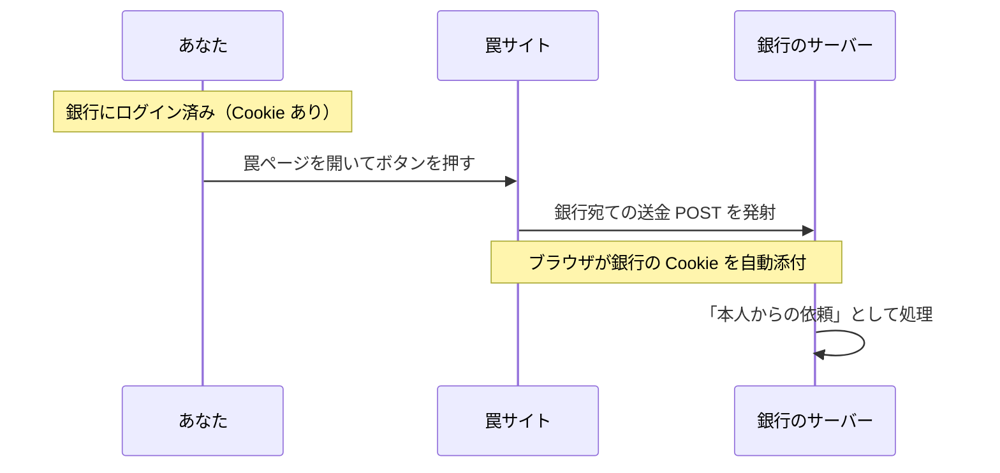

# CSRF — ログイン中のあなたを、別サイトから操る攻撃

## 今日のゴール

- Cookie の「自動添付」が攻撃の入口にもなることを知る
- CSRF の攻撃の流れと、XSS との違いを知る
- SameSite と CSRF トークンという 2 つの防御を知る

## 便利さに伴うリスク

Cookie は、同じサイトへのリクエストに**ブラウザが自動で添付**してくれます。おかげでログイン状態が保たれるわけですが、この「自動」には見落とされがちな仕様があります。

**リクエストの発生源がどこであっても、宛先が合っていれば添付される**（のが従来の動作だった）、という点です。あなたが銀行のサイトを開いていなくても、**別のサイトが銀行宛てのリクエストを発生させれば**、ブラウザは律儀に銀行の Cookie を添えようとします。

この仕様を悪用するのが **CSRF**（Cross-Site Request Forgery、サイトをまたいだリクエストの偽造）です。

## 攻撃の流れ — 押しただけで「本人の操作」になる

1. あなたは銀行のサイトにログインしている（ブラウザに銀行の Cookie がある）
2. 攻撃者の用意したページを開いてしまう。そこには罠のフォームが隠れている

```html
<!-- 罠サイトの中身。見た目は「プレゼントに応募する」ボタン -->
<form action="https://bank.example/transfer" method="POST">
  <input type="hidden" name="to" value="attacker-account" />
  <input type="hidden" name="amount" value="100000" />
  <button>応募する</button>
</form>
```

3. ボタンを押すと、フォームは**銀行に向かって** POST される
4. ブラウザが銀行の Cookie を自動添付するので、銀行のサーバーには「**ログイン済み本人からの送金依頼**」が届く



サーバー側から見ると、正規の操作と区別がつきません。パスワードは盗まれていないのに、操作だけが偽造される。これが CSRF です。

### XSS との違い

| | XSS | CSRF |
|---|-----|------|
| 攻撃の場所 | **標的サイトの中**にスクリプトを注入 | **外部の罠サイト**からリクエストを発射 |
| できること | ほぼ何でも（読み取りも操作も） | **操作の偽造だけ**（結果を読むことはできない） |
| 例えるなら | 家の中に侵入される | 家の外から、本人の名前で出前を注文される |

ブラウザにはもともと「別サイトのデータを JavaScript から**読ませない**」防御（同一オリジンポリシー）があります。しかし**送信そのもの**（フォームの POST）は昔から別サイト宛てに可能で、そこに Cookie が付くことが CSRF の急所でした。読み取りは防がれているのに、操作は通ってしまうという隙間です。

## 1. SameSite Cookie

現代の第一の防御は、Cookie 自身に「**他サイト発のリクエストには付かない**」と宣言させることです。それが `SameSite` 属性です。

| 値 | 動き |
|----|------|
| `Lax`（**現在の既定値**） | 他サイト発の POST などには付けない。リンクをクリックして移動する（GET）場合だけ付ける |
| `Strict` | 他サイト発には一切付けない（リンクで来た直後はログアウト状態に見える） |
| `None` | 従来どおり常に付ける（`Secure` 必須。サイトをまたぐ正当な連携用） |

主要ブラウザの既定が `Lax` になったことで、**先ほどの罠フォーム（他サイト発の POST）には Cookie が付かなくなり**、古典的な CSRF の多くは既定で塞がれました。ただし「既定値頼み」は設定や例外で崩れることがあるため、次のトークンと重ねるのが定石です。

## 2. CSRF トークン（合言葉）

もう 1 つの古典的で堅い防御が、**正規のフォームにだけ合言葉を仕込む**方法です。

1. サーバーは画面を返すとき、推測不能なトークンをフォームに埋め込む
2. 送信時にトークンも一緒に届くか検証する
3. 罠サイトはこのトークンを**読めない**（別オリジンの読み取りは同一オリジンポリシーが防ぐ）ので、正しい合言葉付きのリクエストを偽造できない

「Cookie は自動で付くが、合言葉は正規の画面からしか持ち出せない」という非対称を利用した防御です。

## Next.js ではどうなっているか

Server Actions には、**リクエストの発生源（Origin ヘッダー）がサイト自身かを検証する仕組みが組み込まれています**。SameSite の既定値とあわせて、何もしなくても一定の防御がある状態です。

ただし、自前で API（Route Handler）を作って Cookie 認証で操作を受け付ける場合は、**この自動防御の外**です。AI に API を生成させたときは、「**この変更系 API、他サイトから叩かれたらどうなる？**」が問うべき質問になります。変更系を GET で作らない（GET は SameSite=Lax でも Cookie が付く側です）、という基本もここで効いてきます。

## まとめ

- CSRF = Cookie の自動添付を悪用し、外部サイトから「本人の操作」を偽造する攻撃
- XSS は家への侵入、CSRF は外からの名義悪用。読み取りはできず操作の偽造だけ
- 防御は SameSite（既定 Lax）+ CSRF トークンの重ねがけ
- Server Actions は Origin 検証内蔵。自作 API と GET の変更系が要注意ゾーン
