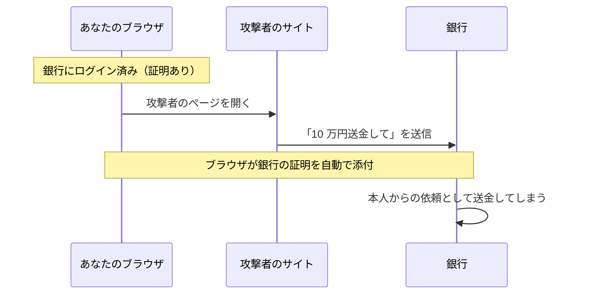

# CSRF — 別サイトからあなたになりすます攻撃

## 今日のゴール

- CSRF が「別サイトから本人の操作を偽造する攻撃」だと知る
- なぜ成立するのか、その仕組みを知る
- SameSite と CSRF トークンという 2 つの防御を知る

## CSRF とは何か

あなたが銀行にログインしています。その状態のまま、まったく別のサイトをうっかり開きます。

すると、その別サイトを開いただけで、あなたの口座から勝手に送金が実行されます。送金ボタンを押した覚えはありません。

これが **CSRF**（Cross-Site Request Forgery）です。別のサイトから、ログイン中の本人になりすまして操作を送り込む攻撃を指します。

盗まれたのはパスワードではありません。「操作」そのものが偽造されたのです。

## なぜ起きるのか

原因は、ログイン状態を保つ **Cookie が自動で送られる** ことです。

Cookie は「ログイン済みの本人だ」という証明で、ブラウザが預かっています。銀行宛てのリクエストには、ブラウザがこの証明を自動で付けます。

だからあなたは、毎回ログインし直さずに済んでいます。

問題は、この自動添付が **リクエストの発信元を問わない** ことです。宛先が銀行でさえあれば、たとえ別のサイトが送ったリクエストでも、ブラウザは銀行の証明を付けてしまいます。

その結果、別サイトから送られた偽の送金リクエストが、銀行には「本人からの正規の依頼」として届きます。

ブラウザは、別サイトのデータを JavaScript から読み取ることは止めています（同一オリジンポリシー）。しかし、別サイトへ送信すること自体は昔から許されてきました。

だから CSRF では、攻撃者は結果を読めないまま、操作だけを送りつけます。



::: details 攻撃の仕掛けを見る
攻撃者がやることは、自分のサイトにこんなフォームを置いておくだけです。

```html
<form action="https://bank.example/transfer" method="POST">
  <input type="hidden" name="to" value="attacker-account" />
  <input type="hidden" name="amount" value="100000" />
</form>
<script>
  document.forms[0].submit(); // ページを開いた瞬間に自動送信
</script>
```

ユーザーがこのページを開くと、スクリプトがフォームを自動で送信します。フォームの送信先は銀行なので、ここで銀行の Cookie が一緒に送られれば、銀行は本人の操作だと信じてしまいます。
:::

## XSS との違い

同じ Web セキュリティの定番でも、XSS と CSRF は別物です。

| | XSS | CSRF |
|---|-----|------|
| 攻撃の場所 | 標的サイトの中にスクリプトを注入 | 外部の攻撃者サイトからリクエストを発射 |
| できること | ほぼ何でも（読み取りも操作も） | 操作の偽造だけ（結果は読めない） |
| 例えるなら | 家の中に侵入される | 家の外から、本人の名前で出前を注文される |

違いは「どこから攻撃するか」です。XSS は標的サイトの中でスクリプトを動かすので、読み取りも操作も自由にできます。

CSRF は外の攻撃者サイトから送りつけるだけなので、操作は通せても、返ってきた結果は読めません。

## どう防ぐか

### SameSite Cookie

一番手の防御が Cookie の `SameSite` 属性です。Cookie 自身に「他サイト発のリクエストには付かない」と宣言させます。

| 値 | 動き |
|----|------|
| `Lax`（現在の既定値） | 他サイト発の POST などには付けない。リンクをたどる移動（GET）だけ付ける |
| `Strict` | 他サイト発には一切付けない |
| `None` | 従来どおり常に付ける（`Secure` 必須） |

主要ブラウザの既定が `Lax` になったことで、さきほどの自動送信フォーム（他サイト発の POST）には Cookie が付かなくなりました。古典的な CSRF の多くは、いまや既定でふさがれています。

ただし設定次第で崩れることもあるため、次のトークンと重ねるのが定石です。

### CSRF トークン

昔からある堅い防御が、正規のフォームにだけ合言葉を仕込む方法です。

1. サーバーは画面を返すとき、推測できないトークンをフォームに埋め込む
2. 送信時に、そのトークンが一緒に届くかを検証する
3. 攻撃者サイトはこのトークンを読み取れないので、正しい合言葉つきの偽造ができない

Cookie は自動で付いてしまいますが、合言葉は正規の画面からしか持ち出せません。この差を突いた防御です。

### Next.js の場合

Server Actions には、そのリクエストが自分のサイトから来たか（Origin ヘッダー）を検証する仕組みが入っています。SameSite の既定値と合わせて、何もしなくても一定の防御がある状態です。

気をつけるのは、自前で API（Route Handler）を作って Cookie 認証で操作を受け付けるときです。ここはこの自動防御の外に出ます。

「この変更系 API、他サイトから叩かれたらどうなるか」を自分に問うのが大事です。

変更を起こす処理を GET で作らないのも基本です。GET は SameSite=Lax でも Cookie が付いてしまうからです。

## まとめ

- CSRF は、Cookie の自動添付を悪用し、外部サイトから本人の操作を偽造する攻撃
- XSS は家への侵入、CSRF は外からの名義悪用で、操作の偽造だけができる
- 防御は SameSite（既定 Lax）と CSRF トークンの重ねがけ
- Next.js は Server Actions に内蔵防御があり、自作 API と GET の変更系が要注意
