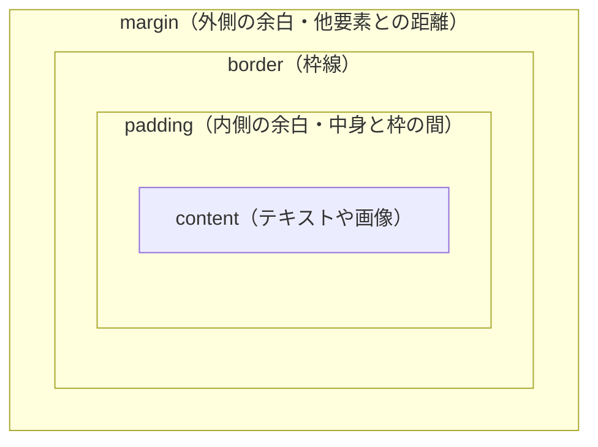

# 余白がおかしい — ボックスモデルと margin の罠

## 今日のゴール

- すべての要素が **content / padding / border / margin** の 4 層でできた「箱」であることを理解する
- `box-sizing: border-box` が、なぜ現代の CSS リセットで必ず指定されるのかを説明できる
- 兄弟要素の余白は `margin` ではなく `gap` で組むのが今の定番だと知っている

## 「余白がおかしい」の正体

AI に CSS を書かせたレイアウトで、こんな経験はないでしょうか。

- `width: 100%` にしたら、親からはみ出した
- 上の要素に `margin-bottom: 24px`、下の要素に `margin-top: 24px` を付けたのに、間隔が 48px にならず 24px になった
- `padding` を足したら、要素の横幅が急に広がってレイアウトが崩れた

どれも犯人は同じで、CSS の **ボックスモデル**（要素を「箱」として扱うルール）です。まずこの箱の構造を押さえると、余白のトラブルは 9 割減ります。

### 箱は 4 層でできている

画面上のすべての要素は、内側から順に **content（中身）/ padding（内側の余白）/ border（枠線）/ margin（外側の余白）** の 4 層で構成されます。



CSS を書くときは、この 4 層のどこを触っているのかを常に意識します。`padding` は箱の「内側」、`margin` は箱の「外側」、`border` はその境界線。これが頭に入っていないと、プロパティを足すほど崩れていきます。

---

## 柱 1: `box-sizing` が width の意味を変える

### デフォルトの `content-box` は罠が多い

CSS の既定値では `box-sizing: content-box` になっています。これは「`width` は content だけの幅を指す」というルールです。

```css
.card {
  width: 300px;
  padding: 20px;
  border: 2px solid #333;
}
```

このとき、実際に画面を占有する横幅は `300 + 20*2 + 2*2 = 344px` になります。`width: 300px` と書いたのに 300px に収まらない。これが「`padding` を足したら横幅が変わった」の正体です。

さらに `width: 100%` を指定した子要素に `padding` を付けると、親の内側からはみ出します。親の幅ピッタリ + `padding` 分だけ膨らむからです。

### `border-box` で「書いた width = 見える width」にする

`box-sizing: border-box` を指定すると、`width` が **content + padding + border の合計** を指すように変わります。

```css
.card {
  box-sizing: border-box;
  width: 300px;
  padding: 20px;
  border: 2px solid #333;
}
```

これなら見える横幅はきっちり 300px。`padding` を増やしても横幅は 300px のまま、内側の content が縮むだけです。直感どおりに動きます。

### だから modern CSS reset は全要素に適用する

多くのプロジェクトでは、先頭にこれを書きます。

```css
*,
*::before,
*::after {
  box-sizing: border-box;
}
```

「すべての要素とその疑似要素を `border-box` にする」という宣言です。これをしておけば、どの要素でサイズ計算の罠にハマらなくて済みます。

**Tailwind CSS を使っているプロジェクトでは、この指定は最初から入っています**。Tailwind の基盤スタイル（Preflight と呼ばれる）が自動で `*, *::before, *::after { box-sizing: border-box }` を適用しているため、何もしなくても `w-[300px]` と `p-5` が直感どおりに足し合わさります。

<div style="background:#f8fafc;color:#1e293b;padding:16px;border-radius:8px;margin:16px 0;">
  <p style="margin:0 0 12px;color:#1e293b;"><strong>同じ <code>width:180px; padding:16px; border:3px</code> でも、<code>box-sizing</code> で占める幅が変わります。</strong></p>
  <div style="display:flex;flex-direction:column;gap:12px;">
    <div>
      <div style="font-size:13px;color:#475569;margin-bottom:4px;">content-box（既定）→ 実寸 218px</div>
      <div style="box-sizing:content-box;width:180px;padding:16px;border:3px solid #dc2626;background:white;color:#1e293b;">
        content:180px + padding:16px×2 + border:3px×2
      </div>
    </div>
    <div>
      <div style="font-size:13px;color:#475569;margin-bottom:4px;">border-box → 実寸 180px</div>
      <div style="box-sizing:border-box;width:180px;padding:16px;border:3px solid #16a34a;background:white;color:#1e293b;">
        content は縮み、外側は 180px のまま
      </div>
    </div>
    <div style="position:relative;height:24px;background:#e2e8f0;border-radius:4px;overflow:hidden;">
      <div style="position:absolute;left:0;top:0;bottom:0;width:180px;background:#16a34a;"></div>
      <div style="position:absolute;left:180px;top:0;bottom:0;width:38px;background:#dc2626;"></div>
      <div style="position:absolute;left:4px;top:2px;color:white;font-size:12px;">180px（border-box の幅）</div>
      <div style="position:absolute;left:184px;top:2px;color:white;font-size:12px;">+38px</div>
    </div>
  </div>
</div>

---

## 柱 2: 上下 margin はくっつく（margin collapsing）

### 「24px + 24px = 24px」の謎

次のような HTML を書いたとします。

```html
<section>
  <p style="margin-bottom: 24px;">上の段落</p>
  <p style="margin-top: 24px;">下の段落</p>
</section>
```

合計 48px 離れてほしいところですが、実際は **24px** になります。これを **margin collapsing（マージンの相殺）** と呼びます。ブロック要素の上下の `margin` は、接したときに大きい方だけが採用されるというルールです。

仕様としては昔からある挙動で、2026 年現在も変わっていません。「連続した段落の間隔が間延びしないように」という配慮で導入されたものですが、知らないと「CSS が効いていない」と誤解しがちです。

<div style="background:#f8fafc;color:#1e293b;padding:16px;border-radius:8px;margin:16px 0;">
  <div style="display:grid;grid-template-columns:1fr 1fr;gap:16px;">
    <div>
      <div style="font-size:13px;color:#475569;margin-bottom:6px;"><strong>ブロック配置</strong>：上下 margin が相殺 → 24px</div>
      <div style="background:white;color:#1e293b;padding:8px;border:1px dashed #cbd5e1;">
        <div style="background:#fde68a;padding:8px;margin-bottom:24px;">margin-bottom:24px</div>
        <div style="background:#fca5a5;padding:8px;margin-top:24px;">margin-top:24px</div>
      </div>
    </div>
    <div>
      <div style="font-size:13px;color:#475569;margin-bottom:6px;"><strong>Flex 配置</strong>：相殺されず 48px</div>
      <div style="background:white;color:#1e293b;padding:8px;border:1px dashed #cbd5e1;display:flex;flex-direction:column;">
        <div style="background:#fde68a;padding:8px;margin-bottom:24px;">margin-bottom:24px</div>
        <div style="background:#fca5a5;padding:8px;margin-top:24px;">margin-top:24px</div>
      </div>
    </div>
  </div>
  <p style="margin:12px 0 0;color:#475569;font-size:14px;">親のレイアウト方式で、同じ margin でも結果の間隔が変わります。</p>
</div>

### 相殺は「上下だけ」「ブロック要素だけ」

押さえるべきポイントは 3 つ。

1. **左右の margin は相殺されない**。横並びで `margin-right: 24px` と `margin-left: 24px` を付ければ 48px 空く
2. **相殺が起きるのはブロック配置のとき**。親が Flex コンテナや Grid コンテナになっていれば、子同士の margin は相殺されない
3. **親子間でも起きる**。子の `margin-top` が、親の上側にすり抜けて外に出る現象（いわゆる「margin のすり抜け」）もある

### 避け方: 片側に寄せる / `gap` を使う

margin collapsing を毎回意識するのは大変なので、実務では **最初から起きない書き方** を選びます。

- 兄弟要素の余白は「下方向だけ」「上方向だけ」と片側に統一する
- もっと推奨: 後述する `gap` を親側で指定する（collapsing 自体が起きない）

---

## 柱 3: 兄弟間の余白は `gap` で親が決める

### margin を子に付ける書き方の限界

カードを縦に並べて 16px ずつ空けたい、という典型的な場面。昔はこう書いていました。

```css
.card {
  margin-bottom: 16px;
}
.card:last-child {
  margin-bottom: 0; /* 最後だけ消す */
}
```

「最後の要素だけ margin を消す」ための `:last-child` の後始末が必要で、何を並べるかによって書き直しが発生します。collapsing の影響も受けます。

### `gap` は「親が子の間隔を決める」

Flexbox / Grid で使える `gap` プロパティを親に指定すれば、**子同士の間にだけ** 間隔を作れます。端には余白が付きません。

```html
<ul class="card-list" aria-label="お知らせ一覧">
  <li class="card">1 件目</li>
  <li class="card">2 件目</li>
  <li class="card">3 件目</li>
</ul>
```

```css
.card-list {
  display: flex;
  flex-direction: column;
  gap: 16px;
  list-style: none;
  padding: 0;
}
```

これで最後の要素に余計な余白が付きません。`:last-child` のケアも不要、margin collapsing も起きません。`gap` は 2026 年時点ですべての主要ブラウザで Flex / Grid ともに対応済みなので、迷わず使えます。

ちなみに上の HTML で `<ul>` + `<li>` を使い、`aria-label` で何の一覧かを示しているのは、見た目の装飾とは別にスクリーンリーダーに構造を伝えるためです。`<div>` の羅列にしてしまうと、音声読み上げ時に「お知らせが 3 件ある」ことが伝わりません。

### Tailwind の `gap-*` と `space-y-*` の違い

Tailwind CSS には似た 2 つのユーティリティがあります。

- `gap-4` → 親が Flex / Grid のときに子の隙間を 1rem（16px）にする。CSS の `gap` をそのまま出す
- `space-y-4` → 子要素すべてに `margin-top: 1rem` を付け、最初の子だけ除外する（CSS の隣接兄弟セレクタを使ったテクニック）

どちらも「間隔を開ける」点は同じですが、仕組みが違います。**親が Flex / Grid なら `gap-*` が素直**。`space-y-*` は親のレイアウトに関係なく動くので、単純なブロック要素の縦並びで便利ですが、中の要素の順序や表示形式によっては margin 起因のクセが出ることがあります。迷ったら `gap-*` を選びます。

### おまけ: タッチターゲットとしての padding

`gap` でボタンを並べるときは、ボタン自体の大きさも気にします。WCAG のアクセシビリティ基準では、**タッチで押す要素は 44×44 px 相当を確保する** のが目安です。見た目のために `padding` を削りすぎると、指で押しにくいボタンになります。

```css
.button {
  /* 文字だけだと 20px くらいの高さしか出ないので、padding で 44px 以上にする */
  padding: 12px 20px;
  min-height: 44px;
}
```

`padding` は飾りではなく、押せる面積を作るための実装です。`box-sizing: border-box` になっていれば、`padding` を増やしても外側のサイズは破綻しません。

---

## まとめ

- すべての要素は **content / padding / border / margin** の 4 層でできた箱。触っているのがどの層かを意識する
- 既定の `content-box` は `padding` / `border` で見た目の幅が膨らむ。**`box-sizing: border-box` を全要素に適用** するのが現代の標準。Tailwind では最初から入っている
- 隣接するブロック要素の上下 margin は **大きい方だけが残る**（margin collapsing）。「24px + 24px = 24px」は仕様どおりの挙動
- 兄弟要素の余白は、**親に `gap` を付けて親側で管理する** のが今の定番。端の余白が付かず、collapsing も起きない

「余白がおかしい」と感じたら、まず `box-sizing` と、margin か gap のどちらで組んでいるかを確かめる。今日はそれだけ覚えれば OK です。
