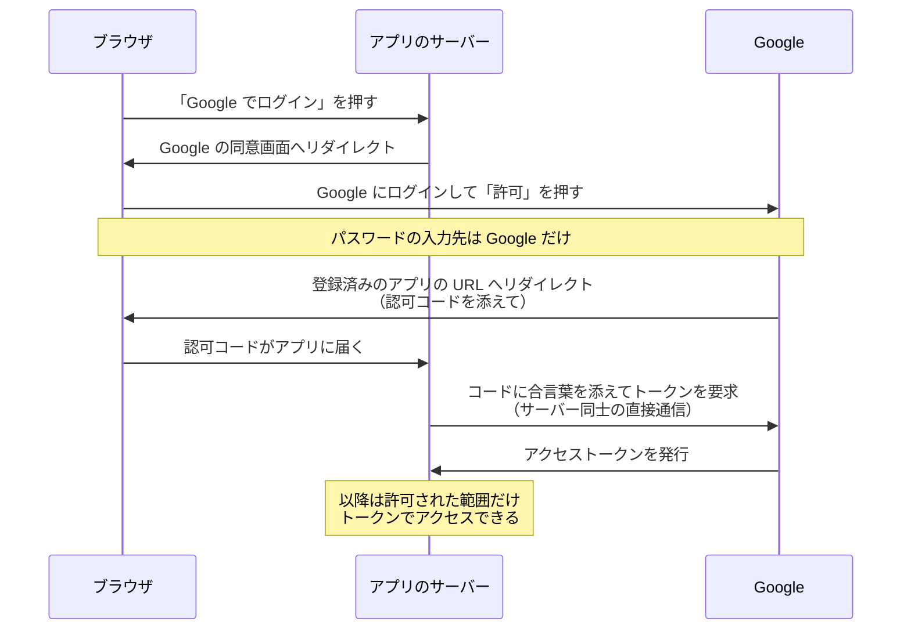

# 「Google でログイン」の仕組み — OAuth と OIDC

## 今日のゴール

- 「○○でログイン」がパスワードを渡さずに成立する流れを追える
- リダイレクトと認可コードがなぜ挟まるのか知る
- OAuth が認可、OIDC が認証の規格だと区別できる

## パスワードを教えていないのにログインできる

新しいサービスに登録するとき、「Google でログイン」「GitHub でログイン」というボタンを日常的に押しています。冷静に考えると不思議です。

そのサービスに Google のパスワードを**教えていない**のに、Google のアカウントでログインできている。初回には「このアプリに以下を許可しますか: メールアドレスの表示」のような確認画面も出ます。

この裏で動いているのが **OAuth 2.0** と **OIDC** という 2 つの規格です。仕組みを追うと、同意画面にもリダイレクトにも、一つひとつ理由があると分かります。

## パスワードを預ける方式の弱点

この規格が生まれる前、サービス連携では「相手のサービスに Google のパスワードそのものを預ける」形が実際に使われていました。預かった側は、あなたの Google アカウントで何でもできます。

- 相手のサービスがパスワードを丸ごと保持する。漏れたら全滅
- 渡した権限に制限がない。メールを読む、削除する、すべて可能
- 連携を切る手段がパスワード変更しかない。他の連携も全部巻き添え

問題の核心は、パスワードが全権限の合鍵であることです。貸したいのは一部の権限だけなのに、合鍵そのものを渡すしかありませんでした。

## OAuth — 全権の合鍵ではなく限定の許可証

**OAuth 2.0** は、パスワードの代わりに**アクセストークン**という限定の許可証を発行してもらう規格です。ホテルの係員に車を預けるときの、エンジンはかかるがトランクは開かない専用キーに例えられます。

「Google でログイン」ボタンの後ろでは、**認可コードフロー**という手順が動いています。

パスワードの入力先は、最初から最後まで Google だけです。アプリが受け取るのは、範囲と期限を絞ったトークンだけです。

## リダイレクトと認可コードが挟まる理由

このフローには、初見だと回りくどく見える点が 2 つあります。リダイレクトで Google へ行って戻ることと、トークンを直接渡さず**認可コード**という引換券を挟むことです。

リダイレクトは、パスワードの確認を本人と Google の間だけで完結させるための仕組みです。アプリの画面の中に Google のログイン欄を埋め込む形だと、アプリが入力を横取りしていないことを誰も確認できません。

だから一度 Google のドメインへ完全に移動し、本物の Google の画面でログインします。終わると、あらかじめ Google に登録されたアプリの URL へリダイレクトで戻されます。

- 戻り先の URL は事前登録制。攻撃者が「自分のサイトへ戻す」ように細工できない
- 戻りの URL に載るのは、短命で 1 回きりの認可コードだけ

引換券を挟む理由は、リダイレクトが URL を使った受け渡しだからです。URL はブラウザの履歴や中継サーバーのログに残りやすく、長く使えるトークンを載せるには危険すぎます。

そこで URL には使い捨てのコードだけを載せ、本物のトークンはアプリのサーバーと Google の直接通信で交換します。交換にはアプリしか知らない合言葉を添えるため、コードを盗み見られても勝手にトークンへ換えられません。

スマホアプリのように合言葉を安全に持てない環境向けには、リクエストごとに使い捨ての合言葉を作って同じ検証をする **PKCE** という仕組みがあります。現在はどの種類のアプリでも PKCE を併用するのが標準的な作法になっています。

## スコープ — 同意画面で決まる範囲

初回に出る「メールアドレスの表示を許可しますか」という画面は、**スコープ**の確認です。スコープはトークンに紐づく「してよいことの範囲」で、同意した範囲の外にはトークンがあっても手を出せません。

- メールアドレスの表示だけを許可すれば、メール本文は読めない
- トークンが漏れても、被害はスコープと有効期限の内側に収まる
- 連携をやめたければ、Google 側でそのトークンだけを失効できる。パスワードは無傷

## 認可と認証 — トークンが 2 種類ある理由

ここまでの OAuth が規定するのは**認可**、つまり「何をしてよいか」の委任です。「あなたは誰か」を確かめる**認証**の規格ではありません。

| | 問い | 規格 |
|---|------|------|
| 認証 | あなたは誰か | OIDC |
| 認可 | あなたは何をしてよいか | OAuth 2.0 |

ログインは本来、認証の問題です。そこで OAuth 2.0 の上に認証を載せた規格が **OIDC** で、アクセストークンに加えて **ID トークン**を発行します。

| | アクセストークン | ID トークン |
|---|-----------------|------------|
| 規格 | OAuth 2.0 | OIDC |
| 意味 | 何をしてよいかの許可証 | 誰がログインしたかの証明書 |
| 見せる相手 | Google の API | アプリ自身 |
| 形式 | 決まっていない | JWT で署名と宛先が入る |

ID トークンの形式である JWT は、中身と発行者の署名をひとまとめにしたデータ形式です。アプリは署名を検証して、「Google が本人確認済みのこの人」としてログインさせます。

トークンが 2 枚に分かれているのは、見せる相手が違うからです。アクセストークンは Google の API に見せるための許可証で、アプリが中身を解釈することは想定されていません。

もしアクセストークンをログインの証拠に流用すると、そのトークンが自分のアプリ向けに発行されたものか検証できません。別のアプリで手に入れたトークンを持ち込むなりすましが成立します。

ID トークンには「どのアプリ向けか」という宛先が署名付きで入っているため、この持ち込みを検出できます。つまり「Google でログイン」は、OIDC による認証と OAuth による最小限の認可の組み合わせです。

## 実務の相場 — 自作しない

仕組みを知ったうえで、実務の結論は明快です。認証まわりは自分で実装せず、実績のあるライブラリやサービスに任せます。

- Next.js 圏のライブラリ: Auth.js、Better Auth など
- 認証サービス: Auth0、Clerk、Firebase Authentication、Cognito など

リダイレクト先の検証、トークンの保管と失効、セッション管理と、周辺には間違えると即事故になる箇所が並びます。世界中の専門家が叩いてきた実装に乗るのが正解です。

仕組みを知る価値は、任せた後に残ります。同意画面で要求されたスコープが広すぎないか、トークンをどこに保存しているかといった確認の観点は、この流れを知らないと出てきません。

## まとめ

- パスワードの入力先は常に提供元だけで、アプリにはスコープ付きのトークンだけが渡る
- リダイレクトの戻り先は事前登録制で、URL に載るのは使い捨ての認可コードだけ
- 「誰か」は OIDC の ID トークン、「何をしてよいか」は OAuth のアクセストークンが担う
- 認証まわりは自作せず、ライブラリや認証サービスに乗る
