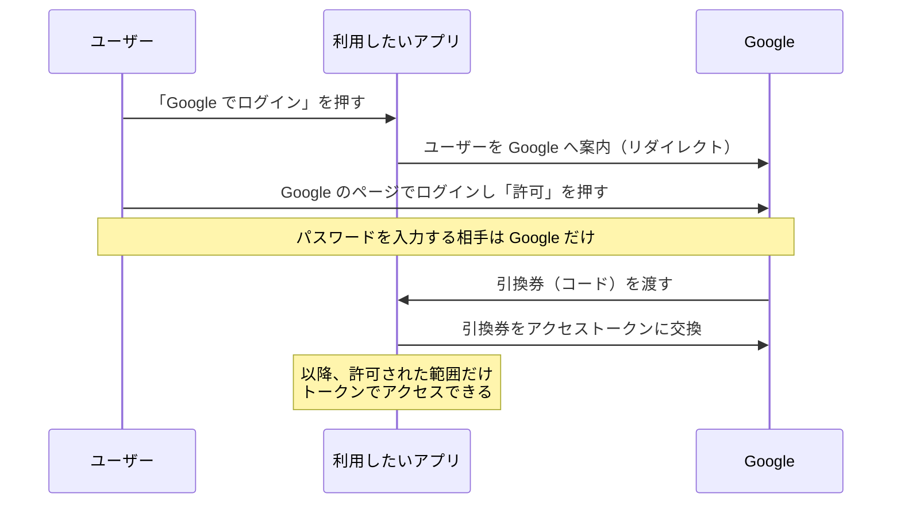

# 「Google でログイン」の裏側 — OAuth と OIDC

## 今日のゴール

- 「○○でログイン」がパスワードを渡さずに成立する仕組みを知る
- OAuth が「認可」、OIDC が「認証」の規格だと知る
- 認証まわりは自作せずライブラリに任せる、という相場を知る

## パスワードを教えていないのに、ログインできる

新しいサービスに登録するとき、「Google でログイン」「GitHub でログイン」というボタンを日常的に押しています。

冷静に考えると不思議です。そのサービスに Google のパスワードを**教えていない**のに、Google のアカウントでログインできている。しかも初回には「このアプリに以下を許可しますか: メールアドレスの表示」のような確認画面が出ます。

この裏側で動いているのが **OAuth 2.0** と **OIDC** という 2 つの規格です。

## 前提 — パスワードを渡す世界の悪夢

この規格が生まれる前、サービス連携は最悪の形で行われていました。「あなたの Google のパスワードをうちに入力してください。代わりにアクセスしておきます」方式です。

何が悪いかは数え上げるまでもありません。

- 相手のサービスが**パスワードを丸ごと保持**する（漏れたら全滅）
- 渡した相手は**何でもできる**（メールを読む、削除する、買い物する）
- 連携を切りたければ**パスワード変更しかない**（他の連携も全部巻き添え）

問題の本質は、パスワードが「**全権限の鍵**」であることです。貸したいのは一部の権限だけなのに、合鍵そのものを渡すしかなかった。

## OAuth — すべてを渡さず、限定の許可証を渡す

**OAuth 2.0** の発想は、ホテルのバレーパーキング（係員に車を預ける駐車サービス）に例えられます。係員に渡すのは、エンジンはかかるが**トランクは開かない専用キー**。マスターキーは渡しません。

OAuth では、パスワード（マスターキー）の代わりに**アクセストークン**（限定キー）を発行します。

押さえるべき点は 3 つです。

- パスワードの入力先は**最初から最後まで Google だけ**。アプリには一切渡らない
- トークンには**範囲**（スコープ）がある。「メールアドレスの表示」だけ許可すれば、それしかできない。あの同意画面はスコープの確認だった
- 連携を切りたければ、Google 側で**そのトークンだけを失効**できる。パスワードは無傷

## OAuth は「認可」、ログインには OIDC

ここで、見落とされがちな区別があります。OAuth が規定するのは**認可**（authorization）、つまり「**何をしてよいか**」の委任です。「**あなたは誰か**」を確かめる**認証**（authentication）の規格ではありません。

| | 問い | 規格 |
|---|------|------|
| 認証（AuthN） | あなたは**誰**？ | **OIDC** |
| 認可（AuthZ） | あなたは何を**してよい**？ | **OAuth 2.0** |

「ログイン」は本来、認証の問題です。そこで OAuth 2.0 の上に認証の層を載せた規格が **OIDC**（OpenID Connect）です。OIDC では、アクセストークンに加えて **ID トークン**（「この人は誰か」を Google が署名して証明した、JWT 形式のデータ）が発行されます。アプリは署名を検証して、「Google が本人確認済みのこの人」としてログインさせる。

つまり「Google でログイン」は、**OIDC による認証 + OAuth による最小限の認可**を組み合わせた仕組みです。

## 実務の相場 — 絶対に自作しない

仕組みを知ったうえで、実務の結論は明快です。**認証まわりは自分で実装せず、実績あるライブラリやサービスに任せる**。

- Next.js 圏のライブラリ: Auth.js（NextAuth）、Better Auth など
- 認証サービス（IDaaS）: Auth0、Clerk、Firebase Authentication、Cognito など

リダイレクトの検証、トークンの保管、失効、セッション管理。OAuth/OIDC の周辺は**間違えると即事故になる危険が大量にある**領域で、世界中の専門家が叩いてきた実装に乗るのが正解です。

AI に「ログイン機能を作って」と頼むと、教科書的な自前実装（パスワードのハッシュ化から手書き）を始めることがあります。学習用には良い教材ですが、本番に向かうコードなら「**ライブラリか IDaaS を使う前提で**」と指示するのが、今日の知識の使いどころです。

## まとめ

- 「○○でログイン」はパスワードを渡さない。入力先は常に提供元だけ
- OAuth はスコープ付きの限定許可証（アクセストークン）を渡す「認可」の規格
- 「誰か」の証明は OIDC（ID トークン）。ログイン = OIDC + OAuth
- 認証は自作しない。ライブラリ・IDaaS に乗るのが相場
