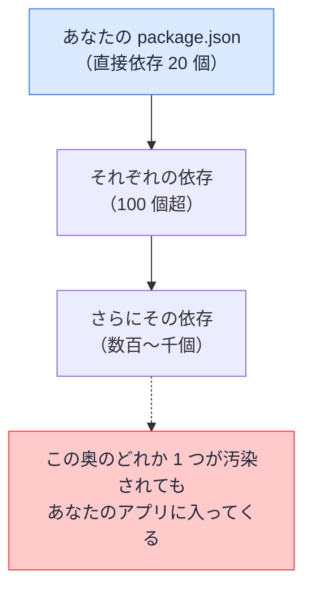

# npm サプライチェーン — install した瞬間に何が実行されるのか

## 今日のゴール

- npm install が他人のコードを大量に取り込んで実行まで許す行為だと知る
- 攻撃が依存の網のどこを狙うのか型で知る
- lockfile のコミットと npm ci という日常の防御を知る

## 気軽な 1 コマンドの中身

新しいライブラリを使うとき、私たちは気軽にこれを打ちます。

```bash
npm install date-fns
```

正確に言い直すと、「インターネット上の他人が書いたコードを自分のプロジェクトへ取り込み、場合によってはその場で実行する」コマンドです。

しかも実行の舞台は、ブラウザのような制限された箱の中ではなく、あなたの開発マシンそのものです。ファイルの読み取りも外部への通信も、あなたの権限で自由にできます。

## 依存の木 — 信頼が芋づる式に広がる

取り込む対象は 1 つではありません。インストールしたパッケージが依存するパッケージ、そのまた依存と、芋づる式に取り込まれます。

この直接指定していないのに付いてくる依存を**推移的依存**と呼びます。中規模のアプリでも `node_modules` には数百から千を超えるパッケージが入り、あなたが名前を知っているのはそのうち数十個です。



材料の調達網になぞらえて、この依存の連なりを**サプライチェーン**（供給網）と呼びます。1 つのパッケージを入れることは、その先の依存を書いた無数の他人まで信頼することと同じです。

## install スクリプト — 取り込んだ瞬間の実行

「場合によってはその場で実行する」は誇張ではありません。パッケージは `package.json` にインストール時のスクリプトを書いておくことができ、従来の npm はこれをインストールの流れの中で自動実行してきました。

```json
{
  "name": "some-package",
  "scripts": {
    "postinstall": "node setup.js"
  }
}
```

本来の用途は、環境に合わせたコンパイルなどの正当な準備作業です。ただし中身は任意のコマンドなので、環境変数から認証情報を集めて外部へ送るコードでも同じように動きます。

危険の中心は実行のタイミングです。アプリに組み込む前、コードを 1 行も読む前、`npm install` と打ったその瞬間に動きます。

この入口が実際に悪用され続けた反省から、2026 年 7 月リリースの npm 12 では方針が変わりました。依存パッケージの install スクリプトは既定では実行されず、開発者が明示的に許可したものだけが動く方式になっています。

ただし入口が 1 つ塞がっただけです。取り込んだコードはビルドやアプリの実行でいずれ動くので、「その依存を信頼できるか」という問いは残ります。

## 供給網を狙う攻撃の型

攻撃者から見ると、人気パッケージは魅力的な標的です。1 つ汚染すれば、それを使う何十万のプロジェクトへ一斉に忍び込めます。

| 手口 | 内容 |
|------|------|
| **メンテナ乗っ取り** | 人気パッケージの管理者アカウントを乗っ取り、悪意あるバージョンを公開する |
| **タイポスクワッティング** | `react` に対する `raect` のような、打ち間違い狙いの偽パッケージを公開して待つ |
| **依存の奥への注入** | 有名パッケージ本体ではなく、その依存のそのまた依存という目の届かない奥に仕込む |

型どおりの事件は、実際に繰り返し起きています。

- 2025 年、メンテナがフィッシングでアカウントを乗っ取られ、合計で週 26 億ダウンロード規模の定番パッケージ群に悪意あるバージョンが公開された
- 同じ年の Shai-Hulud と呼ばれる攻撃は、install スクリプトで認証情報を盗み、盗んだ公開権限で自分自身を別のパッケージへ複製していくワームだった

共通するのは、開発者は数百個の依存をいちいち検分できないという現実を突いていることです。`npm install` が成功した画面は、安全の証明ではありません。

## lockfile — 供給網の全記録

普段なんとなくコミットしている `package-lock.json` は、この供給網の全記録です。

`package.json` に書くのは直接の依存と大まかなバージョン範囲だけです。対して lockfile には、推移的依存まで含めた全パッケージの正確なバージョンと、内容の指紋にあたるハッシュが記録されています。

| | package.json | package-lock.json |
|---|--------------|-------------------|
| 記録対象 | 直接依存のみ | 推移的依存まで全部 |
| バージョン | 範囲（`^19.0.0` など） | 完全に固定 |
| 内容の検証 | なし | ハッシュで改ざん検知 |

これが効く場面は 2 つあります。

- **再現性**: チームの全員と本番サーバーが、寸分違わぬ同じ供給網でインストールできる
- **改ざん検知**: 同じバージョン番号のまま中身をすり替えられても、指紋が合わずに検出できる

乗っ取り型の攻撃では、悪意あるバージョンが公開されてから撤去されるまで数時間の危険な窓が生まれます。lockfile が固定されていれば、その窓の間に install しても新しい悪意あるバージョンを勝手に拾いません。

だから lockfile は必ずコミットします。そして CI や本番では `npm install` ではなく、lockfile へ厳密に従いズレていたら失敗する **`npm ci`** を使うのが定石です。

## 日常の防御

特別な対策ツールの前に、習慣レベルの防御が効きます。

1. **lockfile を守る**: コミットする。むやみに消して作り直さない。CI は `npm ci`
2. **`npm audit` を回す**: 依存に既知の脆弱性が報告されていないか照合するコマンド。CI に組み込んで常時チェックが理想
3. **依存を安易に増やさない**: 1 行で書ける処理のためにパッケージを足さない。依存が 1 つ増えるたびに供給網の口が増える
4. **公開直後のバージョンに飛びつかない**: 乗っ取り型の攻撃は公開直後が危険域。少し寝かせてから上げる運用には合理性がある

## AI が挙げる実在しないパッケージ

最後に、いまの時代ならではの注意です。AI はコードと一緒にパッケージ名を提案してきますが、その中にはもっともらしい名前の実在しないパッケージが混ざることがあります。

実在しなければインストールが失敗するだけ、では済みません。攻撃者は AI が挙げがちな架空の名前を観察し、その名前の悪意あるパッケージを先回りして公開しておきます。

AI の提案を信じてそのまま `npm install` した人が、まとめて標的になる構図です。タイポスクワッティングの現代版と言えます。

対策はシンプルで、見慣れないパッケージは入れる前に npm のページを確認することです。週間ダウンロード数、最終更新、リポジトリの実在という 1 分の確認が、供給網へ変な口を開けない最後の砦になります。

## まとめ

- npm install は他人のコードを推移的依存まで芋づる式に取り込み、実行も許す行為
- install スクリプトは取り込んだ瞬間に動く入口で、npm 12 から許可制になった
- 攻撃の型はメンテナ乗っ取り、打ち間違い狙い、依存の奥への注入
- lockfile をコミットして CI は npm ci、見慣れないパッケージは実在と健全性を確認してから入れる
