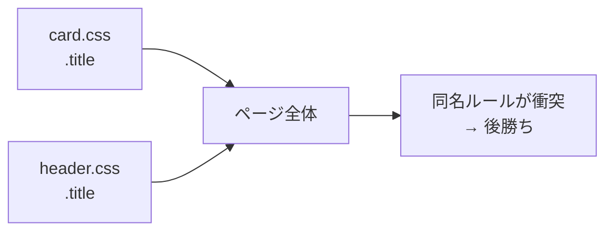
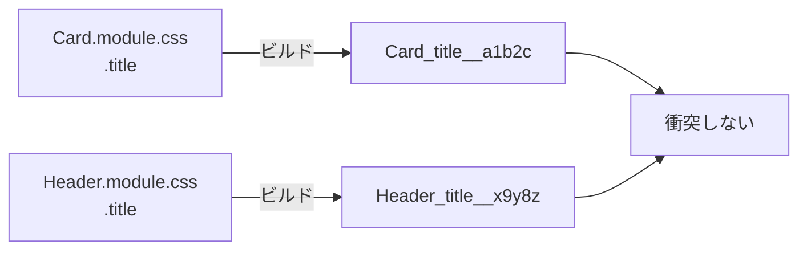

# スタイルが衝突する — CSS のスコープ問題と解決アプローチ

## 今日のゴール

- CSS のセレクタが既定で「グローバルスコープ」であることを知り、なぜスタイルが予期せず他へ漏れるのかを説明できる
- BEM、CSS Modules、Tailwind CSS という 3 つの解決アプローチが、同じ問題に対する別角度の答えだと理解する（加えて CSS 標準の `@scope` という新しい選択肢にも触れる）
- 「なぜ配属先で Tailwind CSS が選ばれているのか」を自分の言葉で説明できる

## CSS は「ファイルを分けても全部混ざる」

まず、CSS の根本的な性質を一つ押さえる。

たとえば次のように、2 つの CSS ファイルを 1 つの HTML で読み込んだとする。

```html
<link rel="stylesheet" href="card.css" />
<link rel="stylesheet" href="header.css" />
```

```css
/* card.css */
.title { font-size: 20px; color: navy; }
```

```css
/* header.css */
.title { font-size: 14px; color: gray; }
```

ファイルは分かれている。しかし **ブラウザにとっては「1 枚の巨大な CSS」を上から順に読んだのと同じ**だ。`.title` というクラスがページ内のどこにあっても、両方のルールが適用候補になり、後から読み込まれた `header.css` の定義が勝つ。card 側の `.title` も header 側の `.title` も区別されない。

この「CSS のルールは書いた場所に関係なくページ全体に届く」性質を、**グローバルスコープ**と呼ぶ。「スコープ」はスタイルが届く範囲のことで、CSS は既定で「ページ全体」がスコープになっている。



プロジェクトが大きくなってファイルが増えるほど、「知らないファイルに書かれた同名のクラスが自分のスタイルを壊す」事故が起きやすくなる。CSS が壊れやすいと言われる最大の理由がこのグローバルスコープだ。

今日はこの問題に対する 3 つの解決アプローチ（命名で頑張る／ビルドで頑張る／そもそもクラスを作らない）を順に見ていく。

## 柱 1: 人間が命名で頑張る — BEM と命名規約

一番素朴な解決策は「名前が被らないよう、人間が気をつける」こと。**BEM**（Block Element Modifier）は、その代表的な命名ルールだ。

- **Block**: 意味のあるかたまり（例: `card`）
- **Element**: Block の部品（例: `card__title`、`__` で繋ぐ）
- **Modifier**: 状態やバリエーション（例: `card__title--large`、`--` で繋ぐ）

```html
<article class="card">
  <h2 class="card__title card__title--large">今日のレッスン</h2>
  <p class="card__body">CSS のスコープについて</p>
</article>
```

```css
.card { padding: 16px; border-radius: 8px; background: white; color: #1e293b; }
.card__title { font-size: 18px; font-weight: bold; }
.card__title--large { font-size: 24px; }
.card__body { color: #475569; }
```

「`title` ではなく `card__title` と書けば被らない」という作戦。シンプルだがメリットは大きい。ビルドツールが要らず、素の HTML/CSS だけで動く。

ただし弱点もある。**規約に違反しても怒ってくれる仕組みがない**。新しいメンバーが `.title` と書いてしまえば、それで衝突が発生する。人間の注意力に頼る方式だ。

::: tip ひとこと
BEM の `card__title--large` のような一見冗長な書き方は、「ビルドツールを前提としなくても衝突を避けたい」という時代の知恵だと捉えておくといい。
:::

## 柱 2: ビルド時に一意なクラス名を生成する — CSS Modules

「人間が頑張る」から「機械に頑張ってもらう」に発想を切り替えると、**CSS Modules** になる。ファイル名が `.module.css` で終わるものを CSS Modules として扱う、というのが Next.js App Router のネイティブ対応だ。

```css
/* components/Card.module.css */
.card { padding: 16px; border-radius: 8px; background: white; color: #1e293b; }
.title { font-size: 20px; font-weight: bold; }
```

```tsx
// components/Card.tsx
import styles from "./Card.module.css";

export function Card() {
  return (
    <article className={styles.card}>
      <h2 className={styles.title}>今日のレッスン</h2>
    </article>
  );
}
```

ビルド後、`styles.title` は `Card_title__a1b2c` のようなユニークな文字列に変換される。**ファイル A の `.title` とファイル B の `.title` は別物として扱われる**。



JavaScript の `import` と同じ感覚でスタイルを閉じ込められる。**CSS-in-JS**（`styled-components`、`Emotion`、`vanilla-extract` など）も発想は同じで、「JS ファイルの中にスタイルを書いて、一意な名前を振る」というアプローチ。

ただし Next.js App Router では注意が必要。`styled-components` や `Emotion` の多くの機能は**実行時にブラウザでスタイルを組み立てる**作りなので、サーバーで HTML を返す Server Components と相性が悪い（Server Components 内で使えず、`"use client"` を付けた Client Components 側に寄せる必要がある）。一方 `vanilla-extract` や `CSS Modules` は**ビルド時に CSS ファイルを生成する**ので Server Components でもそのまま使える。App Router の主流が「Tailwind CSS + CSS Modules」に寄っている背景にはこの事情もある。

## 柱 3: そもそも自分でクラスを作らない — Tailwind CSS

もう一段違う角度の解決策がある。**クラス名を作らなければ、衝突は起きない**。

Tailwind CSS は「ユーティリティファースト」という思想で、`text-lg`（文字大）、`font-bold`（太字）、`p-4`（内側余白 4）のように、**1 クラス 1 役割**の小さな部品を大量に用意している。開発者は「.title という意味のクラス」を作らず、HTML にユーティリティを並べる。

```tsx
export function Card() {
  return (
    <article className="rounded-lg bg-white p-4 text-slate-900">
      <h2 className="text-xl font-bold">今日のレッスン</h2>
      <p className="text-slate-600">CSS のスコープについて</p>
    </article>
  );
}
```

`.card` も `.title` も存在しないので、そもそも衝突のしようがない。AI が Next.js のコードに Tailwind を大量に書いてくるのは、偶然ではない。**グローバルスコープ問題の最も実践的な回避策**として業界が選んだ結果だ。

最新の Tailwind CSS v4 では、従来 `tailwind.config.js` に書いていた色やフォントの設定が CSS ファイル内の `@theme` ブロックに移り、ビルドも高速化された。Next.js App Router + TypeScript + Tailwind という組み合わせが配属先で標準化されているのも、この「クラス名を作らない」アプローチがグローバルスコープ問題への実用的な答えになっているからだ。

```css
/* app/globals.css — Tailwind v4 の設定例 */
@import "tailwindcss";

@theme {
  --color-brand: #2563eb;
  --font-display: "Inter", sans-serif;
}
```

### アクセシビリティとユーティリティの注意点

ユーティリティに慣れると、なんでも `<div className="...">` で済ませたくなる。これは危険な罠だ。スクリーンリーダーやキーボード操作は HTML の **意味（セマンティクス）** を手がかりに動くので、ボタンは `<button>`、ナビゲーションは `<nav>`、見出しは `<h1>` 〜 `<h6>` を使う。ユーティリティはあくまで見た目の調整役。

Tailwind の `sr-only` は「視覚的には隠すが、スクリーンリーダーには読ませる」ユーティリティで、アイコンだけのボタンに文字ラベルを添えるときに使う。

```tsx
<button
  type="button"
  aria-label="メニューを開く"
  className="rounded p-2 hover:bg-slate-100"
>
  <span className="sr-only">メニューを開く</span>
  <MenuIcon aria-hidden="true" />
</button>
```

## おまけ: CSS 標準が追いついてきた — `@scope`

長らくスコープ問題は「外部ツールで解決するもの」だった。しかし CSS 標準側も `@scope` というルールで答えを用意しつつある。

```css
@scope (.card) {
  :scope { padding: 16px; border-radius: 8px; background: white; color: #1e293b; }
  .title { font-size: 20px; font-weight: bold; }
}
```

`.card` の配下でだけ `.title` が適用される。2026 年 4 月時点で Chrome / Safari / Edge は対応済みだが、**Firefox はまだ未対応**（フラグ付きの実験段階）。本番利用はもう少し先、という立ち位置。

「CSS はグローバル」という話に対して、「将来は言語仕様レベルで解決される方向へ向かっている」という引き出しとして持っておけば十分だ。

## 衝突を目で見る — 最小デモ

下は「同じクラス名を 2 回定義すると、後勝ちですべてに効いてしまう」ことを体感するデモ。ページ全体のスタイルとして 2 つの `.demo-card` を定義している様子を、独立した枠に再現している。

<div style="background:#f8fafc;color:#1e293b;padding:16px;border-radius:8px;border:1px solid #cbd5e1;">
  <p style="margin:0 0 12px;font-weight:bold;">両方のカードが同じ <code>.demo-card</code> クラス。後から読み込まれたスタイルに揃えられる。</p>
  <div style="background:white;color:#1e293b;padding:12px;border-radius:6px;border:2px solid #ef4444;margin-bottom:8px;">
    カード A（意図: 赤枠）
  </div>
  <div style="background:white;color:#1e293b;padding:12px;border-radius:6px;border:2px solid #ef4444;">
    カード B（意図: 青枠だったのに、後から書かれた赤枠の定義に上書きされた）
  </div>
  <details style="margin-top:12px;background:white;color:#1e293b;padding:8px;border-radius:6px;">
    <summary style="cursor:pointer;">CSS Modules ならどうなるか</summary>
    <p style="margin:8px 0 0;color:#475569;">A は <code>A_demoCard__hash1</code>、B は <code>B_demoCard__hash2</code> という別の名前に変換されるので、片方を書き換えても他方は影響を受けない。Tailwind ならそもそも <code>.demo-card</code> というクラスを作らないので、同じ問題は発生しない。</p>
  </details>
</div>

## 4 つのアプローチを並べて比べる

同じ「グローバルスコープ問題」への答えでも、得意不得意がある。

| アプローチ | 衝突防止の強さ | 書きやすさ | ビルドツール | 学習コスト | 特徴 |
|---|---|---|---|---|---|
| **BEM（命名規約）** | 弱（人間頼み） | 普通 | 不要 | 低 | 素の HTML/CSS で動く。古い資産の保守に今も有効 |
| **CSS Modules** | 強（自動で一意化） | 普通 | 必要 | 低 | Next.js App Router がネイティブ対応。CSS の知識がそのまま活きる |
| **Tailwind CSS** | 最強（そもそも作らない） | 慣れれば速い | 必要 | 中（クラス名を覚える） | v4 で設定が CSS 側に。新規 Next.js の第一選択 |
| **`@scope`（CSS 標準）** | 強（宣言範囲に限定） | 普通 | 不要 | 低 | Firefox 未対応。将来性は高い |

**ポイント**: 「クラス名を作らない」という発想の転換こそが Tailwind の独自性で、これが AI 時代のコード生成とも相性がいい理由になっている（AI は意味のある命名を考えるよりも、既存のユーティリティを並べるほうが安定する）。

## Next.js App Router ではどう選ぶか

配属先では以下の使い分けが現実的。

| アプローチ | 向いている場面 |
|---|---|
| **Tailwind CSS** | 第一選択。新規プロジェクト全般、スピード重視、デザインシステムと相性良好 |
| **CSS Modules** | コンポーネントに閉じた複雑なスタイル、アニメーションなどユーティリティで書きにくい箇所 |
| **`globals.css`（グローバル）** | フォント指定、CSS 変数、`body` の背景色など「本当に全ページに効かせたいもの」だけ |
| **CSS-in-JS** | 動的にスタイルを組み立てたい特殊なケース。App Router の Server Components とは相性に注意が必要 |

「Tailwind を基本に、CSS Modules を補助的に、`globals.css` は最小限」が定番の構成。

## まとめ

- CSS のセレクタは既定で**グローバルスコープ**。これが「他画面のスタイルが漏れる」原因
- 解決アプローチは 3 系統: (1) **BEM** で人間が命名規約を守る、(2) **CSS Modules / CSS-in-JS** でビルド時にユニークな名前を生成する、(3) **Tailwind CSS** でそもそもクラスを作らない
- Tailwind が流行っているのは単なる流行ではなく、**スコープ問題への最も実践的な回答**であり、App Router の Server Components とも相性が良いから
- CSS 標準にも `@scope` が登場しつつあるが、Firefox 未対応のため本番利用はもう少し先
- どのアプローチを選んでも、**意味のあるタグ（`<button>`、`<nav>`、見出しレベル）を使う**姿勢は変わらない土台
