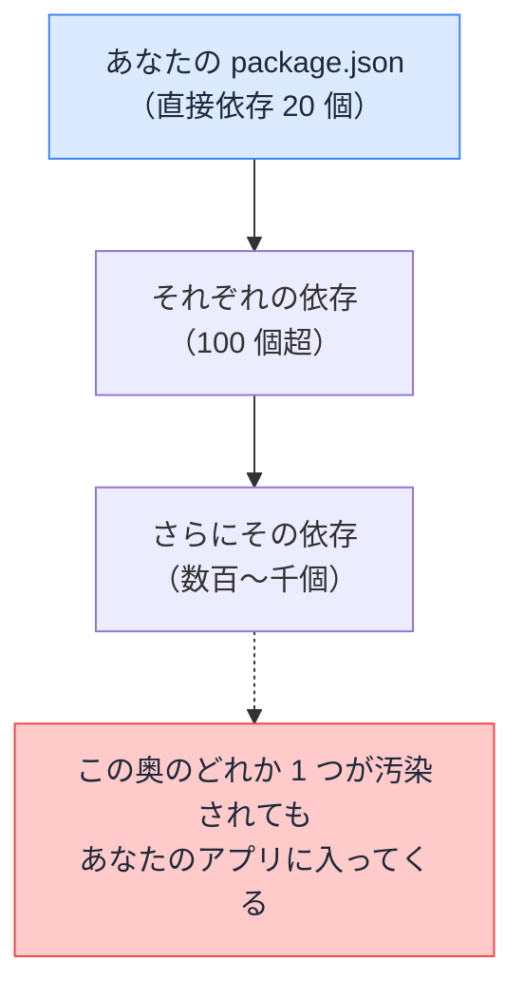

# npm サプライチェーン — install した瞬間、何が実行されるのか

## 今日のゴール

- npm install が「他人のコードを大量に迎え入れる」行為だと知る
- サプライチェーン攻撃の代表的な手口を知る
- lockfile と npm audit という日常の防御を知る

## 気軽な 1 コマンドの中身

新しいライブラリを使うとき、私たちは気軽にこれを打ちます。

```bash
npm install date-fns
```

このとき起きていることを正確に言うと、「**インターネット上の他人が書いたコードを、自分のプロジェクトの中に取り込んで、場合によってはその場で実行する**」です。

「場合によっては実行」が誇張でない理由は 2 つあります。

- パッケージは**インストール時に任意のスクリプトを実行できる**仕組み（install スクリプト）を持っている
- 取り込んだコードは、ビルドやアプリ実行で結局動く

しかも、対象は 1 つではありません。インストールしたパッケージが依存するパッケージ、そのまた依存…と**芋づる式**に取り込まれ、中規模のアプリでも `node_modules` には数百〜千以上のパッケージが入ります。あなたが名前を知っているのは、そのうち数十個です。



この「材料の調達網」になぞらえて、依存パッケージの連なりを**サプライチェーン**（供給網）と呼びます。

## 供給網を狙う攻撃

攻撃者から見ると、人気パッケージは魅力的な標的です。**1 つ汚染すれば、それを使う何十万のプロジェクトに一斉に忍び込める**からです。実際に起きてきた手口は、パターンで覚えられます。

| 手口 | 内容 |
|------|------|
| **メンテナ乗っ取り** | 人気パッケージの管理者アカウントを乗っ取り（または管理権限を譲り受け）、悪意あるバージョンを公開する |
| **タイポスクワッティング** | `react` に対する `raect` のような**打ち間違い狙いの偽パッケージ**を公開して待つ |
| **依存の奥への注入** | 有名パッケージ本体ではなく、その依存のそのまた依存という**目の届かない奥**に仕込む |

共通するのは、「開発者は数百個の依存をいちいち検分できない」という現実を突いていることです。`npm install` が成功した画面は、安全の証明ではありません。

## lockfile — 供給網の「全記録」

ここで、普段なんとなくコミットしている `package-lock.json` の意味が立ち上がってきます。

`package.json` に書くのは**直接の依存と大まかなバージョン範囲**だけです。対して lockfile（`package-lock.json`）には、**間接依存まで含めた全パッケージの、正確なバージョンと、内容の指紋（ハッシュ）**が記録されています。

| | package.json | package-lock.json |
|---|--------------|-------------------|
| 記録対象 | 直接依存のみ | **間接依存まで全部** |
| バージョン | 範囲（`^19.0.0` など） | **完全に固定** |
| 内容の検証 | なし | **ハッシュで改ざん検知** |

これが効く場面は 2 つあります。

- **再現性**: チームの全員と本番サーバーが、**寸分違わぬ同じ供給網**でインストールできる（「自分の環境だと動くのに」の削減）
- **改ざん検知**: 同じバージョン番号で中身がすり替えられても、指紋が合わずに検出できる

だから lockfile は**必ずコミットする**。そして CI や本番では `npm install` ではなく **`npm ci`**（lockfile に厳密に従い、ズレていたら失敗するインストール）を使うのが定石です。

## 日常の防御 — 習慣でやる 4 つ

特別な対策ツールの前に、習慣レベルの防御が効きます。

1. **lockfile を守る**: コミットする。むやみに消して作り直さない。CI は `npm ci`
2. **`npm audit` を回す**: 依存に既知の脆弱性が報告されていないか照合するコマンド。CI に組み込んで常時チェックが理想
3. **依存を安易に増やさない**: 1 行で書ける処理のためにパッケージを足さない。依存は 1 つ増えるたびに供給網の口が増える
4. **公開直後のバージョンに飛びつかない**: 乗っ取り型の攻撃は公開直後が危険域。少し寝かせてから上げる運用には合理性がある

## AI 時代の新しい注意 — 実在しないパッケージ

最後に、いまの時代ならではの注意です。AI はコードと一緒にパッケージ名を提案してきますが、**もっともらしい名前の、実在しないパッケージ**を挙げることがあります。

これ自体はインストールが失敗するだけ、で済めばよいのですが、攻撃者は先回りします。**AI が言いがちな架空の名前を観察し、その名前で悪意あるパッケージを実際に公開しておく**という手口が現実に確認されています。AI を信じて `npm install` した人が、まとめて餌食になる構図です。

対策はシンプルで、**AI が挙げた見慣れないパッケージは、入れる前に npm のページを見る**こと。週間ダウンロード数、最終更新、リポジトリの実在。1 分の確認が、供給網に変な口を開けない最後の砦になります。

## まとめ

- npm install = 他人のコードを芋づる式に迎え入れ、実行も許す行為
- 攻撃は供給網を狙う: 乗っ取り、タイポスクワッティング、依存の奥への注入
- lockfile は全依存の固定 + 指紋。必ずコミットし、CI は npm ci
- npm audit を習慣に。AI が挙げたパッケージは実在と健全性を確認してから入れる
