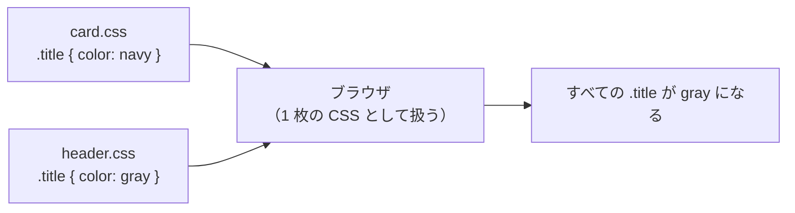
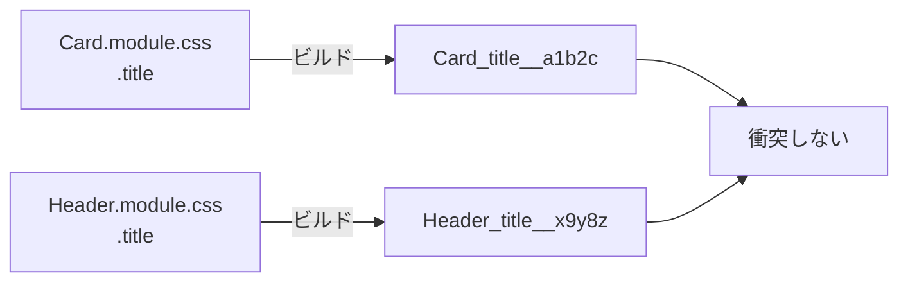

# スタイルが衝突する — CSS のグローバルスコープと解決手段の歴史

## 今日のゴール

- CSS はファイルを分けてもスタイルが分離されないことを知る
- この性質を「グローバルスコープ」と呼ぶことを知る
- グローバルスコープに対して、どんな解決手段が生まれてきたかを知る

## CSS の読み方

この先のコードを読むために、CSS の書き方だけ押さえておく。

CSS は HTML の見た目を指定する言語で、書き方はこの形になる。

```css
セレクタ {
  プロパティ: 値;
}
```

```css
.title {
  font-size: 20px;
  color: navy;
}
```

| 用語 | 役割 | 上の例 |
|------|------|--------|
| セレクタ | どの要素にスタイルを当てるか | `.title`（HTML の `class="title"` が付いた要素） |
| プロパティ | 何を変えるか | `font-size`、`color` |
| 値 | どう変えるか | `20px`、`navy` |

CSS ファイルは HTML から `<link>` タグで読み込む。

```html
<link rel="stylesheet" href="style.css" />
```

## 同じセレクタを 2 回書いたらどうなるか

1 つの CSS ファイルの中で、同じ `.title` を 2 回書いた場合を考える。

```css
/* style.css */
.title {
  color: navy;
}

.title {
  color: red;
}
```

ブラウザは CSS を上から順に読む。同じ対象に同じプロパティが 2 回指定されていたら、**後に書かれた方で上書きする**。この場合、`.title` の文字色は赤になる。

## ファイルを分けたらどうなるか

ここが一番大事なところ。

カード用の CSS とヘッダー用の CSS を別ファイルに分けて、それぞれで `.title` を定義する。

```css
/* card.css */
.title {
  font-size: 20px;
  color: navy;
}
```

```css
/* header.css */
.title {
  font-size: 14px;
  color: gray;
}
```

```html
<!DOCTYPE html>
<html lang="ja">
  <head>
    <meta charset="UTF-8" />
    <meta name="viewport" content="width=device-width, initial-scale=1.0" />
    <title>CSS の衝突</title>
    <link rel="stylesheet" href="card.css" />
    <link rel="stylesheet" href="header.css" />
  </head>
  <body>
    <header>
      <h1 class="title">サイトのタイトル</h1>
    </header>
    <article>
      <h2 class="title">カードのタイトル</h2>
    </article>
  </body>
</html>
```

`card.css` の `.title` はカード用、`header.css` の `.title` はヘッダー用のつもりで書いた。ファイルが分かれているのだから、それぞれ独立して効いてほしい。

しかし実際にはそうならない。ブラウザは `<link>` で読み込んだ CSS を**読み込んだ順に 1 枚の CSS として並べるだけ**。ファイルが別でも、さっきの「1 つのファイルに 2 回書いた」場合と動きは同じ。

後から読み込まれた `header.css` の `.title` が勝ち、カードの見出しにも `font-size: 14px; color: gray` が適用される。

## これが「グローバルスコープ」

この「どのファイルに書いても、ページ全体に届く」という CSS の性質を**グローバルスコープ**と呼ぶ。

「スコープ」はスタイルが届く範囲のこと。CSS のスコープは既定で「ページ全体」になっている。`card.css` に書こうが `header.css` に書こうが、ページ内のすべての `.title` に届く。



JavaScript では、あるファイルで宣言した変数は `import` しない限り他のファイルからは見えない。ファイルごとに壁がある。CSS にはその壁がない。すべてのルールが 1 つの空間に混ざる。

## グローバルスコープのつらさ

ファイルが数個しかないうちは問題にならない。しかしファイルと人が増えると、グローバルスコープはいくつものつらさを生む。

**衝突**: 自分が書いた `.title` のスタイルが、別のファイルに書かれた `.title` に上書きされる。どのファイルが原因かも分かりにくい。

**命名疲れ**: 衝突を避けるために、被らない名前を毎回考える必要がある。`.title` がダメなら `.card-title`、それも危ないなら `.card-component-title`。名前がどんどん長くなる。

**削除できない**: あるスタイルを消したくても、他のページで使われているかもしれない。影響範囲が分からないので放置される。使われていないスタイルが積もっていく。

**規模で破綻**: ファイルが 10 個なら注意すれば済むが、100 個、1000 個になると人間には追いきれない。チームの人数が増えるほど、同じ名前を使ってしまう確率は上がる。

CSS が「壊れやすい」と言われる根本の原因がこのグローバルスコープにある。ここからは、この問題に対してどんな解決手段が生まれてきたかを見ていく。

## 解決手段の歴史

### 命名規約で乗り切る — BEM

最初に広まった解決策は「名前が被らないよう、ルールを決めて守る」こと。**BEM**（Block Element Modifier）はその代表的な命名規約で、クラス名を次のように付ける。

- **Block**: かたまりの名前（例: `card`）
- **Element**: かたまりの中の部品。`__` で繋ぐ（例: `card__title`）
- **Modifier**: バリエーション。`--` で繋ぐ（例: `card__title--large`）

```css
.card {
  padding: 16px;
  border-radius: 8px;
}
.card__title {
  font-size: 18px;
  font-weight: bold;
}
.card__title--large {
  font-size: 24px;
}
```

`.title` ではなく `.card__title` と書くことで、他の `.title` との衝突を避ける。ビルドツールなしで使えるのが利点。

ただし**ルールを破っても何も止めてくれない**。誰かが `.title` と書いてしまえば衝突は起きる。人間の注意力に頼る方法の限界がここにある。

### ビルドで名前を変える — CSS Modules

「人間がルールを守る」のではなく「機械に名前を変えてもらう」方法。CSS Modules では、ビルド時にクラス名が自動でユニークな文字列に変換される。

```css
/* Card.module.css */
.title {
  font-size: 20px;
  font-weight: bold;
}
```

```tsx
import styles from "./Card.module.css";

export function Card() {
  return <h2 className={styles.title}>レッスン</h2>;
}
```

ビルド後、`.title` は `Card_title__a1b2c` のような名前に変わる。別のファイルの `.title` は `Header_title__x9y8z` に変わる。同じ `.title` と書いても、実際のクラス名は別物になる。



命名規約に頼らず、仕組みとして衝突を防げる。ただしビルドツールが必須になる。

### クラスを自分で作らない — Tailwind CSS

さらに違う角度からの解決策。**クラスを自分で作らなければ、衝突は起きない**。

Tailwind CSS は `text-xl`（文字を大きく）、`font-bold`（太字）、`p-4`（内側の余白）のように、あらかじめ用意された小さなクラスを HTML に並べて使う。開発者が `.title` のようなクラスを新しく作る必要がない。

```html
<h2 class="text-xl font-bold">レッスン</h2>
<p class="text-sm text-gray-600">CSS のスコープについて</p>
```

`.title` も `.card` も作っていないので、衝突のしようがない。

### CSS 自身がスコープを持つ — @scope

ここまでの解決手段はどれも CSS の外側の工夫だった。CSS の言語仕様自体にスコープの仕組みがあれば、外部のツールや規約に頼る必要はない。それが `@scope`。

```css
@scope (.card) {
  .title {
    font-size: 20px;
    font-weight: bold;
  }
}
```

`.card` の中にある `.title` にだけスタイルが適用される。`.card` の外の `.title` には届かない。

2026 年 4 月時点で Chrome・Safari・Edge・Firefox の主要ブラウザすべてが対応しており、実用できる段階にある。

## まとめ

- CSS はファイルを分けてもスタイルが分離されない。すべてのルールがページ全体に届く。これが**グローバルスコープ**
- グローバルスコープは衝突・命名疲れ・削除できない・規模での破綻を生む
- 解決手段は世代を重ねて生まれてきた
  - **BEM**: 命名規約で被らないようにする
  - **CSS Modules**: ビルド時に名前を自動で変える
  - **Tailwind CSS**: クラスを自分で作らない
  - **@scope**: CSS の仕様でスコープを制限する
