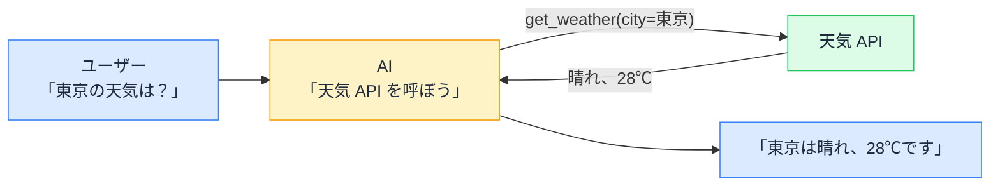
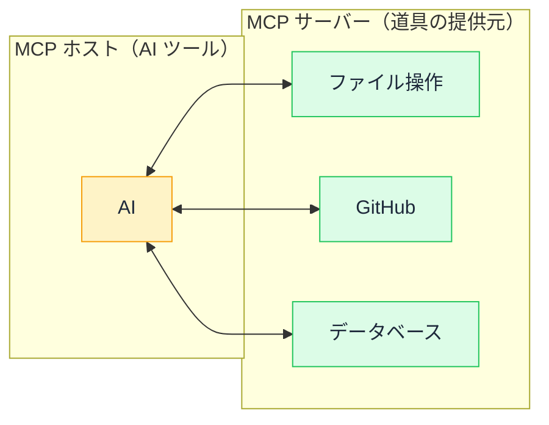

# MCP — AI が道具を使えるようになった仕組み

## 今日のゴール

- AI チャットが「外の世界」に触れられなかった制約を知る
- MCP が「道具の差し込み口」を標準化したものだと知る
- AI に渡す道具の設計が、出力の質を左右すると知る

## チャットしかできなかった AI

AI チャットは賢く見えますが、長らく決定的な制約がありました。**外の世界に触れられない**ことです。

- ファイルを読めない
- データベースを調べられない
- API を呼べない
- ブラウザを操作できない

「この CSV を集計して」と頼んでも、CSV の中身を見る手段がなければ、もっともらしい嘘を返すか「ファイルの内容を貼ってください」と頼み返すしかありません。AI は「考える力」は持っていても、「手足」が無かったのです。

## Tool Use — AI に道具を渡す

この制約を破ったのが **Tool Use**（ツール使用、関数呼び出しとも）という仕組みです。

開発者が「こういう道具がありますよ」と AI に教えると、AI は必要に応じて**道具を使うことを選べる**ようになります。



AI 自身が HTTP リクエストを飛ばしているわけではありません。「この道具を、この引数で呼んでほしい」と**リクエストを出す**だけで、実際の実行はアプリ側が行います。AI は道具の**名前と説明**を読んで、使うかどうか・引数に何を渡すか、を自分で判断します。

## MCP — 道具の差し込み口を標準にする

道具を渡せるなら、あとは「どんな道具を」「どうやって渡すか」の問題です。ここで各社がバラバラに実装すると、GitHub 用の道具を Google 用にも Slack 用にも作り直すことになります。

**MCP**（Model Context Protocol）は、この「**道具の差し込み口**」を標準化したプロトコルです。

| 登場人物 | 役割 |
|---------|------|
| **MCP ホスト** | AI アシスタント側（Claude Code、Cursor など） |
| **MCP サーバー** | 道具を提供する側。ファイル操作、DB 検索、GitHub 操作など |

MCP サーバーは「私はこういう道具を持っています」と宣言し、ホストはそれを AI に教えます。標準化されているので、**1 つの MCP サーバーを作れば、対応するすべての AI ツールで使い回せます**。USB のように、端子の形さえ合えばどの機器でも繋がるイメージです。



## 道具の設計が出力を決める

MCP で面白いのは、**AI に渡す道具の「名前」と「説明」が、AI の判断の質を大きく左右する**ことです。

```
❌ 名前: do_stuff
   説明: データを処理する

✅ 名前: search_products
   説明: 商品名または商品カテゴリで商品を検索する。
         引数 query は検索キーワード（部分一致）。
         結果は最大20件。
```

AI は道具の名前と説明を「読んで」判断するので、曖昧な名前や説明不足の道具は**使いどころを間違える**か、そもそも使われません。人間に道具を貸すときと同じで、「何のための道具で、どう使うのか」が書いてあるほど正確に使ってもらえます。

これはプロンプトエンジニアリング（AI への指示の工夫）と同根の話で、**道具の説明文は AI への指示の一部**です。

## 身近な MCP の使われ方

MCP は特別な開発者向けの話ではなく、すでに日常に溶け込み始めています。

- **コーディングエージェント（Claude Code など）**: ファイルの読み書き、Git 操作、GitHub 操作を MCP サーバー経由で行っている
- **IDE の AI 機能**: コードの検索、テスト実行、ビルドなどの開発ツールを MCP で接続
- **社内ツール連携**: Slack・Notion・Google Calendar の MCP サーバーを繋いで、AI が横断的に情報を集める

「AI にファイルを読ませたい」「AI にデータベースを検索させたい」が、**MCP サーバーを 1 つ立てるだけで実現する**。参入障壁が劇的に下がったことで、道具の生態系が急速に広がっています。

この仕組みを知っていると、AI への要望の出し方も一段変わります。「この作業は手でやるしかない」と諦める前に、「**この作業、MCP サーバーを繋げば AI にやらせられない？**」という問いが立てられるようになるからです。

## セキュリティの観点 — 道具は権限

最後に、当然の注意です。AI に道具を渡すことは、**AI に権限を渡す**ことと同義です。

- 読み取りだけの道具なら被害は限定的
- 書き込み・削除・送信のできる道具は、AI の判断ミスが実害になる
- **「この道具で最悪何ができるか」を考えてから繋ぐ**のが原則

AI に全権を渡して「よしなにやって」は、丸投げの究極形です。渡す道具の範囲を絞り、危険な操作には人間の確認を挟む設計が、AI 時代の「権限管理」です。

## まとめ

- AI は考える力はあるが手足が無く、Tool Use で道具を渡せるようになった
- MCP は道具の差し込み口の標準規格で、1 つ作れば対応ツール全部で使える
- 道具の名前と説明が AI の判断の質を左右するので、説明文は指示の一部
- 道具を渡すことは権限を渡すことなので、範囲を絞り危険な操作は確認を挟む
