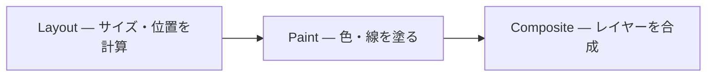

# CSS アニメーション — 動きの選択肢と使い分け

## 今日のゴール

- Web でアニメーションさせる方法にどんな選択肢があるかを知る
- CSS の `transition` と `animation` の違いを知る
- パフォーマンスに影響するプロパティの違いを知る

## アニメーションの選択肢

Web で「動き」をつけたいとき、選択肢はいくつかあります。

| 方法 | どんなとき |
|------|----------|
| CSS `transition` | ホバーで色を変える、メニューをスッと開くなど |
| CSS `@keyframes` + `animation` | スピナーを回し続ける、要素をふわっと表示するなど |
| CSS Scroll-driven animations | スクロールに連動してプログレスバーを伸ばす、要素を動かすなど |
| JavaScript（Web Animations API） | ユーザー操作に応じて動きを途中で止めたり、速度を変えたい |
| JavaScript ライブラリ（Framer Motion など） | React コンポーネントが現れる/消えるときの演出など |
| Canvas / WebGL | ゲームや粒子エフェクトなど、大量の描画が必要なとき |

多くの UI アニメーション（ボタンのホバー演出、メニューの開閉、読み込みスピナーなど）は CSS だけで十分です。このレッスンでは CSS の `transition` と `animation` に絞って見ていきます。

## transition — 状態が変わったら滑らかにつなぐ

ボタンにマウスを乗せると色が変わる。メニューがスッと開く。こうした「状態 A から状態 B への変化」を滑らかに見せるのが `transition` です。

```css
.button {
  background: #3b82f6;
  transition: background 300ms ease-out;
}

.button:hover {
  background: #1d4ed8;
}
```

`transition` がなければ色は一瞬で切り替わります。`transition` を付けると、ブラウザが A と B の間を自動で補間して、300ms かけて滑らかに変化させます。

<div class="c056-demo">
  <div style="display:flex;gap:16px;align-items:center">
    <button type="button" class="c056-btn c056-btn-no-transition">transition なし</button>
    <button type="button" class="c056-btn c056-btn-with-transition">transition あり</button>
  </div>
  <p class="c056-demo-note">ホバーまたは Tab フォーカスで比較してください</p>
</div>

`transition` に指定する値は 3 つです。

| 値 | 意味 | 例 |
|---|---|---|
| プロパティ | 何を補間するか | `background`、`transform`、`all` |
| 時間 | どれくらいかけるか | `300ms`、`0.5s` |
| イージング | 時間の進み方 | `ease-out`、`linear`、`ease-in-out` |

イージングは体感に効きます。`linear`（等速）だと機械的に、`ease-out`（最後がゆっくり）だと自然に見えます。迷ったら `ease-out` で十分です。

## animation — きっかけがなくても動く

読み込み中にくるくる回るスピナー。ページを開いた瞬間にふわっと現れるカード。こうした「状態変化をきっかけにしない動き」や「ループする動き」には `@keyframes` と `animation` を使います。

```css
@keyframes spin {
  from { transform: rotate(0deg); }
  to   { transform: rotate(360deg); }
}

.spinner {
  animation: spin 1s linear infinite;
}
```

`@keyframes` は「何パーセントの時点でどの状態にいるか」を書いた台本です。`animation` はその台本を「何秒で、何回再生するか」という再生指示です。

<div class="c056-demo">
  <div style="display:flex;gap:24px;align-items:center;flex-wrap:wrap">
    <div style="display:flex;flex-direction:column;align-items:center;gap:8px">
      <div class="c056-spinner" role="status" aria-label="読み込み中"></div>
      <span class="c056-demo-note">ループ</span>
    </div>
    <div style="display:flex;flex-direction:column;align-items:center;gap:8px">
      <div class="c056-fadein-card" id="c056-fadein-card">fade-in カード</div>
      <span class="c056-demo-note">一回だけ</span>
      <button type="button" class="c056-replay-btn" id="c056-replay-btn">もう一度再生</button>
    </div>
  </div>
</div>

### transition と animation の使い分け

| 場面 | 使う方法 |
|------|---------|
| ホバーやフォーカスで見た目が変わる | `transition` |
| ページ表示時にふわっと現れる | `animation`（一回再生） |
| ずっと回り続けるスピナー | `animation`（無限ループ） |
| 複数段階を経由する動き | `animation`（キーフレームを複数定義） |

迷ったら「きっかけがあるか」で判断します。`:hover` やクラスの付け外しなど、何かのきっかけで A → B に変わるなら `transition`。それ以外は `animation` です。

## 速いプロパティと遅いプロパティ

`transition` でも `animation` でも、**何を動かすか**でパフォーマンスが大きく変わります。

ブラウザが画面を描くとき、おおまかに 3 つのステップを通ります。



`width`、`height`、`top`、`margin` などを変えると、最初の Layout からやり直しになります。要素 1 つが動くだけで、周囲の要素も位置を再計算する必要があるので重い処理です。

一方、`transform`（移動・拡大・回転）と `opacity`（透明度）は最後の Composite だけで済みます。GPU が処理するので軽く、滑らかに動きます。

| プロパティ | 処理 | パフォーマンス |
|-----------|------|-------------|
| `width`、`height`、`top`、`margin` | Layout → Paint → Composite | 重い |
| `background`、`color`、`box-shadow` | Paint → Composite | そこそこ |
| `transform`、`opacity` | Composite のみ | 軽い |

「要素を動かす」なら `top`/`left` ではなく `transform: translate()`。「見え隠れ」なら `display` の切り替えではなく `opacity`。この 2 つに寄せるだけで、体感の滑らかさが変わります。

<div class="c056-demo">
  <p class="c056-demo-label">ドロワーの開閉: left（重い）vs transform（軽い）</p>
  <div class="c056-drawer-stage">
    <div class="c056-drawer-slow" id="c056-drawer-slow">left で移動</div>
    <div class="c056-drawer-fast" id="c056-drawer-fast">transform で移動</div>
  </div>
  <div style="margin-top:12px;display:flex;gap:8px;flex-wrap:wrap">
    <label style="display:flex;align-items:center;gap:8px;cursor:pointer;color:#1e293b">
      <input type="checkbox" id="c056-drawer-slow-cb" style="width:18px;height:18px;cursor:pointer">
      <span><code>left</code> で開閉</span>
    </label>
    <label style="display:flex;align-items:center;gap:8px;cursor:pointer;color:#1e293b">
      <input type="checkbox" id="c056-drawer-fast-cb" style="width:18px;height:18px;cursor:pointer">
      <span><code>transform</code> で開閉</span>
    </label>
  </div>
</div>

見た目の動きは同じですが、内部では `left` は毎フレーム Layout が走り、`transform` は GPU の Composite だけで済みます。

## 動きを控える配慮

動きの演出はアプリを心地よくしますが、前庭障害を持つ人にとっては、スライドや拡大縮小がめまいや体調不良の引き金になることがあります。

OS には「アニメーションを減らす」という設定があり、ブラウザは `prefers-reduced-motion` というメディアクエリでその設定を教えてくれます。

```css
@media (prefers-reduced-motion: reduce) {
  .drawer {
    transition-duration: 0.01ms;
  }
  .spinner {
    animation: none;
  }
}
```

装飾のアニメーションを書いたら、`prefers-reduced-motion` をセットで書く。これを習慣にしておくと、UI 全体が親切になります。

<div class="c056-demo">
  <p class="c056-demo-label">あなたのブラウザの設定: <strong id="c056-prm-status">判定中...</strong></p>
  <div class="c056-bounce-box" id="c056-bounce-box"></div>
  <p class="c056-demo-note">OS で「アニメーションを減らす」をオンにすると、上の四角が止まります</p>
</div>

## まとめ

- Web のアニメーションには CSS、JavaScript、ライブラリなど複数の選択肢があります。多くの UI アニメーションは CSS だけで十分です
- **transition** は状態変化をきっかけに A → B を滑らかにつなぎます
- **animation** はきっかけがなくても動き、ループや複数段階の動きに使います
- 動かすプロパティは `transform` と `opacity` に寄せると軽くなります。`width` や `top` はレイアウトが走るので重い
- `prefers-reduced-motion` で動きを控える配慮を忘れずに

<style>
.c056-demo {
  background: #f8fafc;
  color: #1e293b;
  border-radius: 8px;
  padding: 16px;
  margin: 16px 0;
}
.c056-demo-label {
  margin: 0 0 8px;
  font-weight: bold;
  color: #1e293b;
}
.c056-demo-note {
  margin: 8px 0 0;
  font-size: 14px;
  color: #64748b;
}
.c056-replay-btn {
  padding: 4px 12px;
  border: 1px solid #cbd5e1;
  border-radius: 4px;
  background: white;
  color: #1e293b;
  cursor: pointer;
  font-size: 12px;
}
.c056-replay-btn:hover {
  background: #f1f5f9;
}
.c056-btn {
  padding: 12px 20px;
  border: none;
  border-radius: 8px;
  background: #3b82f6;
  color: white;
  cursor: pointer;
  font-size: 14px;
}
.c056-btn-no-transition:hover,
.c056-btn-no-transition:focus-visible {
  background: #1d4ed8;
}
.c056-btn-with-transition {
  transition: background 300ms ease-out, transform 300ms ease-out;
}
.c056-btn-with-transition:hover,
.c056-btn-with-transition:focus-visible {
  background: #1d4ed8;
  transform: scale(1.05);
}

/* spinner */
.c056-spinner {
  width: 48px;
  height: 48px;
  border: 4px solid #e2e8f0;
  border-top-color: #3b82f6;
  border-radius: 50%;
  animation: c056-spin 1s linear infinite;
}
@keyframes c056-spin {
  to { transform: rotate(360deg); }
}

/* fade-in card */
.c056-fadein-card {
  padding: 12px 16px;
  background: white;
  border: 1px solid #cbd5e1;
  border-radius: 8px;
  color: #1e293b;
  text-align: center;
  animation: c056-fadein 600ms ease-out both;
}
@keyframes c056-fadein {
  from { opacity: 0; transform: translateY(8px); }
  to   { opacity: 1; transform: translateY(0); }
}

/* drawer demo */
.c056-drawer-stage {
  position: relative;
  height: 80px;
  border: 1px dashed #cbd5e1;
  border-radius: 8px;
  overflow: hidden;
  background: white;
}
.c056-drawer-slow {
  position: absolute;
  top: 8px;
  left: -180px;
  width: 160px;
  padding: 8px 12px;
  background: #fca5a5;
  color: #7f1d1d;
  border-radius: 6px;
  font-size: 14px;
  transition: left 400ms ease-out;
}
.c056-drawer-slow.c056-open {
  left: 8px;
}
.c056-drawer-fast {
  position: absolute;
  bottom: 8px;
  left: 8px;
  width: 160px;
  padding: 8px 12px;
  background: #86efac;
  color: #14532d;
  border-radius: 6px;
  font-size: 14px;
  transform: translateX(-200px);
  transition: transform 400ms ease-out;
}
.c056-drawer-fast.c056-open {
  transform: translateX(0);
}

/* bounce box */
.c056-bounce-box {
  width: 48px;
  height: 48px;
  background: #3b82f6;
  border-radius: 8px;
  animation: c056-bounce 1s ease-in-out infinite alternate;
}
@keyframes c056-bounce {
  from { transform: translateX(0); }
  to { transform: translateX(120px); }
}
@media (prefers-reduced-motion: reduce) {
  .c056-bounce-box { animation: none; }
  .c056-spinner { animation: none; }
  .c056-fadein-card { animation: none; }
}
</style>

<script setup>
import { onMounted } from 'vue'

onMounted(() => {
  document.getElementById('c056-replay-btn')?.addEventListener('click', () => {
    const card = document.getElementById('c056-fadein-card')
    if (card) {
      card.style.animation = 'none'
      card.offsetHeight
      card.style.animation = ''
    }
  })

  document.getElementById('c056-drawer-slow-cb')?.addEventListener('change', (e) => {
    document.getElementById('c056-drawer-slow')?.classList.toggle('c056-open', e.target.checked)
  })
  document.getElementById('c056-drawer-fast-cb')?.addEventListener('change', (e) => {
    document.getElementById('c056-drawer-fast')?.classList.toggle('c056-open', e.target.checked)
  })

  const prmStatus = document.getElementById('c056-prm-status')
  if (prmStatus) {
    const mq = window.matchMedia('(prefers-reduced-motion: reduce)')
    const update = () => {
      prmStatus.textContent = mq.matches ? 'reduce（動きを抑える設定）' : 'no-preference（通常設定）'
    }
    update()
    mq.addEventListener('change', update)
  }
})
</script>
