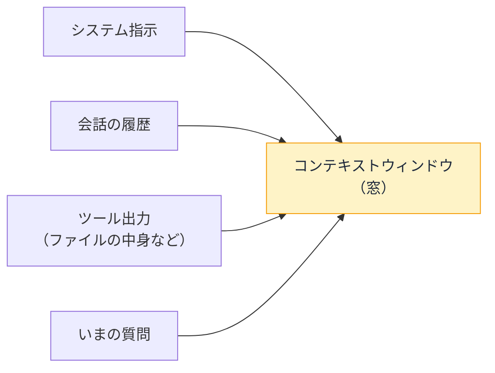

# コンテキストウィンドウ — AI はなぜ忘れるのか

## 今日のゴール

- AI が「すべてを覚えている」わけではないことを知る
- コンテキストウィンドウ（窓）とトークンの仕組みを知る
- 窓の限界がコーディングの指示に与える影響を知る

## 長い会話の果てに突然おかしくなる

AI アシスタントとの作業中、こんな経験はないでしょうか。

- さっき伝えた仕様を忘れている
- 最初のほうで決めた方針に反する提案をしてくる
- 「もう一度教えてください」と言ってくる

AI が「さっき言ったのに」を忘れるのは、性格の問題ではなく**構造的な制約**です。

## トークン — AI がテキストを扱う単位

AI が読み書きするテキストは、内部で**トークン**という単位に分解されて処理されます。

日本語の場合、おおまかに **1 文字 ≒ 1〜3 トークン** です（英語は 1 単語 ≒ 1 トークン程度）。「こんにちは」で 3〜5 トークン程度。コードは変数名や記号ごとにトークンになります。

AI が一度に「見る」ことのできるトークンの総量が、**コンテキストウィンドウ**（context window、文脈の窓）です。

| モデル | 窓のサイズの目安 |
|--------|----------------|
| 小さなモデル | 数千〜数万トークン |
| 大きなモデル | 10 万〜100 万トークン以上 |

この窓にはすべてが入ります。**システムの指示 + これまでの会話の全履歴 + ツールの出力 + いまの質問**。これらの合計が窓のサイズを超えると、古い部分から押し出されるか、要約されて圧縮されます。

## 「忘れる」仕組み

AI に記憶はありません。あるのは窓だけです。

- 窓の中にある情報は「覚えている」ように見える
- 窓から押し出された情報は、**最初から存在しなかったかのように**消える

つまり「忘れた」のではなく、「**もう見えていない**」のが正確です。20 分前の会話でも、窓から出ていれば認識できません。一方、窓の中にある 1 万行のファイルの中身は、隅々まで「覚えて」います。

長い会話で AI がおかしくなるのは、**初期に決めた方針が窓の外に押し出され、最近の文脈だけで判断し始める**からです。

## コーディング作業への影響

この制約は、日常のコーディング作業に直結します。

### 大きなファイルで窓が埋まる

10,000 行のファイルを丸ごと読ませると、それだけで窓の大部分を消費します。他の情報（会話の経緯、他のファイル、指示）が押し出されて、文脈を失います。

- **必要な部分だけ渡す**: 「このファイルの 200 行目付近を見て」のほうが「このファイル全体を見て」より精度が出る
- **小さいファイルに分割する**: 1 ファイル 300 行超が続くなら、分割自体に設計的な意味がある

### 長い会話で方針がブレる

会話が 100 往復を超えると、最初に決めた設計方針や命名規約が窓の外に消え、AI は「いまの文脈で最もそれらしい」判断をし始めます。

- **方針はファイルに書く**: CLAUDE.md やプロジェクトの規約ファイルに書いておけば、窓に読み直してもらえる
- **新しい会話で仕切り直す**: 長くなったら、必要な文脈だけ持って新しいセッションを始めるほうが精度が上がることがある

### 「全部見て」が通じない規模がある

リポジトリ全体で 10 万行を超えるアプリは、窓に収まりません。AI がリポジトリ全体を見られるように見えるのは、ツールで**必要な部分だけ都度読む**仕組みが裏で動いているからです。「全体を把握して」という指示は、実際には部分的な読み取りの積み重ねです。

## 窓の大きさは年々広がっている

注意点として、窓は年々急速に広がっています。数年前は 4,000 トークンだったものが、いまは 100 万トークン以上のモデルもあります。「窓が狭いから工夫する」話は、将来はほとんど気にならなくなる可能性もあります。

ただし窓が広がっても、**窓の端と中心で注意の精度に差がある**（端の情報は見落としやすい）という性質は現時点で残っています。「入るから全部入れる」より「必要なものを手前に置く」ほうが、当面は確実です。

## まとめ

- AI に記憶はなく、あるのはコンテキストウィンドウ（窓）だけ
- 窓の中は覚えていて窓の外は存在せず、「忘れた」のではなく「見えていない」
- 大きなファイル、長い会話、巨大なリポジトリで窓は溢れる
- 方針はファイルに書き、渡す情報は必要な部分に絞る
