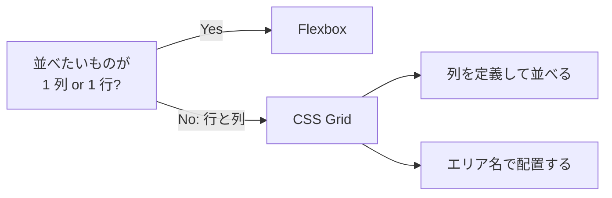
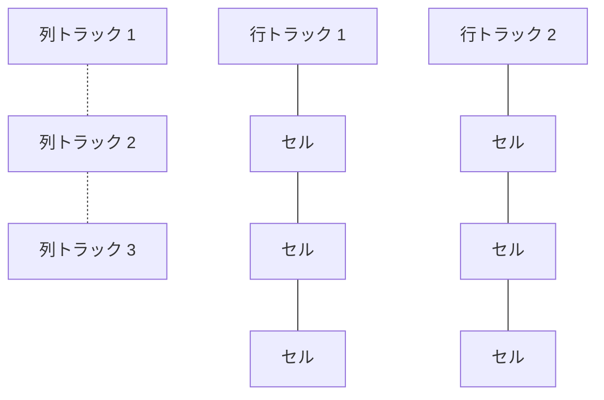

# グリッド状に並べたい — CSS Grid による二次元レイアウト

## 今日のゴール

- 「Flexbox は 1 次元、Grid は 2 次元」という使い分けの軸を持つ
- `grid-template-columns` と `repeat(auto-fit, minmax(...))` で、メディアクエリなしに列数が変わる仕組みを知る
- `grid-template-areas` でダッシュボード風 UI を名前で組み立てられると知る

## 「3 列で並べたい、狭くなったら 2 列、スマホは 1 列」

商品一覧を 3 列で並べたい。画面が狭くなったら 2 列。スマホなら 1 列。カードの高さは内容でバラバラになっても、列の幅はピシッと揃えたい。

こういう「行と列で整える」要求、AI に「商品カードを並べて」と頼んで出てきたコードで見たことがあるはずです。Flexbox で折り返しを作って頑張っている例もあれば、`grid` が使われている例もある。どちらも動いては見えるけれど、**二次元のレイアウトは本来 Grid の仕事**です。

Flexbox は「1 行（または 1 列）に並べる」ための仕組みで、主役はひとつの軸。対して Grid は「行と列という 2 つの軸」を同時に扱います。コンテナに **格子（トラック）** を定義して、子要素を格子のどこに置くかで配置する、という発想です。「トラック」は Grid 用語で、列方向に走る縦の帯と行方向に走る横の帯のことを指します。方眼紙に線を引いてからマス目にモノを置くイメージです。



行と列のトラックが交差してセル（マス目）ができる、というのが Grid の世界観です。



今日は Grid の柱を 3 本だけ持ち帰ります。(1) 列を定義して並べる、(2) エリアで配置する、(3) Flex との使い分け。

## 柱 1: 列を定義して並べる

Grid はまず「親要素に格子を引く」ところから始めます。一番よく使うのは、列の本数と幅を決める `grid-template-columns` です。

```html
<ul class="product-list" aria-label="商品一覧">
  <li class="card"><h3>商品A</h3><p>説明テキスト</p></li>
  <li class="card"><h3>商品B</h3><p>説明テキスト</p></li>
  <li class="card"><h3>商品C</h3><p>説明テキスト</p></li>
  <li class="card"><h3>商品D</h3><p>説明テキスト</p></li>
</ul>

<style>
  .product-list {
    display: grid;
    grid-template-columns: 1fr 1fr 1fr; /* 3 等分の列 */
    gap: 16px;
    list-style: none;
    padding: 0;
  }
</style>
```

`1fr` の `fr` は fraction（分数）の略で、「余りスペースを何等分するか」を表す Grid 専用の単位です。`1fr 1fr 1fr` なら 3 等分、`2fr 1fr` なら 2:1 の比率。ピクセル指定と違って、親の幅が変わっても比率を保ってくれます。

同じ列を何度も書くのは面倒なので、`repeat()` が用意されています。

```css
.product-list {
  display: grid;
  grid-template-columns: repeat(3, 1fr);
  gap: 16px;
}
```

### メディアクエリなしで列数を変える魔法

ここからが Grid の真骨頂です。「画面が狭くなったら勝手に列数を減らしたい」を、**メディアクエリを一切書かずに**実現できます。

```css
.product-list {
  display: grid;
  grid-template-columns: repeat(auto-fit, minmax(240px, 1fr));
  gap: 16px;
}
```

読み方は「240px 以上 1fr 以下の列を、入る分だけ自動で敷き詰めて」です。

- `minmax(240px, 1fr)` — 1 列の幅は最小 240px、最大は `1fr`（余りを等分）
- `auto-fit` — その条件で入るだけ列を増やす。余ったら既存の列を伸ばす

画面幅が 800px なら 3 列、500px なら 2 列、300px なら 1 列、と勝手に切り替わります。メディアクエリのブレイクポイントを悩む代わりに、「カードの最小幅」だけを決めれば済むわけです。

<div style="border:1px solid #cbd5e1;border-radius:8px;padding:16px;background:#f8fafc;color:#1e293b;margin:16px 0;">
  <p style="margin:0 0 12px;font-weight:bold;">デモ: コンテナ幅を変えると列数が勝手に変わる</p>
  <div style="display:grid;grid-template-columns:repeat(auto-fit,minmax(160px,1fr));gap:12px;">
    <div style="background:white;color:#1e293b;padding:16px;border-radius:6px;border:1px solid #e2e8f0;">カード 1</div>
    <div style="background:white;color:#1e293b;padding:16px;border-radius:6px;border:1px solid #e2e8f0;">カード 2</div>
    <div style="background:white;color:#1e293b;padding:16px;border-radius:6px;border:1px solid #e2e8f0;">カード 3</div>
    <div style="background:white;color:#1e293b;padding:16px;border-radius:6px;border:1px solid #e2e8f0;">カード 4</div>
    <div style="background:white;color:#1e293b;padding:16px;border-radius:6px;border:1px solid #e2e8f0;">カード 5</div>
    <div style="background:white;color:#1e293b;padding:16px;border-radius:6px;border:1px solid #e2e8f0;">カード 6</div>
  </div>
  <p style="margin:12px 0 0;color:#475569;font-size:0.9em;">ブラウザの幅を変えてみると、列数が 1 → 2 → 3 と切り替わる。</p>
</div>

`auto-fit` とよく似た `auto-fill` もあります。違いは「中身が少ないとき」に出ます。`auto-fit` は空の列を潰して既存を伸ばす、`auto-fill` は空の列を残して既存の幅を保つ。迷ったら `auto-fit` で十分です。

### カードの高さを揃える

Flexbox で折り返した場合、行をまたぐとカードの高さが揃いません。Grid なら **同じ行のセルは自動で同じ高さ**になります。高さの揃わなさで CSS を書き散らした経験があるなら、Grid に切り替えるだけで解決する場面は多いです。

## 柱 2: エリアで配置する

ダッシュボードやブログ、管理画面でよく見る「ヘッダー・サイドバー・メイン・フッター」の配置。これを位置番号で指定すると頭がこんがらがりますが、Grid には **エリアに名前を付けて配置する** 書き方があります。

```html
<div class="dashboard">
  <header class="dashboard__header">ヘッダー</header>
  <nav class="dashboard__side" aria-label="メインナビゲーション">サイド</nav>
  <main class="dashboard__main">メイン</main>
  <footer class="dashboard__footer">フッター</footer>
</div>

<style>
  .dashboard {
    display: grid;
    grid-template-columns: 200px 1fr;
    grid-template-rows: 60px 1fr 40px;
    grid-template-areas:
      "header header"
      "side   main"
      "footer footer";
    gap: 8px;
    min-height: 400px;
  }
  .dashboard__header { grid-area: header; }
  .dashboard__side   { grid-area: side; }
  .dashboard__main   { grid-area: main; }
  .dashboard__footer { grid-area: footer; }
</style>
```

`grid-template-areas` は、レイアウトを **アスキーアートのように文字列で書ける**のが特長です。`"header header"` は「1 行目は 2 列とも header」、`"side main"` は「2 行目は左が side、右が main」。同じ名前を並べればセルが結合されます。CSS を読むだけでレイアウトが目に浮かぶのが強みです。

<div style="border:1px solid #cbd5e1;border-radius:8px;padding:16px;background:#f8fafc;color:#1e293b;margin:16px 0;">
  <p style="margin:0 0 12px;font-weight:bold;">デモ: grid-template-areas によるダッシュボード</p>
  <div style="display:grid;grid-template-columns:120px 1fr;grid-template-rows:40px 120px 32px;grid-template-areas:'header header' 'side main' 'footer footer';gap:6px;">
    <div style="grid-area:header;background:white;color:#1e293b;padding:8px;border-radius:4px;border:1px solid #e2e8f0;">header</div>
    <div style="grid-area:side;background:white;color:#1e293b;padding:8px;border-radius:4px;border:1px solid #e2e8f0;">side</div>
    <div style="grid-area:main;background:white;color:#1e293b;padding:8px;border-radius:4px;border:1px solid #e2e8f0;">main</div>
    <div style="grid-area:footer;background:white;color:#1e293b;padding:8px;border-radius:4px;border:1px solid #e2e8f0;">footer</div>
  </div>
</div>

### アクセシビリティの注意: 見た目の順 ≠ DOM の順

Grid は便利な一方、`grid-area` や `order` で **見た目の並びを DOM の並びから自由に動かせます**。ところがキーボードでの Tab 移動やスクリーンリーダーの読み上げは **DOM の順** に従います。

たとえば「メインコンテンツを左、ナビを右」に見せたいからといって、HTML では `<nav>` が `<main>` の後ろに書かれている、という状態にすると、Tab キーを押した人は先にメインを触ってからナビに辿り着くことになる。視覚的な順序と DOM 順は揃えておくのが原則で、Grid は配置の自由度を上げる分、意識して HTML の順を先に整えましょう。

### subgrid で孫も親の格子に揃える

ひとつ踏み込んだ話を。カードの中身（タイトル・説明・価格・ボタン）の高さを、**カードをまたいで揃えたい**ことがあります。各カードが独立して中を Grid で組むと、隣のカードとは揃いません。

これを解決するのが `subgrid` です。子要素が `grid-template-columns: subgrid` と書くと、親のトラックをそのまま継承して使えます。2024 年に全主要ブラウザで使えるようになった比較的新しい機能で、「カードの中の要素まで縦ラインが通る」みたいな揃え方がネイティブで書けます。最初から使いこなす必要はなく、「孫の高さも揃えたいときの手札がある」と覚えておけば十分です。

## 柱 3: Flex と Grid の使い分け

「Flex と Grid、どっちを使えばいいですか」は誰もが通る道です。判断軸はシンプルです。

- **1 次元（1 行 or 1 列）なら Flex** — ナビゲーションの横並び、ボタンとアイコンの並び、タグ一覧の折り返し
- **2 次元（行 × 列）なら Grid** — 商品一覧のカード、ダッシュボード、フォームのラベルと入力欄の整列
- **迷ったら Flex** — 単純な並びは Flex のほうがコストが低い。揃え方に悩み始めたら Grid を検討

<div style="border:1px solid #cbd5e1;border-radius:8px;padding:16px;background:#f8fafc;color:#1e293b;margin:16px 0;">
  <p style="margin:0 0 12px;font-weight:bold;">デモ: Flex と Grid で同じ 5 枚のカードを並べた違い</p>
  <p style="margin:0 0 6px;color:#475569;font-size:0.9em;">Flex（折り返し）— 最後の行のカードが余白で広がる、列の縦ラインが揃わない</p>
  <div style="display:flex;flex-wrap:wrap;gap:8px;margin-bottom:12px;">
    <div style="flex:1 1 140px;background:white;color:#1e293b;padding:12px;border-radius:4px;border:1px solid #e2e8f0;">A</div>
    <div style="flex:1 1 140px;background:white;color:#1e293b;padding:12px;border-radius:4px;border:1px solid #e2e8f0;">B</div>
    <div style="flex:1 1 140px;background:white;color:#1e293b;padding:12px;border-radius:4px;border:1px solid #e2e8f0;">C</div>
    <div style="flex:1 1 140px;background:white;color:#1e293b;padding:12px;border-radius:4px;border:1px solid #e2e8f0;">D</div>
    <div style="flex:1 1 140px;background:white;color:#1e293b;padding:12px;border-radius:4px;border:1px solid #e2e8f0;">E</div>
  </div>
  <p style="margin:0 0 6px;color:#475569;font-size:0.9em;">Grid（auto-fit）— 縦ラインがピシッと揃い、最後の行の余りは空白になる</p>
  <div style="display:grid;grid-template-columns:repeat(auto-fit,minmax(140px,1fr));gap:8px;">
    <div style="background:white;color:#1e293b;padding:12px;border-radius:4px;border:1px solid #e2e8f0;">A</div>
    <div style="background:white;color:#1e293b;padding:12px;border-radius:4px;border:1px solid #e2e8f0;">B</div>
    <div style="background:white;color:#1e293b;padding:12px;border-radius:4px;border:1px solid #e2e8f0;">C</div>
    <div style="background:white;color:#1e293b;padding:12px;border-radius:4px;border:1px solid #e2e8f0;">D</div>
    <div style="background:white;color:#1e293b;padding:12px;border-radius:4px;border:1px solid #e2e8f0;">E</div>
  </div>
</div>

配属先が使う Tailwind CSS なら、Grid はクラスとして短く書けます。

```html
<!-- 3 列固定 -->
<ul class="grid grid-cols-3 gap-4" aria-label="商品一覧">
  <li>...</li>
</ul>

<!-- レスポンシブ（sm 以上 2 列、lg 以上 3 列） -->
<ul class="grid grid-cols-1 sm:grid-cols-2 lg:grid-cols-3 gap-4">
  <li>...</li>
</ul>

<!-- 任意の値: 左右固定・真ん中伸縮のダッシュボード -->
<div class="grid grid-cols-[200px_1fr_200px] gap-4">
  <aside>左</aside>
  <main>中央</main>
  <aside>右</aside>
</div>
```

`grid-cols-[200px_1fr_200px]` のような角括弧記法は Tailwind の arbitrary value（任意値）と呼ばれる書き方で、「用意されたクラスにない値でも書ける」逃げ道です。`auto-fit` + `minmax()` のような込み入った指定も `grid-cols-[repeat(auto-fit,minmax(240px,1fr))]` と書けます。

## まとめ

- Flexbox は 1 次元、Grid は 2 次元。二次元のレイアウトは Grid の仕事
- `grid-template-columns: repeat(auto-fit, minmax(240px, 1fr))` でメディアクエリなしに列数が変わる
- `grid-template-areas` はレイアウトを名前で書ける。ダッシュボード系に強い
- Grid は配置を自由にできる反面、DOM の順と視覚の順がずれるとアクセシビリティを壊す。HTML の順を先に整える
- Tailwind でも `grid grid-cols-*` と任意値で同じ発想を短く書ける

今日はこれだけ覚えれば OK。「並べたい」と思ったとき、それが 1 次元か 2 次元かをまず自分に問う。2 次元なら Grid を素直に選ぶ、という判断の軸を持ち帰ってください。
