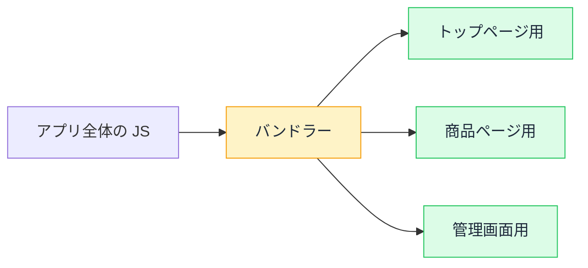

# バンドルサイズ — なぜ JavaScript は肥大化するのか

## 今日のゴール

- npm install した瞬間にブラウザ行きのコードが増える仕組みを知る
- code splitting と tree shaking というビルドの自動最適化を知る
- バンドルの大きさを「見える化」する習慣を知る

## ページが開かない原因は JS かもしれない

ページの読み込みが遅い原因はいくつもありますが、フロントエンドで最も影響が大きいのが **JavaScript のサイズ**です。

HTML と CSS は届けばすぐ表示に使えますが、JavaScript は**ダウンロード → パース（構文解析） → 実行**という 3 段階を経てようやく動きます。サイズが大きいほど 3 段階すべてが遅くなり、低スペックの端末ほど深刻です。

肥大化はいくつかの原因で起き、原因ごとに抑える手段があります。

## npm install = バンドルへの投入

アプリが使うすべての JavaScript は、ビルド時に**バンドル**（束ねられたファイル群）にまとめられてブラウザに届きます。`npm install` でパッケージを足すと、そのコードがバンドルに入ります。

問題は**間接依存**です。たとえばリッチテキストエディタのライブラリを 1 つ入れると、それが依存する数十のパッケージがすべてバンドルに流れ込みます。開発者が `import` した 1 行の裏で、数百 KB のコードがブラウザ行きになっていることは珍しくありません。

## ビルドの自動最適化 — tree shaking と code splitting

バンドラー（Webpack や Turbopack）は、何もしなくても 2 つの最適化を行っています。

### tree shaking — 使われていないコードを振り落とす

ライブラリが 100 個の関数を公開していても、`import` しているのが 3 個なら、残り 97 個はバンドルに含まれません。木を揺すって（shake）枯れ葉（使われていないコード）を落とすイメージです。

ただし効くのは **ESM の `import` / `export`** で書かれたコードだけです。古い形式（CommonJS の `require`）は静的に解析できないため、丸ごと含まれてしまいます。ライブラリ選定で「ESM 対応か」が気にされるのは、この理由です。

### code splitting — ページごとに分割する

アプリ全体の JavaScript を 1 つのファイルにまとめると、トップページを開くだけで管理画面のコードまで読み込まれます。

code splitting は、**実際にそのページで使うコードだけを分割して読み込む**仕組みです。Next.js の App Router では、`app/` のページ単位で自動的に分割されます。開発者が意識しなくても、「トップページのバンドル」「商品ページのバンドル」が別々に配信されています。



## それでも肥大化する理由

自動最適化があってもバンドルが太る原因は、定番のものが 3 つあります。

### 1. 重いライブラリの安易な追加

日付の表示に `moment.js`（300KB 超）を入れる、アイコン 1 個のために大型アイコンライブラリを丸ごと入れる。便利さの裏にサイズのコストがあるのに、`npm install` の手軽さが感覚を麻痺させます。

### 2. "use client" の境界の引き方

Server Components のコードはバンドルに入りません。しかし `"use client"` を高い位置に付けると、その下の全コンポーネントがバンドル行きになります。これは前に見た SC/CC の境界設計の問題が、サイズとして表面化したものです。

### 3. 未使用の import が残っている

```tsx
import lodash from "lodash"; // lodash 全体を import
```

named import（`import { debounce } from "lodash"`）にすれば tree shaking が効きますが、default import で丸ごと取り込むと全コードがバンドルに入ります。AI のコードでもよくある形です。

## 見える化する — バンドル分析

「何が太いか」を知るには、バンドルの中身を**可視化**するのがいちばんです。

Next.js では `@next/bundle-analyzer` というプラグインで、バンドルの中身を面積図（ツリーマップ）で確認できます。四角が大きいほどサイズが大きく、「あのライブラリがこんなに！」が一目で分かります。

見慣れないほど大きな四角を見つけたときの問いは 2 つです。

1. **この機能に、このサイズは見合っているか？** 軽量な代替はないか
2. **そもそもクライアントに必要か？** Server Components に移せないか

AI に「バンドルサイズを減らして」と丸投げするのではなく、分析結果を見せて「**この 200KB のライブラリを軽量な代替に変えて**」と言えるのが、見える化の価値です。

## まとめ

- JavaScript はダウンロード・パース・実行の 3 段階で、サイズが直接速度に効く
- tree shaking は不要コードの除去、code splitting はページ単位の分割で、どちらも自動
- 肥大化の犯人: 重いライブラリ、高い位置の "use client"、丸ごと import
- バンドル分析で「何が太いか」を見える化し、指名して減らす
