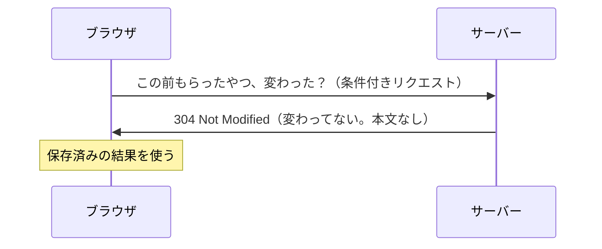
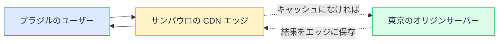

# HTTP キャッシュと CDN — 2 回目のアクセスはなぜ速いか

## 今日のゴール

- ブラウザが「前回の結果」を使い回す HTTP キャッシュの仕組みを知る
- Cache-Control ヘッダーの読み方を知る
- CDN が「世界中に配置されたキャッシュ棚」だと知る

## 2 回目が速い理由

同じページを 2 回目に開くと、体感で明らかに速くなります。これは「慣れ」ではなく、**本当に通信量が減っている**からです。

ブラウザは、サーバーから受け取ったリソース（HTML、CSS、JavaScript、画像など）を**ローカルに保存しておき、同じ URL への次のリクエストで使い回す**仕組みを持っています。これが **HTTP キャッシュ**です。

## Cache-Control — 使い回しの指示書

「どれくらい使い回してよいか」は、サーバーがレスポンスのヘッダーで指示します。

```
Cache-Control: max-age=3600
```

この 1 行は「**このレスポンスは 3600 秒（1 時間）使い回してよい**」という意味です。1 時間以内の再アクセスでは、ブラウザはサーバーに問い合わせず、保存済みの結果をそのまま使います。

| ディレクティブ | 意味 |
|---------------|------|
| `max-age=秒数` | 指定秒数の間、使い回してよい |
| `no-cache` | 使い回す前に**毎回サーバーに確認**する（キャッシュ禁止ではない。名前が紛らわしい） |
| `no-store` | **保存しない**。本当のキャッシュ禁止 |
| `public` | CDN など途中のキャッシュにも保存してよい |
| `private` | ブラウザだけ保存してよい（CDN には保存しない）。ログインユーザー向けのデータなど |
| `immutable` | 内容は絶対に変わらない。確認すら不要 |

`no-cache` が「キャッシュしない」に見えるのは有名な罠です。実際は「**キャッシュするが、毎回サーバーに『まだ最新？』と確認してから使う**」です。

### 条件付きリクエスト — 「変わった？」の問い合わせ

`max-age` が切れた後、ブラウザはいきなり全データを取り直すわけではありません。「前回もらったやつ、まだ最新ですか？」と**条件付きリクエスト**を送ります。

サーバーが「変わっていない」と判断すれば **304 Not Modified** を返します。本文は空で、「前の使っていいよ」という合図だけ。通信量がほぼゼロで済みます。



## CDN — 世界中に配置されたキャッシュ棚

オリジンサーバー（アプリ本体が動くサーバー）が東京にあるとき、ブラジルのユーザーは地球の裏側まで往復するので遅くなります。

**CDN**（Content Delivery Network）は、**世界各地にキャッシュ専用のサーバー（エッジ）を配置して、ユーザーに近い場所からリソースを返す**仕組みです。



最初のアクセスはオリジンまで行きますが、その結果がエッジに保存されれば、**2 人目以降は近くのエッジから即座に返る**。Next.js を Vercel にデプロイすると、この CDN 配信が標準で効いています。

CDN は Cache-Control ヘッダーを読みます。`public, max-age=3600` なら、エッジにも 1 時間保存されます。`private` のデータ（ログインユーザーの情報など）をエッジに保存させたら、**他人のデータが別人に配信される事故**になるので、`public` / `private` の区別は重要です。

## Next.js のキャッシュの層

Next.js アプリでは、キャッシュが複数の層で効いています。

| 層 | 何をキャッシュするか |
|----|-------------------|
| ブラウザ | 画像、CSS、JS、フォントなど |
| CDN エッジ | 静的ページ、ISR で生成されたページ |
| Next.js サーバー | "use cache" で宣言した関数やコンポーネントの結果 |

「更新したのに画面が変わらない」という現象は、**どの層のキャッシュが古いまま残っているか**を特定する問題になります。キャッシュ制御のレッスンで見た cacheLife / cacheTag は Next.js サーバー層のキャッシュの話で、ブラウザや CDN のキャッシュは HTTP ヘッダーの仕事です。層が違うことを意識すると、「どこを疑うか」が絞れます。

## AI への指示のコツ

API のレスポンスに Cache-Control を付けるよう AI に頼むとき、「キャッシュして」だけだと `max-age=31536000`（1 年）のような極端な値を返すことがあります。

- **このデータは何分古くていいか？**（max-age の判断材料）
- **ログインユーザーに固有のデータか？**（public / private の判断材料）
- **一度配信したら絶対変わらないか？**（immutable の判断材料）

この 3 つの問いで、適切な Cache-Control が決まります。

## まとめ

- HTTP キャッシュはブラウザが前回の結果を使い回す仕組み。Cache-Control が指示書
- `no-cache` はキャッシュ禁止ではなく「毎回確認」。`no-store` が本当の禁止
- CDN は世界中のエッジにキャッシュを配置する。`private` のデータを `public` にしない
- 「変わらない」はどの層のキャッシュの問題かを特定する
