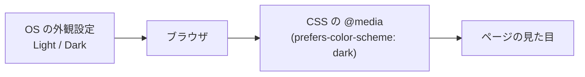

# ダークモード対応したい — カスタムプロパティと prefers-color-scheme

## 今日のゴール

- ダークモードは「OS やブラウザの配色設定」を CSS 側から読み取って切り替えていると理解する
- 色をカスタムプロパティ（CSS 変数）にまとめ、1 箇所で管理する発想を身につける
- 自動切替（OS 追従）とユーザー選択（ライト固定・ダーク固定）の実装パターンを知る

## 「ダークモード対応して」と AI に頼むと起きる違和感

AI で Next.js アプリを作っていて「ダークモード対応したい」とお願いすると、Tailwind のクラスにひたすら `dark:bg-gray-900 dark:text-gray-100` のような接頭辞が全要素に付いて返ってくる、という経験はないでしょうか。動くのはいいのですが、こんな素朴な疑問が残ります。

- そもそも「ダークモード」って何を見て切り替わっているのか？ OS の設定？ ブラウザの設定？
- `dark:` の正体は何なのか？
- コンポーネントが増えるたびに `dark:` を 2 倍書くのが本当に正解なのか？

この答えは、Tailwind の独自機能ではなく **CSS そのものの仕組み**にあります。今日はその仕組みを押さえておきましょう。覚えておいてほしいのはたった 3 つです。

1. 色を「変数」で 1 箇所に集める
2. `prefers-color-scheme` で OS の配色に追従する
3. 切り替えスイッチはルート要素の `class` で実現する

## 柱 1: 色を「変数」で 1 箇所に集める

ダークモード対応が大変になる最大の原因は、**色がコード全体にベタ書きされていること**です。`background: #ffffff` や `color: #111111` が 200 箇所に散らばっていると、ダーク版の色を決めるたびに 200 箇所直すことになります。

CSS にはこれを解決する仕組みがあります。**カスタムプロパティ**（CSS 変数）です。`--` で始まる名前に値を入れておいて、`var(--名前)` で参照します。

```css
:root {
  /* 色を意味のある名前で定義する */
  --color-bg: #ffffff;
  --color-text: #0f172a;
  --color-surface: #f8fafc;
  --color-border: #e2e8f0;
  --color-primary: #2563eb;
}

body {
  background: var(--color-bg);
  color: var(--color-text);
}

.card {
  background: var(--color-surface);
  border: 1px solid var(--color-border);
}
```

ポイントは **「色名」ではなく「役割名」で変数を付ける**こと。`--color-blue-500` ではなく `--color-primary`、`--color-gray-100` ではなく `--color-surface`（面の色）。役割で書いておけば、ダーク時に中身だけ差し替えれば全体の意味が保たれます。

## 柱 2: `prefers-color-scheme` で OS に追従する

「ダークモード」の正体を覗いてみます。macOS・Windows・iOS・Android には「外観」や「テーマ」の設定があって、そこで選んだライト/ダークを**ブラウザが OS から受け取り**、CSS 側に露出しています。それを参照するのが **メディアクエリ** `@media (prefers-color-scheme: dark)` です。



`light-dark()` を使わず、自分で明示的に切り替える書き方はこうなります。

```css
:root {
  color-scheme: light dark;
  --color-bg: #ffffff;
  --color-text: #0f172a;
  --color-surface: #f8fafc;
}

@media (prefers-color-scheme: dark) {
  :root {
    --color-bg: #0f172a;
    --color-text: #f1f5f9;
    --color-surface: #1e293b;
  }
}
```

変数の値だけを上書きしているので、`body` や `.card` 側のコードは一切触らなくてよいことに注目してください。これが「色を変数に集める」価値です。

Tailwind CSS v4 の `dark:bg-gray-900` も、初期設定ではこの `@media (prefers-color-scheme: dark)` に展開されているだけです（v4 では `@custom-variant dark (&:where(.dark, .dark *))` と書けばクラス方式に切替可能）。つまり `dark:` はマジックではなく、CSS 標準機能の薄いラッパーにすぎません。

### `light-dark()` と `color-scheme` でもっと短く書く

同じことを 2024 年以降の新しい CSS 機能で書くと、メディアクエリを自分で書かなくて済みます。`light-dark()` は「ライト時の色, ダーク時の色」を並べて書くだけで、現在のテーマに応じた値が自動で選ばれる関数です。

```css
:root {
  color-scheme: light dark; /* この 1 行が重要 */
  --color-bg: light-dark(#ffffff, #0f172a);
  --color-text: light-dark(#0f172a, #f1f5f9);
  --color-surface: light-dark(#f8fafc, #1e293b);
}
```

`color-scheme: light dark` は「このページはライトもダークも両対応です」という宣言です。これがあると `light-dark()` が機能するだけでなく、**フォーム部品・スクロールバー・デフォルトの選択ハイライト色まで**ブラウザが自動でダーク化してくれます。書くのを忘れやすいのに効果が大きい 1 行です。

### hover 色は `color-mix()` で自動生成する

「プライマリの hover 色、ダーク時にも合うように...」と色をもう 1 セット用意するのは面倒です。`color-mix()` でベース色に白や黒を混ぜれば、ライト/ダーク双方で自然な hover 色が作れます。

```css
.button {
  background: var(--color-primary);
  color: white;
}
.button:hover {
  /* プライマリに 15% の白を混ぜて明るくする */
  background: color-mix(in srgb, var(--color-primary), white 15%);
}
```

色のバリエーションを手で定義する代わりに式で表現する、という発想を覚えておくと引き出しが増えます。

## 柱 3: ユーザー選択は `class` で切り替える

OS 追従だけだと「このサイトだけダークで見たい」という要望には応えられません。実際のプロダクトでは **「システム / ライト / ダーク」の 3 択トグル**が定番です。これは `<html>` に付けるクラスで実現します。

```html
<!-- ユーザーがダークを選んだとき JS でこう付与する -->
<html class="theme-dark">
```

```css
:root {
  color-scheme: light;
  --color-bg: #ffffff;
  --color-text: #0f172a;
}

/* 明示的にダークを選んだとき */
:root.theme-dark {
  color-scheme: dark;
  --color-bg: #0f172a;
  --color-text: #f1f5f9;
}

/* 「システムに従う」選択時は OS 設定を尊重 */
:root.theme-system {
  color-scheme: light dark;
}
@media (prefers-color-scheme: dark) {
  :root.theme-system {
    --color-bg: #0f172a;
    --color-text: #f1f5f9;
  }
}
```

ルート（`<html>`）のクラスを付け替えるだけで、変数の値が一斉に変わり、ページ全体の配色が差し替わります。

### 選択を記憶するときの落とし穴（SSR のチラつき）

ユーザーの選択は `localStorage` や Cookie に保存します。ただし Next.js のような**サーバーで HTML を作るフレームワーク**では注意が必要です。サーバーはユーザーの好みを知らずにライトで HTML を返し、その後クライアントで JS がダーククラスを付ける、という順序になると、一瞬ライトが見えてからダークになる **フラッシュ**が起きます。

対策は 2 つ。

- **Cookie に保存**して、サーバーが HTML を作る時点で `<html class="theme-dark">` を出力する
- `<head>` のインラインスクリプトで、React の描画より前に `localStorage` を見てクラスを付ける

どちらも「React が動く前にクラスが当たっている」状態を作るのが要点です。この仕組みを知っていると、AI が出してきた対策コードが何をしているか読めるようになります。

### ブラウザのタブ色も合わせる

スマホのブラウザはタブバーの色を `<meta name="theme-color">` で変えられます。ダーク版も用意しておくと統一感が出ます。

```html
<meta name="theme-color" content="#ffffff" media="(prefers-color-scheme: light)">
<meta name="theme-color" content="#0f172a" media="(prefers-color-scheme: dark)">
```

## アクセシビリティ: 両テーマでコントラストを測る

ダーク配色は「かっこよさ」を優先するとコントラストが足りなくなりがちです。WCAG の AA 基準では、通常テキストは**背景に対してコントラスト比 4.5:1 以上**が必要とされています。ライト版で OK でも、ダーク版で `#94a3b8` の文字が暗い背景に埋もれていないか、Chrome DevTools の色ピッカー（コントラスト比が自動表示される）で両方を確認する習慣を持ちましょう。

また、フォーカスリングの色も両テーマで見える色に。`currentColor` や `var(--color-text)` を使えば、テキスト色に連動して自然に反転します。

```css
:focus-visible {
  outline: 2px solid var(--color-primary);
  outline-offset: 2px;
}
```

## インタラクティブデモ: スイッチで切り替えてみる

下の枠内は、この記事に閉じた小さなデモです。「システム / ライト / ダーク」を選ぶと、変数の値だけが切り替わって全体の色が変わる様子が見えます。

<div style="border:1px solid #e2e8f0;border-radius:8px;padding:16px;background:white;color:#1e293b">
  <div id="theme-demo" style="--c-bg:light-dark(#ffffff,#0f172a);--c-text:light-dark(#0f172a,#f1f5f9);--c-surface:light-dark(#f8fafc,#1e293b);--c-border:light-dark(#e2e8f0,#334155);--c-primary:#2563eb;color-scheme:light dark;background:var(--c-bg);color:var(--c-text);border:1px solid var(--c-border);border-radius:8px;padding:16px">
    <div role="radiogroup" aria-label="テーマ選択" style="display:flex;gap:8px;margin-bottom:12px;flex-wrap:wrap">
      <button type="button" data-theme="system" aria-pressed="true" style="padding:6px 12px;border:1px solid var(--c-border);border-radius:6px;background:var(--c-surface);color:var(--c-text);cursor:pointer">システム</button>
      <button type="button" data-theme="light" aria-pressed="false" style="padding:6px 12px;border:1px solid var(--c-border);border-radius:6px;background:var(--c-surface);color:var(--c-text);cursor:pointer">ライト</button>
      <button type="button" data-theme="dark" aria-pressed="false" style="padding:6px 12px;border:1px solid var(--c-border);border-radius:6px;background:var(--c-surface);color:var(--c-text);cursor:pointer">ダーク</button>
    </div>
    <div style="background:var(--c-surface);border:1px solid var(--c-border);border-radius:6px;padding:12px">
      <p style="margin:0 0 8px">カード本文。<code>var(--c-bg)</code> と <code>var(--c-text)</code> が切り替わっています。</p>
      <button type="button" style="padding:6px 12px;border:0;border-radius:6px;background:var(--c-primary);color:white;cursor:pointer">プライマリボタン</button>
    </div>
  </div>
</div>

<script>
if (typeof document !== 'undefined') {
  (() => {
    const root = document.getElementById('theme-demo');
    if (!root) return;
    const buttons = root.querySelectorAll('button[data-theme]');
    const apply = (mode) => {
      // デモ内だけで切り替えるため root 要素のスタイルを書き換える
      if (mode === 'light') {
        root.style.setProperty('--c-bg', '#ffffff');
        root.style.setProperty('--c-text', '#0f172a');
        root.style.setProperty('--c-surface', '#f8fafc');
        root.style.setProperty('--c-border', '#e2e8f0');
        root.style.colorScheme = 'light';
      } else if (mode === 'dark') {
        root.style.setProperty('--c-bg', '#0f172a');
        root.style.setProperty('--c-text', '#f1f5f9');
        root.style.setProperty('--c-surface', '#1e293b');
        root.style.setProperty('--c-border', '#334155');
        root.style.colorScheme = 'dark';
      } else {
        root.style.removeProperty('--c-bg');
        root.style.removeProperty('--c-text');
        root.style.removeProperty('--c-surface');
        root.style.removeProperty('--c-border');
        root.style.colorScheme = 'light dark';
      }
      buttons.forEach((b) => b.setAttribute('aria-pressed', String(b.dataset.theme === mode)));
    };
    buttons.forEach((b) => b.addEventListener('click', () => apply(b.dataset.theme)));
  })();
}
</script>

「システム」を選んで OS 側のダークモードを切り替えると、追従して色が変わるのが確認できます（`light-dark()` が効いています）。

## まとめ

- ダークモードは OS/ブラウザの配色設定を **`prefers-color-scheme`** で読み取って CSS 側で切り替える仕組み
- 色は **CSS カスタムプロパティ（変数）で 1 箇所に集める**。値だけ差し替えればテーマが切り替わる
- 2 値を並べて書ける **`light-dark()`**、フォーム部品まで追従させる **`color-scheme`**、色を式で作る **`color-mix()`** を覚えておく
- ユーザー選択（システム/ライト/ダーク）は **ルート要素の class** で制御。SSR ではチラつき対策に Cookie か先行スクリプトを使う
- 見た目を整えたら **両テーマでコントラスト比 4.5:1 以上**を確認する

`dark:bg-gray-900` が大量に並んだコードを見たら、その裏で動いているのは今日の 3 本柱だと思い出してください。
