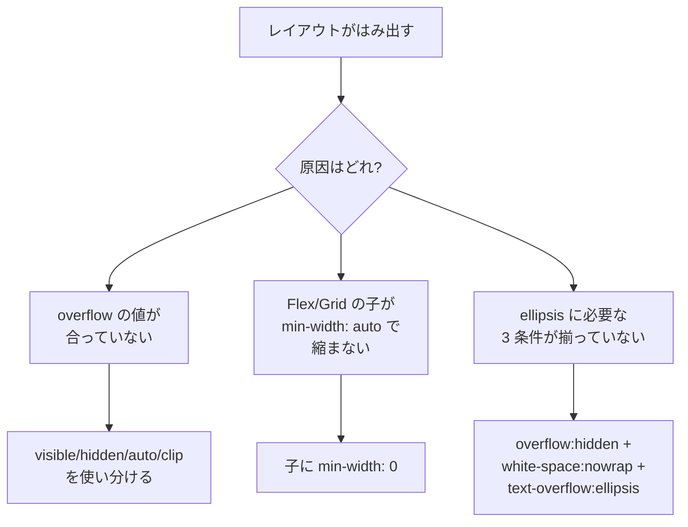

# レイアウトが突然はみ出す — overflow と min-width: 0 の罠

## 今日のゴール

- `overflow` の値（`visible` / `hidden` / `scroll` / `auto` / `clip`）が何を決めているかを自分の言葉で説明できる
- Flexbox や Grid の子が親からはみ出す「犯人」が既定値の `min-width: auto` だと知り、`min-width: 0` で直せる理由がわかる
- テキストを `...` で省略するための「三点セット」と、複数行省略の `line-clamp` を引き出しに入れる

## 「なんで縮まないの？」の正体

AI にチャット画面を作らせたら、ユーザー名とメッセージを Flexbox で横並びにしてくれた。動作確認するとなぜか長いユーザー名のカードだけが親カードからはみ出し、ページ全体に横スクロールが出る。焦って `overflow: hidden` を付けたら今度は文字の一部がブツっと切れた。`text-overflow: ellipsis` も足したのに `...` が出ない。──Tailwind で `flex` や `truncate` を使っていると、一度は見る光景です。

この「なんで？」の多くは、**1. overflow の仕組み**、**2. Flex/Grid アイテムの最小幅**、**3. テキスト省略に必要な条件**、の 3 つに集約されます。今日はこの 3 本柱で攻略します。



## 柱 1: overflow は「はみ出した時にどう見せるか」

`overflow` は、**ボックスに入りきらなかった中身をどう扱うか**を決めるプロパティです。値ごとに役割がはっきり分かれています。

| 値 | 振る舞い | スクロール可能 | スクロールコンテナを作る |
|---|---|---|---|
| `visible`（既定） | はみ出した中身がそのまま見える | しない | 作らない |
| `hidden` | はみ出した部分を隠す | JS からは可能 | **作る** |
| `scroll` | 常にスクロールバーを出す | する | 作る |
| `auto` | はみ出した時だけスクロールバー | する | 作る |
| `clip` | はみ出した部分を切り取るだけ | しない | **作らない** |

注目は `hidden` と `clip` の違い。見た目は同じ「切られる」ですが、`hidden` は内部的にスクロールコンテナを作ります。つまりプログラムから `scrollLeft` で動かせるし、子の `position: sticky` の基準にもなる。一方 `clip` は本当にただ切るだけで、スクロールは一切発生しません。「切るだけでいい」なら `clip` のほうが意図が明確です。

### アクセシビリティ: スクロール領域はキーボードで触れるように

`overflow: auto` や `scroll` でスクロール領域を作ったら、キーボード操作でもスクロールできるようにします。マウスホイールは効きますが、タブキーでフォーカスが入らないと、キーボードユーザーは中身が読めません。

```html
<!-- 長いログを表示するパネル。tabindex="0" でフォーカス可能に -->
<section
  aria-label="実行ログ"
  tabindex="0"
  style="max-height: 200px; overflow: auto; border: 1px solid #cbd5e1;"
>
  <pre>... 大量のログ行 ...</pre>
</section>
```

`tabindex="0"` を付けるとタブ順に入り、矢印キーでスクロールできるようになります。`aria-label` でスクリーンリーダーにも何の領域か伝わります。

## 柱 2: Flex/Grid の「縮まない子」問題

Flexbox や Grid で横並びにしたら、長いテキストを持つ子だけが親をはみ出す。これは仕様として決まった既定値が原因です。

**Flex アイテムと Grid アイテムの `min-width` / `min-height` の既定値は `auto`**。`auto` は「**中身が縮みたくない最小幅**」を意味します。つまり、長い単語や URL、画像の元サイズより小さくは**なってくれない**。親に `width: 100%` や `flex: 1` を指定しても、子の「最小幅」が親より大きければ、はみ出します。

解決は 1 行、`min-width: 0` を子に付けるだけ。これで「必要なら 0 まで縮んでいいよ」と明示できます。

```html
<style>
  .chat {
    display: flex;
    gap: 12px;
    width: 320px;
    border: 1px solid #cbd5e1;
    padding: 8px;
  }
  .avatar { width: 40px; height: 40px; border-radius: 50%; background: #64748b; flex-shrink: 0; }

  /* name は縮めたい */
  .name { flex: 1; /* min-width: 0 を付けないと縮まない */ }
  .name.fixed { min-width: 0; }

  .name p { overflow: hidden; text-overflow: ellipsis; white-space: nowrap; margin: 0; }
</style>

<article class="chat" aria-label="修正前">
  <div class="avatar" aria-hidden="true"></div>
  <div class="name">
    <p>tanaka_hanako_from_the_other_department_longlonglong</p>
  </div>
</article>

<article class="chat" aria-label="修正後 (min-width: 0)">
  <div class="avatar" aria-hidden="true"></div>
  <div class="name fixed">
    <p>tanaka_hanako_from_the_other_department_longlonglong</p>
  </div>
</article>
```

上が「なぜかはみ出す」、下が `min-width: 0` を足したもの。Tailwind なら `flex-1 min-w-0` の並びが定番で、`truncate`（= `overflow-hidden text-ellipsis whitespace-nowrap` のセット）と組み合わせて使います。

入れ子にも注意。Flex の中に Flex があるとき、**外側の子と内側の子の両方**に `min-width: 0` が必要なケースがあります。「なぜか縮まない」時は、祖先の Flex アイテムを順にたどって確認してください。

### 日本語や URL を折り返す: overflow-wrap

省略ではなく折り返したい時は、`overflow-wrap: anywhere` が便利です。長い英単語や URL の途中でも折り返してくれます。`word-break: break-all` は句読点の位置を無視して切るため、日本語では読みにくい。`anywhere` のほうが自然です。

```html
<style>
  .note {
    width: 220px;
    background: white;
    color: #1e293b;
    border: 1px solid #cbd5e1;
    padding: 8px;
    overflow-wrap: anywhere;
  }
</style>

<p class="note">
  参考リンク: https://example.com/very/long/path/that/would/otherwise/overflow
</p>
```

## 柱 3: テキスト省略の「三点セット」

`...` で省略するには、**3 つの条件が同時に揃う必要**があります。1 つでも欠けると動きません。

```css
.truncate {
  overflow: hidden;        /* はみ出しを隠す */
  white-space: nowrap;     /* 改行させない */
  text-overflow: ellipsis; /* 溢れた部分を ... に置き換える */
}
```

`white-space: nowrap` がないと自動で折り返されてそもそも溢れない、`overflow: hidden` がないと切られないので `ellipsis` の出番がない、という仕組みです。Tailwind の `truncate` ユーティリティはこの 3 つをまとめてセットしてくれます。

### 複数行の省略: line-clamp

1 行でなく「3 行で省略」したい時は `line-clamp` を使います。もともと WebKit のプレフィックス付きプロパティでしたが、2023 年以降は `line-clamp` として CSS Overflow Module に入り、主要ブラウザで動きます。古いブラウザ向けに `-webkit-line-clamp` と `display: -webkit-box` を併記する書き方が今も定番です。

```html
<style>
  .summary {
    background: white;
    color: #1e293b;
    border: 1px solid #cbd5e1;
    padding: 8px;
    width: 260px;

    display: -webkit-box;
    -webkit-box-orient: vertical;
    -webkit-line-clamp: 2;
    line-clamp: 2;
    overflow: hidden;
  }
</style>

<p class="summary">
  CSS の overflow は、ボックスからはみ出た中身をどう見せるかを決める仕組みです。visible、hidden、scroll、auto、clip の 5 つの値があり、それぞれ用途が異なります。
</p>
```

Tailwind CSS v4 では `line-clamp-2` のようなユーティリティが標準で使えるようになりました。v3 までは別プラグインが必要でしたが、今は入れるだけで動きます。

### アクセシビリティ: 省略されたテキストは消えたわけではない

`truncate` や `line-clamp` で画面から消えた文字列も、**DOM には存在しています**。スクリーンリーダーは全文を読み上げるので、情報が失われるわけではありません。ただし視覚的には切れているので、マウスホバーやフォーカス時に全文を表示するなどの配慮があるとより親切です。`title` 属性で補うのが手軽ですが、モバイルでは見られないため、重要な情報を省略しないのが原則です。

## もう一つの地雷: スクロールバーでレイアウトが揺れる

ページの中身が増えて縦スクロールバーが出た瞬間、横幅が数 px 減ってレイアウトが微妙にズレる。この揺れは `scrollbar-gutter` で止められます。

```css
html {
  scrollbar-gutter: stable;
}
```

「スクロールバー用の余白を常に確保する」指示です。2024 年にはすべての主要ブラウザで使えるようになったため、安心して入れられます。

## 2026 年の新顔: field-sizing: content

入力量に合わせて `<textarea>` が自動で縦に伸びるフォーム、見たことがあるはず。これまで JS で `scrollHeight` を測って高さを書き換える実装が定番でしたが、2025 年以降は CSS だけでできます。

```css
textarea {
  field-sizing: content;
  min-height: 3lh;  /* 最低 3 行分 */
}
```

`field-sizing: content` は「中身の分だけ広がる」指示。はみ出しが起きる前に器のほうが伸びるので、`overflow` の悩みがそもそも発生しません。Chrome/Edge/Safari で利用可能です（Firefox は執筆時点で実装中）。

## デモ 1: min-width: 0 で「はみ出す vs 縮む」

<div style="background:#f8fafc;color:#1e293b;border:1px solid #cbd5e1;border-radius:8px;padding:16px;">
  <p style="margin:0 0 8px;font-weight:600;">修正前: 親 280px からはみ出している</p>
  <div style="display:flex;gap:8px;width:280px;background:white;color:#1e293b;border:1px solid #cbd5e1;padding:8px;overflow:auto;">
    <div style="width:32px;height:32px;border-radius:50%;background:#64748b;flex-shrink:0;" aria-hidden="true"></div>
    <div style="flex:1;">
      <p style="margin:0;overflow:hidden;text-overflow:ellipsis;white-space:nowrap;">tanaka_hanako_from_the_other_department_longlonglong</p>
    </div>
  </div>
  <p style="margin:4px 0 0;font-size:12px;color:#475569;">truncate を書いたのに ... にならず、横スクロールが出る</p>

  <p style="margin:16px 0 8px;font-weight:600;">修正後: 子に min-width: 0 を追加</p>
  <div style="display:flex;gap:8px;width:280px;background:white;color:#1e293b;border:1px solid #cbd5e1;padding:8px;">
    <div style="width:32px;height:32px;border-radius:50%;background:#64748b;flex-shrink:0;" aria-hidden="true"></div>
    <div style="flex:1;min-width:0;">
      <p style="margin:0;overflow:hidden;text-overflow:ellipsis;white-space:nowrap;">tanaka_hanako_from_the_other_department_longlonglong</p>
    </div>
  </div>
  <p style="margin:4px 0 0;font-size:12px;color:#475569;">ちゃんと省略され、親の幅に収まる</p>
</div>

見た目の差は 1 行の CSS（`min-width: 0`）が生み出しています。Tailwind なら子に `min-w-0` を足すだけです。

## デモ 2: truncate と line-clamp の違い

<div style="background:#f8fafc;color:#1e293b;border:1px solid #cbd5e1;border-radius:8px;padding:16px;">
  <p style="margin:0 0 8px;font-weight:600;">truncate: 1 行で切る</p>
  <p style="margin:0;width:260px;background:white;color:#1e293b;border:1px solid #cbd5e1;padding:8px;overflow:hidden;text-overflow:ellipsis;white-space:nowrap;">CSS の overflow は、ボックスからはみ出た中身をどう見せるかを決める仕組みです。visible、hidden、scroll、auto、clip の 5 つがあります。</p>

  <p style="margin:16px 0 8px;font-weight:600;">line-clamp: 2 行で切る</p>
  <p style="margin:0;width:260px;background:white;color:#1e293b;border:1px solid #cbd5e1;padding:8px;display:-webkit-box;-webkit-box-orient:vertical;-webkit-line-clamp:2;line-clamp:2;overflow:hidden;">CSS の overflow は、ボックスからはみ出た中身をどう見せるかを決める仕組みです。visible、hidden、scroll、auto、clip の 5 つがあります。</p>
  <p style="margin:4px 0 0;font-size:12px;color:#475569;">どちらも DOM には全文が残っており、スクリーンリーダーは全文を読み上げる</p>
</div>

カード一覧のタイトルは 1 行で `truncate`、本文プレビューは 2〜3 行で `line-clamp`、と使い分けるのが定番です。

## まとめ

- `overflow` は「はみ出した時にどう見せるか」を決める。`hidden` はスクロールコンテナを作る、`clip` は作らない
- Flex/Grid の子は既定で `min-width: auto`。中身より小さくならない。`min-width: 0`（Tailwind なら `min-w-0`）が必要
- テキスト省略は **`overflow: hidden` + `white-space: nowrap` + `text-overflow: ellipsis`** の三点セット。複数行は `line-clamp`
- 省略されたテキストは DOM に残り、スクリーンリーダーには読まれる。過信せず、重要な情報は省略しない

「はみ出し」の原因を「overflow か？ min-width か？ 三点セットが欠けているか？」と切り分けられるようになれば、レイアウトの謎解きは一気に速くなります。
